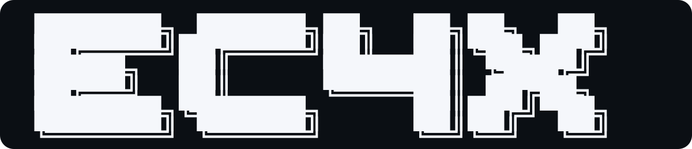
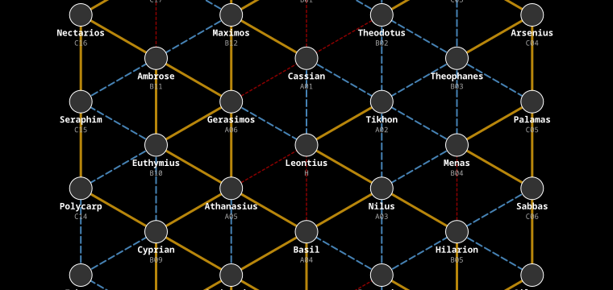

# EC4X - Asynchronous Turn-Based 4X Wargame

<p align="center">
  
</p>

EC4X is an asynchronous turn-based wargame of the classic eXplore,
eXpand, eXploit, and eXterminate (4X) variety for multiple players.

Inspired by Esterian Conquest and other classic BBS door games, EC4X
combines the async rhythm of turn-based strategy with Nostr-native
identity, encrypted relay transport, and a self-hostable multiplayer
stack.

**📖 [Read the Complete Game Specification](docs/specs/index.md)** - Full rules, gameplay mechanics, and strategic systems



## Game Overview

The twelve *dynatoi* (δυνατοί - "the powerful") - ancient Great Houses rising from the ashes - battle over a small region of space to dominate rivals and claim supremacy. The game features abstract strategic cycles that scale with map size - from decades in small skirmishes to centuries in epic campaigns.

**Game Details:**
- **Players:** 2-12
- **Turn Duration:** ~24 hours (real-time)
- **Victory Condition:** Turn limit reached (highest prestige wins) or last House standing
- **Starting Prestige:** 100 points

Turns cycle every 24 hours IRL, intentionally designed for async gameplay where players check in once per day.

## Project Status

EC4X is in active development, but the core multiplayer loop is working:

- authoritative daemon-backed turn resolution
- player TUI with invite join, staging, submit, and turn refresh
- encrypted Nostr transport for commands and player state
- live playtesting with ongoing bug fixing and balance work

Expect active iteration on rules, UI polish, and operational tooling.

## Online Play Model

EC4X uses **Nostr relays** for transport and `npub`/`nsec` identities for
players and daemons.

Each game is resolved by an authoritative daemon. Players interact through
the TUI, submit encrypted command packets, and receive fog-of-war filtered
state updates over Nostr.

For local development, point the daemon at a localhost relay such as
`ws://localhost:8080`. For hosted multiplayer, run a daemon and relay
together on the same server or LAN.

**Binaries:**
- `ec4x` — Game moderator CLI: create games, manage invites, inspect state
- `ec4x-daemon` — Autonomous turn processing service: ingests player commands, resolves turns, publishes results
- `tui` — Terminal player client: join games via invite code, submit orders, view game state

**Key Features:**
- Nostr-native identity and transport
- Server-authoritative game state over Nostr (NIP-44 encryption)
- Fog of war via intel system
- Delta updates plus authoritative full-state resync
- KDL-based configuration (no hardcoded gameplay values)
- SQLite single source of truth per game

See **[Architecture Documentation](docs/architecture/overview.md)** for complete system design.

## Development Status

**Engine, Daemon, and TUI Operational — Active Playtesting**

✅ **Engine:**
- Core game engine stable and tested
- All 13 game systems operational
- Full turn cycle tested (Conflict → Income → Command → Production)

✅ **Infrastructure:**
- Daemon operational: game discovery, turn resolution, Nostr publish/subscribe
- TUI operational: invite code join flow, order submission, fog-of-war state rendering
- Nostr transport implemented: encrypted commands, deltas, full-state resync

🔄 **Current Work:**
- Playtesting and balance validation
- Polish and bug fixes surfaced during real games

**Game Systems (Operational):**
- Combat system (space battles, ground combat, starbases)
- Economy system (production, construction, maintenance)
- Research system (tech trees, science levels)
- Prestige system (dynamic scaling, morale)
- Espionage system (covert operations, counter-intelligence)
- Diplomacy system (three-state relations)
- Colonization system (PTU, Space Guild)
- Victory conditions (turn limit, elimination)
- Fleet management (movement, orders, status)
- Star map generation (procedural jump-lane network)
- Fog-of-war intelligence system
- Configuration system (KDL format)
- Turn resolution (order processing)

## Documentation

### Game Rules
- **[Complete Game Specification](docs/specs/index.md)** - Full rules, gameplay, and strategic systems
- **[Documentation Overview](docs/README.md)** - Navigation guide for all documentation

### Architecture
- **[System Architecture](docs/architecture/overview.md)** - Core system design and components
- **[Daemon Design](docs/architecture/daemon.md)** - Daemon architecture and identity management
- **[Combat Engine](docs/architecture/combat-engine.md)** - Combat system architecture
- **[Fleet System](docs/architecture/fleet_system.md)** - Fleet management architecture
- **[Intelligence System](docs/architecture/intel.md)** - Fog-of-war and intelligence mechanics

### Development
- **[TODO](docs/TODO.md)** - Current work tracking and roadmap
- **[Daemon Setup (system service)](docs/guides/daemon-setup.md)** - Production deployment guide
- **[Daemon Setup (user service)](docs/guides/daemon-setup-user.md)** - Local dev deployment guide
- **[Local Nostr Development](docs/guides/local-nostr-development.md)** - Relay and transport workflow
- **[Playtesting Plans](docs/play_testing/README.md)** - Human playtesting and training data collection

## Development Setup

### Prerequisites

- **Nim** 2.0+ and **Nimble**
- **OpenGL** development libraries (for client)
- **zstd** compression library

**Arch/CachyOS:**
```bash
sudo pacman -S nim nimble zstd libgl libx11 libxcursor libxi libxrandr
```

**Ubuntu/Debian:**
```bash
sudo apt install nim libgl-dev libx11-dev libxcursor-dev libxi-dev libxrandr-dev libzstd-dev
```

**macOS (Homebrew):**
```bash
brew install nim zstd
```

### Quick Start (Developers)

**Build everything:**
```bash
nimble buildAll
```

**Run tests:**
```bash
nimble testUnit           # Unit tests
nimble testIntegration    # Integration tests
nimble testStress         # Stress tests
```

**Dev reset** (clear state, create a fresh game, print invite codes):
```bash
nim r tools/clean_dev.nim
```

### Running the Daemon

The daemon requires a Nostr relay. For local dev we recommend [nostr-rs-relay](https://github.com/scsibug/nostr-rs-relay) at `ws://localhost:8080` (configurable in `config/daemon.kdl`).

**First-time setup** — generate the daemon's Nostr keypair:
```bash
./bin/ec4x-daemon init
```

This creates `~/.local/share/ec4x/daemon_identity.kdl` with `600` permissions. Running `init` again is safe — it will never overwrite an existing identity.

**Start the daemon:**
```bash
./bin/ec4x-daemon start
```

For running the daemon as a systemd service, see the full setup guides:
- [System service (production)](docs/guides/daemon-setup.md)
- [User service (local dev)](docs/guides/daemon-setup-user.md)
