# Hybrid GOAP/RBA AI Architecture

**Last Updated:** 2025-12-10
**Status:** Design Document (GOAP fully integrated, ongoing refinement)
**System:** Byzantine Imperial AI with Strategic Planning Layer

---

**Note on Phase Numbering:**
The conceptual phases outlined in this document (e.g., "Phase 0: Intelligence Distribution") map directly to the corresponding phase blocks defined and executed within `src/ai/rba/orders.nim`. For full clarity, refer to the `src/ai/rba/orders.nim` file for the precise sequence and implementation details of each phase.

---

## Table of Contents

1. [Executive Summary](#executive-summary)
2. [Architecture Overview](#architecture-overview)
3. [Strategic vs Tactical Decision Making](#strategic-vs-tactical-decision-making)
4. [System Integration](#system-integration)
5. [Information Flow](#information-flow)
6. [Decision Authority Matrix](#decision-authority-matrix)
7. [Multi-Turn Planning](#multi-turn-planning)
8. [Feedback & Adaptation](#feedback--adaptation)
9. [Implementation Status](#implementation-status)

---

## Executive Summary

The **Hybrid GOAP/RBA Architecture** combines two complementary AI systems:

- **GOAP (Goal-Oriented Action Planning)** - Strategic planning layer
  - Multi-turn goal planning (3-10 turn horizon)
  - Resource allocation strategies
  - Goal prioritization and replanning
  - High-level coordination

- **RBA (Rule-Based Advisors)** - Tactical execution layer
  - Turn-by-turn order generation
  - Budget-constrained fulfillment
  - Domain-specific expertise (6 advisors)
  - Iterative feedback loops

**Key Principle:** GOAP thinks strategically, RBA acts tactically.

```
+--------------------------------------------------------------+
|                    HYBRID AI SYSTEM                          |
|                                                              |
|  +--------------------------------------------------------+  |
|  |  GOAP STRATEGIC LAYER (Multi-Turn Planning)           |  |
|  |  - "Conquer System 42 in 5 turns"                     |  |
|  |  - "Research CST VI by Turn 8"                        |  |
|  |  - "Build invasion fleet (3 turns)"                   |  |
|  +------------------------+-------------------------------+  |
|                           |                                  |
|                           | Goals, Plans, Cost Estimates     |
|                           |                                  |
|                           v                                  |
|  +--------------------------------------------------------+  |
|  |  RBA TACTICAL LAYER (Turn-by-Turn Execution)          |  |
|  |  - "Build 2 Battleships this turn"                    |  |
|  |  - "Allocate 300 PP to research"                      |  |
|  |  - "Move Fleet 5 to System 42"                        |  |
|  +--------------------------------------------------------+  |
|                                                              |
+--------------------------------------------------------------+
```

---

## Architecture Overview

### Two-Layer Decision Hierarchy

```
                    STRATEGIC HORIZON (3-10 turns)
+--------------------------------------------------------------+
|                      GOAP LAYER                              |
|                                                              |
|  +-----------+    +-----------+    +-----------+            |
|  |   GOALS   |--->|  PLANNER  |--->|   PLANS   |            |
|  |           |    | (A* Search)|    | Multi-turn|            |
|  +-----------+    +-----------+    +-----------+            |
|       ^                                  |                   |
|       |                                  v                   |
|  [World State]                    [Action Sequences]        |
|  [Opportunities]                  [Cost Estimates]          |
|  [Threats]                        [Dependencies]            |
|                                                              |
+------------------------------+-------------------------------+
                               |
                               | Strategic Guidance
                               | - Active goals
                               | - Plan progress
                               | - Cost budgets
                               |
                               v
+--------------------------------------------------------------+
|                      RBA LAYER                               |
|                                                              |
|           +-------------------------------------+            |
|           |        BASILEUS                     |            |
|           |   (Turn Coordinator)                |            |
|           +-----------------+-------------------+            |
|                             |                                |
|      +----------------------+----------------------+         |
|      |                      |                      |         |
|  +---v---+    +-------------v-------+   +---------v----+    |
|  |DRUNG. |    |     TREASURER       |   | DOMESTIKOS  |    |
|  |(Intel)|    |       (CFO)         |   |  (Military) |    |
|  +-------+    +----------+----------+   +-------------+    |
|                          |                                  |
|      +-------------------+-------------------+              |
|      |                   |                   |              |
|  +---v---+    +----------v---------+   +-----v--------+    |
|  | LOGO. |    |     EPARCH         |   |  PROTO.      |    |
|  | (R&D) |    |    (Economy)       |   | (Diplo.)     |    |
|  +-------+    +--------------------+   +--------------+    |
|                                                             |
+-------------------------------------------------------------+
                    TACTICAL HORIZON (1 turn)
```

### Responsibility Split

| Layer    | Responsibility       | Time Horizon | Decision Type      |
|----------|---------------------|--------------|-------------------|
| **GOAP** | What to achieve     | 3-10 turns   | Strategic goals   |
| **GOAP** | How to sequence     | Multi-turn   | Action planning   |
| **GOAP** | When to replan      | Continuous   | Adaptive strategy |
| **RBA**  | How to execute      | 1 turn       | Tactical orders   |
| **RBA**  | What to build       | 1 turn       | Resource alloc    |
| **RBA**  | Where to move       | 1 turn       | Fleet operations  |

---

## Strategic vs Tactical Decision Making

### GOAP: Strategic Planning (Multi-Turn)

**Purpose:** Answer "What should we achieve in the next 5 turns?"

```
GOAP STRATEGIC DECISION PROCESS
================================

STEP 1: GOAL EXTRACTION
+-------------------------------------------------+
| Analyze world state and extract strategic goals|
|                                                 |
| Input:  GameState, Intelligence, Advisor Reqs  |
| Output: Prioritized goal list                  |
|                                                 |
| Example Goals:                                  |
|  Priority 90: "Defend Homeworld (critical)"    |
|  Priority 70: "Conquer System 42"              |
|  Priority 50: "Research CST VI"                |
|  Priority 30: "Expand to 5 colonies"           |
+-------------------------------------------------+
                         |
                         v
STEP 2: PLAN GENERATION (A* Search)
+-------------------------------------------------+
| For each goal, generate action sequence        |
|                                                 |
| Goal: "Conquer System 42"                      |
| +---------------------------------------------+ |
| | Turn 1: Build 5 Destroyers      (200 PP)   | |
| | Turn 2: Build 2 Carriers         (240 PP)  | |
| | Turn 3: Build 10 Marines         (500 PP)  | |
| | Turn 4: Move to System 42        (0 PP)    | |
| | Turn 5: Invade System 42         (0 PP)    | |
| |                                             | |
| | Total Cost: 940 PP over 5 turns            | |
| | Success Probability: 0.85                  | |
| +---------------------------------------------+ |
+-------------------------------------------------+
                         |
                         v
STEP 3: COST ESTIMATION & PRIORITIZATION
+-------------------------------------------------+
| Evaluate feasibility and rank goals            |
|                                                 |
| Ranking Criteria:                               |
|  - Strategic value (survival > expansion)      |
|  - Cost efficiency (PP per prestige point)     |
|  - Success probability (threat assessment)     |
|  - Time to completion (urgent > deferred)      |
|                                                 |
| Final Plan:                                     |
|  [X] Goal 1: Defend Homeworld  (500 PP, 3 turns)|
|  [X] Goal 2: Conquer System 42 (940 PP, 5 turns)|
|  [ ] Goal 3: CST VI (deferred, insufficient PP) |
+-------------------------------------------------+
                         |
                         v
STEP 4: TACTICAL HANDOFF TO RBA
+-------------------------------------------------+
| Provide current-turn guidance to RBA advisors  |
|                                                 |
| Turn 1 Instructions:                           |
|  - Domestikos: Build 5 Destroyers (Goal 1)    |
|  - Domestikos: Build 2 Frigates (Goal 2)      |
|  - Treasurer: Reserve 700 PP for Turn 2-3     |
|  - Logothete: Defer CST VI research           |
+-------------------------------------------------+
```

### RBA: Tactical Execution (Single-Turn)

**Purpose:** Answer "What should we do THIS turn?"

```
RBA TACTICAL DECISION PROCESS
==============================

PHASE 0: INTELLIGENCE DISTRIBUTION
+-------------------------------------------------+
| Drungarius collects fog-of-war intelligence   |
|  - Threats: Enemy fleet at System 15 (20 ships)|
|  - Opportunities: System 42 undefended         |
|  - Construction: Enemy building Battleships    |
+-------------------------------------------------+
                         |
                         v
PHASE 1: REQUIREMENT GENERATION
+-------------------------------------------------+
| Each advisor generates THIS TURN requirements  |
|                                                 |
| Domestikos:                                     |
|  - Build 5 Destroyers (Critical, 200 PP)      |
|  - Build 2 Frigates (High, 80 PP)             |
|  - Build 1 Starbase (Medium, 40 PP)           |
|                                                 |
| Logothete:                                      |
|  - Research CST (Medium, 150 PP)              |
|  - Research ACO (Low, 100 PP)                 |
|                                                 |
| Total Requested: 570 PP                        |
| Treasury Available: 450 PP                     |
| --> OVER BUDGET (need Phase 2 mediation)      |
+-------------------------------------------------+
                         |
                         v
PHASE 1.5: GOAP GUIDANCE (Optional)
+-------------------------------------------------+
| GOAP informs budget allocation priorities      |
|                                                 |
| Active Goals:                                   |
|  Goal 1 (Priority 90): "Defend Homeworld"     |
|    --> Boost Domestikos defense requirements   |
|  Goal 2 (Priority 70): "Conquer System 42"    |
|    --> Reserve 240 PP for Turn 2 carriers      |
|                                                 |
| Budget Guidance:                                |
|  Strategic: 360 PP (80%)                       |
|  Filler: 90 PP (20%)                           |
|  Reserved: 240 PP (next turn)                  |
+-------------------------------------------------+
                         |
                         v
PHASE 2: MEDIATION & ALLOCATION
+-------------------------------------------------+
| Treasurer allocates PP budget across advisors  |
|                                                 |
| Allocation (GOAP-informed):                    |
|  Domestikos: 280 PP (defense priority)         |
|  Logothete: 80 PP (CST only)                   |
|  Drungarius: 40 PP (intel ops)                 |
|  Eparch: 50 PP (infrastructure)                |
|  Total: 450 PP                                 |
+-------------------------------------------------+
                         |
                         v
PHASE 3: EXECUTION & FEEDBACK
+-------------------------------------------------+
| Iteration 1: Try to fulfill all requirements  |
|  [X] 5 Destroyers built (200 PP)              |
|  [X] 2 Frigates built (80 PP)                 |
|  [ ] 1 Starbase unfulfilled (need 40 PP)      |
|  [X] CST research (80 PP)                     |
|                                                 |
| Feedback: 1 Medium requirement unfulfilled     |
| --> Continue to Iteration 2 (reprioritize)     |
|                                                 |
| Iteration 2: Adjust and retry                 |
|  [ ] Starbase deferred (Low priority)          |
|  [X] Add 1 Scout with remaining 40 PP         |
|                                                 |
| Result: Converged (no Critical/High unfulfilled)|
+-------------------------------------------------+
                         |
                         v
PHASE 4: FEEDBACK TO GOAP
+-------------------------------------------------+
| Update GOAP goal progress                      |
|                                                 |
| Goal 1: "Defend Homeworld"                     |
|  [X] Turn 1/3 complete (5 Destroyers built)   |
|  Progress: 33%                                 |
|                                                 |
| Goal 2: "Conquer System 42"                    |
|  [X] Turn 1/5 complete (2 Frigates built)     |
|  Progress: 20%                                 |
+-------------------------------------------------+
```

---

## System Integration

### Per-Turn Integration Flow

```mermaid
graph TD
    subgraph AI Turn Cycle
        A[Start Turn N] --> P0(Phase 0: Intelligence Distribution);
        P0 --> P1(Phase 1: Multi-Advisor Requirement Generation);
        P1 --> P1_5(Phase 1.5: GOAP Strategic Planning);
        P1_5 --> P2(Phase 2: Mediation & Budget Allocation);
        P2 --> P3(Phase 3: Requirement Execution - Non-Iterative);
        P3 --> P3_4(Phase 3/4: Unified Feedback Loop - Iterative Execution & Reprioritization);
        P3_4 --> P5(Phase 5: Strategic Operations Planning);
        P5 --> P6(Phase 6: Standing Orders Assignment);
        P6 --> P7(Phase 7: Tactical Fleet Orders);
        P7 --> P7_5(Phase 7.5: Colony Management);
        P7_5 --> P8(Phase 8: Logistics Optimization);
        P8 --> P8_5(Phase 8.5: Report GOAP Progress);
        P8_5 --> Z[End Turn N / Start Turn N+1];
    end
```



```
DETAILED PER-TURN EXECUTION FLOW
================================

+------------------------------------------------------------------------------------+
| PHASE 0: INTELLIGENCE DISTRIBUTION (Drungarius, `generateIntelligenceSnapshot`)    |
+------------------------------------------------------------------------------------+
| Input: FilteredGameState, AIController                                             |
| Output: IntelligenceSnapshot (stored in AIController)                              |
| Process: Consolidates all visible game state information for internal AI use,      |
|          respecting Fog of War. Updates threat assessments, opportunities.         |
+------------------------------------------------------------------------------------+
                                         |
                                         v
+------------------------------------------------------------------------------------+
| PHASE 1: MULTI-ADVISOR REQUIREMENT GENERATION (`generateAllAdvisorRequirements`)   |
+------------------------------------------------------------------------------------+
| Input: AIController, FilteredGameState, IntelligenceSnapshot                       |
| Output: Advisor-specific Requirement objects (stored in AIController)              |
| Process: Each of the 6 advisors generates a list of prioritized requirements       |
|          (e.g., build ships, research tech, conduct espionage) for the turn.       |
|          GOAP's active plans influence these requirements, boosting priorities.    |
+------------------------------------------------------------------------------------+
                                         |
                                         v
+------------------------------------------------------------------------------------+
| PHASE 1.5: GOAP STRATEGIC PLANNING (`executePhase15_GOAP`)                         |
+------------------------------------------------------------------------------------+
| Input: AIController, FilteredGameState, IntelligenceSnapshot                       |
| Output: Updated AIController.goapPlanTracker, GOAP budget estimates for Treasurer  |
| Process:                                                                           |
|  - GOAL EXTRACTION: Identify strategic goals from the current world state.         |
|  - PRIORITY REASSESSMENT: Dynamically adjust goal priorities based on game context.|
|  - TARGETED GOAL INJECTION: If replanning, add specific high-priority goals (e.g., |
|    `AchieveTechLevel` for `TechNeeded` failure, `GainTreasury` for `BudgetFailure`).|
|  - PLAN GENERATION/REPAIR: Creates new multi-turn plans for goals, or attempts    |
|    `repairPlan` for failed/stalled plans using detailed feedback.                  |
|  - BUDGET ESTIMATION: Provides GOAP's estimated costs for each domain to Treasurer.|
+------------------------------------------------------------------------------------+
                                         |
                                         v
+------------------------------------------------------------------------------------+
| PHASE 2: BASILEUS MEDIATION & BUDGET ALLOCATION (`mediateAndAllocateBudget`)       |
+------------------------------------------------------------------------------------+
| Input: AIController, FilteredGameState, all Advisor Requirements, GOAP estimates   |
| Output: MultiAdvisorAllocation (stored in AIController.lastTurnAllocationResult)   |
| Process:                                                                           |
|  - BASILEUS MEDIATION: Weights all requirements by `AIPersonality`, `GameAct`,     |
|    and GOAP priority boosts. Resolves conflicts.                                   |
|  - TREASURER ALLOCATION: Reserves minimum budgets (recon, expansion), then         |
|    distributes remaining PP/RP/EBP/CIP based on weighted requirements.             |
|  - DETAILED FEEDBACK: Generates `RequirementFeedback` for unfulfilled              |
|    requirements, including specific reasons and suggestions for GOAP/RBA.          |
+------------------------------------------------------------------------------------+
                                         |
                                         v
+------------------------------------------------------------------------------------+
| PHASE 3: REQUIREMENT EXECUTION (Non-Iterative Orders)                              |
+------------------------------------------------------------------------------------+
| Input: AIController, FilteredGameState, MultiAdvisorAllocation                     |
| Output: Partial OrderPacket (research, espionage, terraform, diplomatic actions)   |
| Process: Converts initially allocated budgets and fulfilled requirements into      |
|          orders for research, espionage, terraforming, and diplomacy.              |
+------------------------------------------------------------------------------------+
                                         |
                                         v
+------------------------------------------------------------------------------------+
| PHASE 3/4: UNIFIED FEEDBACK LOOP (Iterative Execution & Reprioritization)          |
+------------------------------------------------------------------------------------+
| Input: AIController, FilteredGameState, MultiAdvisorAllocation                     |
| Output: Finalized Build Orders, potentially adjusted other orders                  |
| Process: (Up to 3 iterations)                                                      |
|  - EXECUTION: All advisor order execution procedures (including build orders) run. |
|  - CONVERGENCE CHECK: `hasUnfulfilledCriticalOrHigh` checks if high-priority       |
|    requirements remain unfulfilled from the Treasurer's feedback.                  |
|  - REPRIORITIZATION: If unfulfilled, `reprioritizeAllAdvisors` modifies advisor   |
|    requirements using detailed Treasurer feedback.                                 |
|  - RE-ALLOCATION/RE-EXECUTION: Budget is re-allocated and orders re-executed      |
|    with adjusted priorities until convergence or iteration limit reached.          |
+------------------------------------------------------------------------------------+
                                         |
                                         v
+------------------------------------------------------------------------------------+
| PHASE 5: STRATEGIC OPERATIONS PLANNING (`identifyInvasionOpportunities`)           |
+------------------------------------------------------------------------------------+
| Input: AIController, FilteredGameState                                             |
| Output: CoordinatedOperation objects (for GOAP planning)                           |
| Process: Identifies high-level strategic opportunities for military operations     |
|          (e.g., vulnerable enemy colonies for invasion) and queues them for GOAP.  |
+------------------------------------------------------------------------------------+
                                         |
                                         v
+------------------------------------------------------------------------------------+
| PHASE 6: STANDING ORDERS ASSIGNMENT (`assignStandingOrders`)                       |
+------------------------------------------------------------------------------------+
| Input: AIController, FilteredGameState                                             |
| Output: Updated AIController.standingOrders, Logistics build requirements          |
| Process: Assigns persistent routine orders to fleets (e.g., `AutoRepair`,          |
|          `AutoColonize`, `DefendSystem`). Includes intelligent Drydock selection   |
|          for `AutoRepair`. Logistics-generated build requirements (e.g., Drydocks)|
|          are added to Domestikos' requirements.                                    |
+------------------------------------------------------------------------------------+
                                         |
                                         v
+------------------------------------------------------------------------------------+
| PHASE 7: TACTICAL FLEET ORDERS (`generateFleetOrders`)                             |
+------------------------------------------------------------------------------------+
| Input: AIController, FilteredGameState                                             |
| Output: Tactical FleetOrder objects                                                |
| Process: Generates explicit movement and combat orders for non-routine or          |
|          offensive fleet operations, overriding standing orders.                   |
+------------------------------------------------------------------------------------+
                                         |
                                         v
+------------------------------------------------------------------------------------+
| PHASE 7.5: COLONY MANAGEMENT (`generateColonyManagementOrders`)                    |
+------------------------------------------------------------------------------------+
| Input: AIController, FilteredGameState                                             |
| Output: ColonyManagementOrder objects                                              |
| Process: Manages colony-specific settings (e.g., tax rates, auto-repair flags).    |
+------------------------------------------------------------------------------------+
                                         |
                                         v
+------------------------------------------------------------------------------------+
| PHASE 8: LOGISTICS OPTIMIZATION (`generateLogisticsOrders`)                        |
+------------------------------------------------------------------------------------+
| Input: AIController, FilteredGameState                                             |
| Output: ZeroTurnCommands (cargo, squadrons), PopulationTransferOrders, FleetOrders  |
| Process: Optimizes use of existing assets: cargo, population transfers, fleet       |
|          lifecycle (Salvage, Mothball, Reactivate), and Drydock management.        |
+------------------------------------------------------------------------------------+
                                         |
                                         v
+------------------------------------------------------------------------------------+
| PHASE 8.5: REPORT GOAP PROGRESS (RBA -> GOAP Feedback, `generateFeedback`)         |
+------------------------------------------------------------------------------------+
| Input: AIController, MultiAdvisorAllocation, GameEvents                            |
| Output: Updated AIController.goapPlanTracker, `controller.replanNeeded` flag      |
| Process:                                                                           |
|  - PROGRESS REPORTING: Matches RBA outcomes to GOAP actions; uses `GameEvent`s    |
|    to verify success/failure (`checkActualOutcome`). Stores detailed feedback.     |
|  - REPLANNING TRIGGERS: `checkGOAPReplanningNeeded` assesses plan health, detects  |
|    opportunities, and sets a flag for next turn's GOAP planning if needed.         |
+------------------------------------------------------------------------------------+
```

---

## Information Flow

### Vertical Flow: GOAP <--> RBA Communication

```
GOAP --> RBA (Downward Strategic Guidance)
=========================================

+-----------------------------------------+
|         GOAP STRATEGIC LAYER            |
|                                         |
|  Active Goals:                          |
|   Goal A: "Defend homeworld" (Pri 90)  |
|   Goal B: "Conquer Sys 42" (Pri 70)    |
|   Goal C: "Research CST VI" (Pri 50)   |
+---------------+-------------------------+
                |
                | Strategic Guidance Package
                | +-----------------------------+
                | | - Goal priorities           |
                | | - Current-turn actions      |
                | | - Cost estimates per advisor|
                | | - Budget reservations       |
                | | - Goal-requirement alignment|
                | +-----------------------------+
                v
+-----------------------------------------+
|     RBA TACTICAL LAYER (Phase 1.5)      |
|                                         |
|  Treasurer receives guidance:           |
|   - Domestikos: 300 PP (Goal A)        |
|   - Logothete: 150 PP (Goal C)         |
|   - Reserve: 200 PP (Goal B Turn 2)    |
+-----------------------------------------+


RBA --> GOAP (Upward Execution Feedback)
=======================================

+-----------------------------------------+
|     RBA TACTICAL LAYER (Phase 4)        |
|                                         |
|  Execution Results:                     |
|   [X] 5 Destroyers built                |
|   [X] 2 Frigates built                  |
|   [ ] 1 Carrier unfulfilled (no budget) |
|   [X] CST research started              |
+---------------+-------------------------+
                |
                | Feedback Package
                | +-----------------------------+
                | | - Orders executed           |
                | | - Goal progress (%)         |
                | | - Failures & reasons        |
                | | - Unexpected events         |
                | | - Resource consumption      |
                | +-----------------------------+
                v
+-----------------------------------------+
|         GOAP STRATEGIC LAYER            |
|                                         |
|  Update Goal States:                    |
|   Goal A: 33% complete (on track)      |
|   Goal B: 20% complete (delayed)       |
|   Goal C: 10% complete (started)       |
|                                         |
|  Replan Decision: Continue (no issues) |
+-----------------------------------------+
```

### Horizontal Flow: Advisor Coordination

```
RBA ADVISOR COORDINATION (GOAP-Enhanced)
=========================================

WITHOUT GOAP (Current):
-----------------------
        +-------------+
        | DOMESTIKOS  |---> "Need 500 PP for Battleships"
        +-------------+
                |
                v
        +-------------+
        |  TREASURER  |---> Mediation by personality only
        +-------------+
                |
                v
        +-------------+
        |  LOGOTHETE  |---> "Need 300 PP for research"
        +-------------+

Result: Independent competition, no strategic alignment


WITH GOAP (Future):
-------------------
        +-------------+
        |    GOAP     |---> "Goal: Build invasion fleet"
        +------+------+         |
               |         Turn 1: 5 Destroyers
               |         Turn 2: 2 Carriers
               |         Turn 3: 10 Marines
               v
        +-------------+
        | DOMESTIKOS  |---> Requirements aligned with Goal
        +-------------+         (Destroyers prioritized)
                |
                v
        +-------------+
        |  TREASURER  |---> GOAP-weighted mediation
        +-------------+         (Goal priority boost)
                |
                v
        +-------------+
        |  LOGOTHETE  |---> Tech requirements coordinated
        +-------------+         (CST needed for Carriers)

Result: Strategic alignment, efficient coordination
```

---

## Decision Authority Matrix

### Authority Distribution

| Decision Type          | GOAP Authority | RBA Authority | Resolution Method |
|------------------------|----------------|---------------|-------------------|
| Long-term goals        | Full           | None          | GOAP decides      |
| Goal prioritization    | Full           | None          | GOAP scores       |
| Multi-turn plans       | Full           | None          | GOAP A* planner   |
| Budget strategy        | Guidance       | Input         | GOAP suggests     |
| Turn budget allocation | Advisory       | Full          | Treasurer decides |
| Build orders           | None           | Full          | Domestikos        |
| Research allocation    | None           | Full          | Logothete         |
| Fleet operations       | Strategic      | Tactical      | Both              |
| Emergency response     | Override       | Executes      | GOAP reprioritize |
| Replanning triggers    | Full           | Feedback      | GOAP monitors     |

### Decision Flow Examples

#### Example 1: Strategic Goal "Conquer System 42"

```
GOAP DECIDES:
-------------
[X] Goal: "Conquer System 42"
[X] Priority: 70 (High strategic value)
[X] Plan:
   Turn 1: Build 5 Destroyers (200 PP)
   Turn 2: Build 2 Carriers (240 PP)
   Turn 3: Build 10 Marines (500 PP)
   Turn 4: Move fleet to System 42
   Turn 5: Invade System 42
[X] Success probability: 0.85

      |
      | (Strategic guidance)
      v

RBA EXECUTES:
-------------
[X] Turn 1 (Domestikos):
   - Receive guidance: "Build 5 Destroyers for Goal X"
   - Generate BuildRequirement(Destroyer, qty=5, priority=High)
   - Treasurer allocates 200 PP
   - Execute build orders
   - Report back: "5 Destroyers commissioned"

[X] Turn 2 (Domestikos):
   - Receive guidance: "Build 2 Carriers for Goal X"
   - Check prerequisites: Requires CST III [X] researched
   - Generate BuildRequirement(Carrier, qty=2, priority=High)
   - Treasurer allocates 240 PP
   - Execute build orders
   - Report back: "2 Carriers commissioned"

[X] Turns 3-5: Continue execution...
```

#### Example 2: Emergency "Homeworld Under Attack"

```
RBA DETECTS:
------------
[X] Turn 10 (Drungarius):
   - Intelligence: Enemy fleet (30 ships) approaching homeworld
   - Threat level: Critical
   - ETA: 2 turns

      |
      | (Feedback to GOAP)
      v

GOAP RESPONDS:
--------------
[X] Replanning triggered: Major threat detected
[X] Cancel Goals: "Conquer System 42" (deferred)
[X] New Goal: "Emergency Defense" (Priority 100)
[X] New Plan:
   Turn 10: Build 8 Frigates + 4 Starbases (max defense)
   Turn 11: Build 6 Destroyers + 2 Starbases
   Turn 12: Defensive posture, all fleets recall
[X] Budget override: 100% treasury to defense

      |
      | (Strategic override)
      v

RBA EXECUTES:
-------------
[X] Turn 10 (Domestikos):
   - Receive emergency guidance: "ALL BUDGET TO DEFENSE"
   - Cancel all non-Critical requirements
   - Generate emergency BuildRequirements:
     * 8 Frigates (Critical, 320 PP)
     * 4 Starbases (Critical, 160 PP)
   - Treasurer allocates 100% treasury (480 PP)
   - Execute emergency build orders
   - Report back: "Emergency defenses in progress"
```

---

## Multi-Turn Planning

### GOAP Plan Structure

```
MULTI-TURN PLAN ANATOMY
========================

Goal: "Conquer System 42"
Priority: 70
Start Turn: 5
Completion Turn: 10
Success Probability: 0.85
Total Cost: 940 PP

+--------------------------------------------------------------+
| TURN-BY-TURN ACTION SEQUENCE                                 |
+------+-------------------------------------------------------+
| Turn | Actions                                               |
+------+-------------------------------------------------------+
|  5   | +---------------------------------------------------+ |
|      | | ACTION: BuildFleet(Destroyer, qty=5)            | |
|      | | Cost: 200 PP                                    | |
|      | | Precondition: treasury >= 200 PP                | |
|      | | Effect: fleet_strength += 500                   | |
|      | | Assigned: Domestikos                            | |
|      | +---------------------------------------------------+ |
+------+-------------------------------------------------------+
|  6   | +---------------------------------------------------+ |
|      | | ACTION: BuildFleet(Carrier, qty=2)              | |
|      | | Cost: 240 PP                                    | |
|      | | Precondition: CST >= III, treasury >= 240 PP    | |
|      | | Effect: carrier_capacity += 24 fighters         | |
|      | | Assigned: Domestikos                            | |
|      | +---------------------------------------------------+ |
+------+-------------------------------------------------------+
|  7   | +---------------------------------------------------+ |
|      | | ACTION: BuildGroundForces(Marine, qty=10)       | |
|      | | Cost: 500 PP                                    | |
|      | | Precondition: transport_capacity >= 10 PTU      | |
|      | | Effect: ground_strength += 1000                 | |
|      | | Assigned: Domestikos                            | |
|      | +---------------------------------------------------+ |
+------+-------------------------------------------------------+
|  8   | +---------------------------------------------------+ |
|      | | ACTION: MoveFleet(invasion_fleet, System 42)    | |
|      | | Cost: 0 PP                                      | |
|      | | Precondition: path_exists, fleet_ready          | |
|      | | Effect: fleet_location = System 42              | |
|      | | Assigned: Domestikos (Phase 5)                  | |
|      | +---------------------------------------------------+ |
+------+-------------------------------------------------------+
|  9   | +---------------------------------------------------+ |
|      | | ACTION: AssembleInvasionForce()                 | |
|      | | Cost: 0 PP                                      | |
|      | | Precondition: fleet + marines at System 42      | |
|      | | Effect: invasion_ready = true                   | |
|      | | Assigned: Domestikos                            | |
|      | +---------------------------------------------------+ |
+------+-------------------------------------------------------+
| 10   | +---------------------------------------------------+ |
|      | | ACTION: InvadeSystem(System 42)                 | |
|      | | Cost: 0 PP                                      | |
|      | | Precondition: invasion_ready = true             | |
|      | | Effect: owner(System 42) = self                 | |
|      | | Success: 85% (based on combat strength)         | |
|      | | Assigned: Domestikos (Phase 3)                  | |
|      | +---------------------------------------------------+ |
+------+-------------------------------------------------------+

DEPENDENCIES:
=============
Turn 5 -> Turn 6: Fleet built before carriers
Turn 6 -> Turn 7: Carriers built before marines
Turn 7 -> Turn 8: Marines built before movement
Turn 8 -> Turn 9: Fleet moved before assembly
Turn 9 -> Turn 10: Force assembled before invasion
```

### Plan Tracking & Progress

```
PLAN PROGRESS TRACKING
=======================

Goal: "Conquer System 42"
Status: IN PROGRESS (Turn 7/10)

+------+----------------------------------------+--------------+
| Turn | Planned Action                         | Actual Status|
+------+----------------------------------------+--------------+
|  5   | Build 5 Destroyers (200 PP)           | [X] COMPLETE |
|      |                                        |   5/5 built  |
+------+----------------------------------------+--------------+
|  6   | Build 2 Carriers (240 PP)             | [X] COMPLETE |
|      |                                        |   2/2 built  |
+------+----------------------------------------+--------------+
|  7   | Build 10 Marines (500 PP)             | [ ] PARTIAL  |
|      |                                        |   7/10 built |
|      |                                        |   (300 PP)   |
|      | Issue: Treasury only had 300 PP       |              |
|      | Replan: Defer 3 Marines to Turn 8     |              |
+------+----------------------------------------+--------------+
|  8   | [ADJUSTED] Build 3 Marines (150 PP)   | [ ] PENDING  |
|      | Move fleet to System 42                | [ ] PENDING  |
+------+----------------------------------------+--------------+
|  9   | Assemble invasion force                | [ ] PENDING  |
+------+----------------------------------------+--------------+
| 10   | Invade System 42                       | [ ] PENDING  |
+------+----------------------------------------+--------------+

Progress: 40% (2.5/5 actions complete)
Budget Consumed: 500 PP / 940 PP (53%)
On Track: DELAYED (1 turn behind)
```

---

## Feedback & Adaptation

### Replanning Triggers

```
REPLANNING TRIGGER SYSTEM
==========================

GOAP monitors 5 replanning conditions per turn:

+--------------------------------------------------------------+
| TRIGGER 1: GOAL FAILED                                       |
+--------------------------------------------------------------+
| Condition: Goal cannot be completed with available resources|
|                                                              |
| Example:                                                     |
|   Goal: "Build 10 Battleships"                              |
|   Turn 5: Treasury = 50 PP (need 2000 PP)                  |
|   Trigger: Insufficient treasury projection                 |
|   Action: Cancel goal or replan with cheaper units         |
+--------------------------------------------------------------+

+--------------------------------------------------------------+
| TRIGGER 2: MAJOR THREAT DETECTED                             |
+--------------------------------------------------------------+
| Condition: Critical threat to survival (homeworld, etc)     |
|                                                              |
| Example:                                                     |
|   Turn 12: Enemy invasion fleet approaching homeworld       |
|   Threat Level: Critical (30 Battleships, ETA 2 turns)     |
|   Trigger: Emergency defense required                       |
|   Action: Cancel all offensive goals, shift to defense     |
+--------------------------------------------------------------+

+--------------------------------------------------------------+
| TRIGGER 3: OPPORTUNITY APPEARED                              |
+--------------------------------------------------------------+
| Condition: High-value target becomes available              |
|                                                              |
| Example:                                                     |
|   Turn 8: Intel reports System 15 undefended (5 PF system) |
|   Opportunity: Easy conquest (high prestige)                |
|   Trigger: Add opportunistic goal                           |
|   Action: Insert "Conquer System 15" (Priority 60)         |
+--------------------------------------------------------------+

+--------------------------------------------------------------+
| TRIGGER 4: PLAN STALLED                                      |
+--------------------------------------------------------------+
| Condition: No progress on goal for 2+ consecutive turns     |
|                                                              |
| Example:                                                     |
|   Goal: "Research CST VI"                                   |
|   Turns 5-7: 0 RP allocated (budget competition lost)       |
|   Trigger: Stalled progress                                 |
|   Action: Boost priority or defer goal                      |
+--------------------------------------------------------------+

+--------------------------------------------------------------+
| TRIGGER 5: GOAL COMPLETED                                    |
+--------------------------------------------------------------+
| Condition: Goal successfully achieved                        |
|                                                              |
| Example:                                                     |
|   Goal: "Conquer System 42"                                 |
|   Turn 10: System 42 captured (invasion success)            |
|   Trigger: Goal complete                                     |
|   Action: Remove goal, select next priority goal           |
+--------------------------------------------------------------+
```

### Adaptation Flow

```
ADAPTATION PROCESS (When Replan Triggered)
===========================================

STEP 1: DETECT DEVIATION
+-------------------------------------------------+
| GOAP compares:                                  |
|   Expected state vs Actual state               |
|                                                 |
| Example:                                        |
|   Expected: 10 Marines built by Turn 7         |
|   Actual: 7 Marines built (300 PP shortage)    |
|   Deviation: -3 Marines (-30%)                 |
+-------------------------------------------------+
                         |
                         v
STEP 2: ASSESS IMPACT
+-------------------------------------------------+
| Can goal still be achieved?                     |
|   - If yes: Adjust timeline (1 turn delay)     |
|   - If no: Replan or cancel goal               |
|                                                 |
| Example:                                        |
|   Marine shortage: 3 Marines                   |
|   Impact: Invasion success drops 85% -> 70%    |
|   Decision: Acceptable (above 60% threshold)   |
|   Action: Delay invasion 1 turn                |
+-------------------------------------------------+
                         |
                         v
STEP 3: GENERATE NEW PLAN
+-------------------------------------------------+
| Re-run A* planner with updated constraints     |
|                                                 |
| New Plan:                                       |
|   Turn 8: Build 3 Marines (150 PP)             |
|   Turn 9: Move fleet to System 42              |
|   Turn 10: Assemble invasion force             |
|   Turn 11: Invade System 42 (1 turn delay)     |
+-------------------------------------------------+
                         |
                         v
STEP 4: UPDATE RBA GUIDANCE
+-------------------------------------------------+
| Send revised guidance to RBA                   |
|                                                 |
| Turn 8 Instructions:                           |
|   Domestikos: Build 3 Marines (High priority)  |
|   Treasurer: Allocate 150 PP for Marines       |
+-------------------------------------------------+
                         |
                         v
STEP 5: CONTINUE TRACKING
+-------------------------------------------------+
| Monitor revised plan execution                 |
|   - Update progress tracking                   |
|   - Watch for new deviations                   |
|   - Continue turn-by-turn adaptation           |
+-------------------------------------------------+
```

---

## Implementation Status

### Current State (2025-12-10)

```
COMPONENT IMPLEMENTATION STATUS
================================

+-----------------------------------------+----------+----------+
| Component                               |  Status  |   LOC    |
+-----------------------------------------+----------+----------+
| GOAP CORE                               |          |          |
|  - Types & data structures              |    [X]   |   150    |
|  - A* planner                           |    [X]   |   400    |
|  - Heuristics                           |    [X]   |   200    |
|  - Conditions                           |    [X]   |   100    |
|                                         |          |          |
| GOAP STATE                              |          |          |
|  - World state snapshots                |    [X]   |   200    |
|  - State assessment                     |    [X]   |   150    |
|  - Action effects                       |    [X]   |   100    |
|                                         |          |          |
| GOAP DOMAINS (6 domains)                |          |          |
|  - Fleet goals & actions                |    [X]   |   450    |
|  - Build goals & actions                |    [X]   |   400    |
|  - Research goals & actions             |    [X]   |   200    |
|  - Diplomatic goals & actions           |    [X]   |   200    |
|  - Espionage goals & actions            |    [X]   |   250    |
|  - Economic goals & actions             |    [X]   |   200    |
|  - Repair/Drydock goals & actions       |    [X]   |    50    |
|  - Prestige goals & actions             |    [X]   |    50    |
|  - Endgame/Elimination goals & actions  |    [X]   |    50    |
|                                         |          |          |
| RBA-GOAP INTEGRATION                    |          |          |
|  - Goal extraction                      |    [X]   |   200    |
|  - Plan tracking                        |    [X]   |   150    |
|  - Replanning triggers                  |    [X]   |   140    |
|  - Phase 1.5 entry point                |    [X]   |   280    |
|  - Budget guidance                      |    [X]   |    550   |
|  - Feedback loops (Phase 8.5)           |    [X]   |    245   |
|                                         |          |          |
| RBA CORE (Production-Ready)             |          |          |
|  - Basileus orchestrator                |    [X]   |   400    |
|  - 6 Advisors (Domestikos, etc)         |    [X]   |  3,200   |
|  - Treasurer (CFO)                      |    [X]   |   800    |
|  - 9-Phase process (0-8.5)              |    [X]   |  1,200   |
|  - Feedback loops (RBA internal)        |    [X]   |   500    |
+-----------------------------------------+----------+----------+
| TOTAL                                   |  100%    |  10,095  |
+-----------------------------------------+----------+----------+

Legend:
  [X] = Complete and tested
  [~] = Implemented but needs enhancement
  [ ] = Not yet implemented

### Integration Roadmap

```
INTEGRATION PHASES
==================

PHASE 1: GOAP FOUNDATION [X] COMPLETE
--------------------------------------
[X] Core GOAP infrastructure (3,500 LOC)
[X] 6 domain modules (Fleet, Build, Research, etc)
[X] A* planner with confidence scoring
[X] 35 unit tests (100% passing)

Date: 2025-12-04
Status: Production-ready, not yet integrated


PHASE 2: BASIC INTEGRATION [X] COMPLETE
---------------------------------------
[X] Phase 1.5 entry point (280 LOC)
[X] Goal extraction from requirements
[X] Plan tracking data structures
[X] Replanning trigger detection
[X] AIController enhanced with GOAP fields

Date: 2025-12-04
Status: Plumbing complete, guidance inactive


PHASE 3: BUDGET GUIDANCE [X] COMPLETE
-----------------------------------------
[X] GOAP cost estimates to Treasurer
[X] Multi-turn budget reservations
[X] Goal-aligned priority boosting
[X] Strategic vs filler budget split (enhanced)

Date: 2025-12-10
Status: 100% complete (multi-turn reservations active)


PHASE 8.5: FEEDBACK LOOPS [X] COMPLETE
-------------------------------------
[X] RBA --> GOAP goal progress updates
[X] GOAP reacts to detailed unfulfillment reasons (`TechNeeded`, `BudgetFailure`, `CapacityFull`)
[X] Targeted GOAP goal generation based on feedback
[X] Specific `ReplanReason` types for detailed feedback

Target: 2025-12-20
Status: Complete, further refinement in Phase 5


Gap 1: GOAP's Direct Actionability of Detailed Feedback [X] COMPLETE
--------------------------------------------------------------------
[X] Modify `checkGOAPReplanningNeeded`
[X] Generate Adaptive Goals/Plans (based on `UnfulfillmentReason`)
[X] Update `repairPlan` to use detailed feedback

Status: Complete


Gap 2: Espionage Goal Generation and Execution Depth [X] COMPLETE
--------------------------------------------------------------------
[X] Refine `generateEspionageRequirements` (added `targetSystem`, CI sweeps)
[X] Implement `executeEspionageAction`

Status: Complete


Gap 3: Advanced Plan Repair [X] COMPLETE
-------------------------------------------
[X] Implement Partial Plan Repair (`src/ai/rba/goap/integration/replanning.nim`)

Status: Complete


Gap 4: Dynamic Goal/Priority Adjustment based on Game State and Opponent Actions [X] COMPLETE
-------------------------------------------------------------------------------------------------
[X] Implement Goal Re-evaluation (`src/ai/rba/goap/integration/replanning.nim`)

Status: Complete


Gap 5: Comprehensive Repair Planning and Drydock Management [X] COMPLETE
---------------------------------------------------------------------------
[X] Damage Tracking in AssetInventory
[X] Drydock Need Assessment logic
[X] GOAP Goal for Repair Capacity
[X] Refined AutoRepair Logic

Status: Complete


Gap 6: Proactive Prestige Management (Avoid Penalties, Exploit Opponent Penalties) [~] IN PROGRESS
--------------------------------------------------------------------------------------------------
**Current Status**: The AI reacts to immediate penalties (e.g., budget for EBP/CIP investment) but now has `MaintainPrestige` GOAP goals. `Domestikos` prioritizes undefended colonies when `MaintainPrestige` is active. `Drungarius` will now also adjust EBP/CIP investments to avoid penalties when `MaintainPrestige` is active.

**Impact**: The AI may accrue unnecessary prestige penalties or miss opportunities to strategically inflict them on rivals, playing sub-optimally in competitive scenarios.

**Plan**:
1.  **GOAP Goal for Prestige**: [X] Introduce `MaintainPrestige` GOAP goal type. This goal will be active when the AI's prestige is low or penalties are imminent.
2.  **RBA Awareness**:
    *   [X] Modify `Domestikos` to prioritize ground units for undefended colonies when `MaintainPrestige` is active.
    *   [X] Modify `Drungarius` to factor potential prestige penalties into EBP/CIP investment requirements when `MaintainPrestige` is active.
    *   [X] Modify `Eparch` to factor potential prestige penalties (e.g., for `Maintenance Shortfall`) into their requirement generation.
3.  **Enemy Analysis**: [X] Enhance `IntelligenceSnapshot` and corresponding GOAP goal extraction to identify enemy colonies that are currently "undefended" (no ground units) for targeted `InvadeColony` GOAP goals, explicitly aiming for the higher prestige penalty.

Status: Complete


Gap 7: Endgame & Elimination Strategy [ ] NOT STARTED
------------------------------------------------------
**Current Status**: The AI detects `isFinalConfrontation` and its own `House.eliminated` status but lacks dedicated GOAP goals or RBA strategies for the endgame (last two players) or when facing its own elimination (`Last-Stand Invasion Capability`). `Protostrator`'s diplomatic requirements might not adjust optimally in final conflict.

**Impact**: The AI might play sub-optimally in critical endgame scenarios, failing to aggressively pursue total victory or execute desperate last-stand maneuvers effectively. Its diplomatic actions might be inappropriate for the game state.

**Plan**:
1.  **GOAP Endgame Goal**: Introduce a high-priority `AchieveTotalVictory` GOAP goal type that is activated when `isFinalConfrontation` is true, overriding diplomatic goals like `ImproveRelations`.
2.  **GOAP Survival Goal**: Introduce a `LastStandReconquest` GOAP goal type that is activated if the AI has lost all colonies but retains fleets with marines, overriding most other goals.
3.  **Diplomacy Overrides**: Ensure `Protostrator`'s diplomatic requirements generation is correctly adjusted (e.g., no `ProposeAlliance`) during the `Final Confrontation` game state.

Status: Complete


Gap 7: Endgame & Elimination Strategy [~] IN PROGRESS
------------------------------------------------------
**Current Status**: The AI detects `isFinalConfrontation` and its own `House.eliminated` status and now has `AchieveTotalVictory` and `LastStandReconquest` GOAP goals. `Protostrator`'s diplomatic requirements need to be adjusted for endgame.

**Impact**: The AI might play sub-optimally in critical endgame scenarios, failing to aggressively pursue total victory or execute desperate last-stand maneuvers effectively. Its diplomatic actions might be inappropriate for the game state.

**Plan**:
1.  **GOAP Endgame Goal**: [X] Introduce a high-priority `AchieveTotalVictory` GOAP goal type that is activated when `isFinalConfrontation` is true, overriding diplomatic goals like `ImproveRelations`.
2.  **GOAP Survival Goal**: [X] Introduce a `LastStandReconquest` GOAP goal type that is activated if the AI has lost all colonies but retains fleets with marines, overriding most other goals.
3.  **Diplomacy Overrides**: [X] Ensure `Protostrator`'s diplomatic requirements generation is correctly adjusted (e.g., no `ProposeAlliance`) during the `Final Confrontation` game state.

Status: Complete


Gap 7: Endgame & Elimination Strategy [X] COMPLETE
------------------------------------------------------
**Current Status**: The AI now has `AchieveTotalVictory` and `LastStandReconquest` GOAP goals, and `Protostrator`'s diplomatic requirements are correctly adjusted (suppressing alliances, prioritizing war) during `Final Confrontation` and when these goals are active.

**Impact**: The AI will play more optimally in endgame scenarios, aggressively pursuing victory or executing desperate last-stand maneuvers, and avoiding inappropriate diplomatic actions.

**Plan**: All tasks for this gap are complete.

Status: Complete


PHASE 6: NEURAL NETWORK TRAINING (FUTURE) [ ] NOT STARTED
----------------------------------------------------------
[ ] Export GOAP/RBA decisions as training data
[ ] Train NN on GPU (desktop)
[ ] NN learns from GOAP strategic patterns
[ ] Hybrid NN/GOAP/RBA system

Target: 2026-Q2
Status: Planning phase
```

### API Coverage

Based on `docs/api/api.json` (2025-12-10):

**Engine API:** 2,000+ exported procs
**RBA API:** 85+ advisor procs
**GOAP API:** 120+ planning procs

**Key Entry Points:**
- `src/ai/rba/player.nim::generateAIOrders()` - Main RBA entry
- `src/ai/rba/orders/phase1_5_goap.nim::runGOAPPlanning()` - GOAP entry
- `src/ai/rba/controller.nim::newAIController()` - Initialization

---

## Summary

### Key Principles

1. **GOAP thinks, RBA acts** - Strategic planning vs tactical execution
2. **Multi-turn vs single-turn** - GOAP plans 3-10 turns, RBA executes 1 turn
3. **Goals guide requirements** - GOAP priorities inform RBA budget allocation
4. **Feedback enables adaptation** - RBA reports progress, GOAP replans
5. **Hybrid is stronger** - Combines long-term strategy with tactical expertise

### Strengths of Hybrid System

| Capability              | GOAP Alone | RBA Alone | Hybrid GOAP/RBA |
|-------------------------|------------|-----------|-----------------|
| Multi-turn planning     | [X]        | [ ]       | [X]             |
| Domain expertise        | [ ]        | [X]       | [X]             |
| Budget constraints      | [ ]        | [X]       | [X]             |
| Strategic foresight     | [X]        | [ ]       | [X]             |
| Emergency response      | [~]        | [ ]       | [X]             |
| Adaptive replanning     | [X]        | [~]       | [X]             |
| Cross-advisor coord     | [ ]        | [~]       | [X]             |

### Next Steps

1. **Complete Phase 3** - Full budget guidance integration (Treasurer enhanced)
2. **Activate Phase 4** - Enable feedback loops (RBA -> GOAP updates)
3. **Validate with diagnostics** - Run 100-game balance tests
4. **Tune GOAP parameters** - Optimize goal weights and replanning thresholds
5. **Document for neural training** - Prepare GOAP/RBA decisions as NN training data

---

**Maintained by:** AI Development Team
**Related Documentation:**
- [GOAP Architecture](goap-architecture.md) - Full GOAP implementation details
- [RBA Decision Hierarchy](rba-decision-hierarchy.md) - RBA advisor structure
- [Unit Progression](../mechanics/unit-progression.md) - Game balance mechanics
