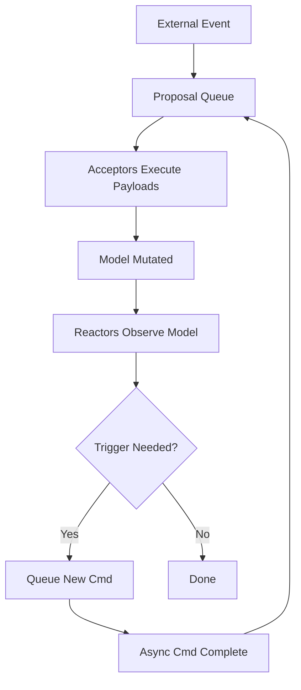
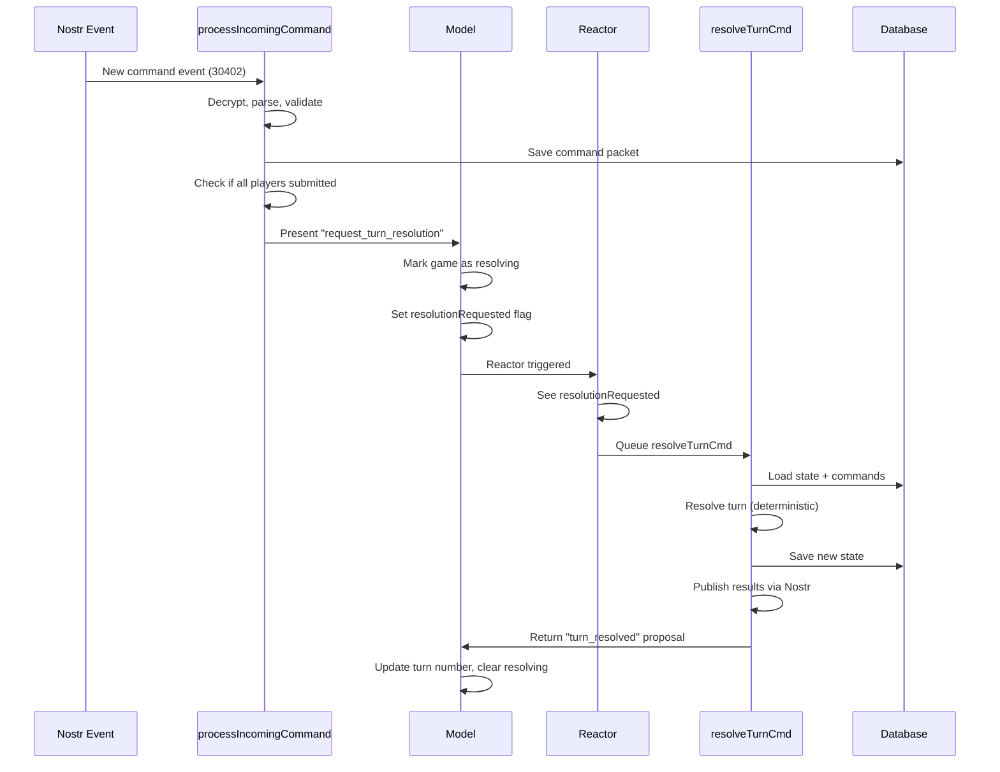
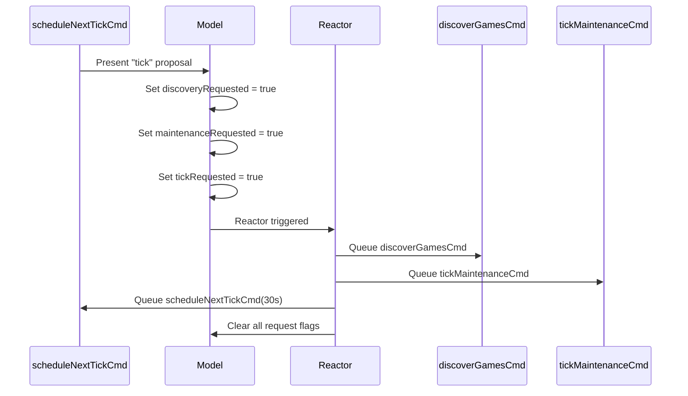

# EC4X Daemon SAM Architecture

**Status:** Implemented
**Pattern:** State-Action-Model (SAM)
**Last Updated:** 2026-01-18

---

## Table of Contents

1. [What is SAM?](#what-is-sam)
2. [Why SAM for EC4X Daemon](#why-sam-for-ec4x-daemon)
3. [Core SAM Concepts](#core-sam-concepts)
4. [Implementation Overview](#implementation-overview)
5. [SAM Flow Diagrams](#sam-flow-diagrams)
6. [Code Examples](#code-examples)
7. [Best Practices](#best-practices)
8. [Testing Strategy](#testing-strategy)

---

## What is SAM?

**SAM (State-Action-Model)** is a reactive pattern for managing application state with clear separation of concerns:

- **State**: Immutable application data
- **Actions**: Async operations that produce proposals
- **Model**: Pure mutations triggered by proposals

### Key Principles

1. **Unidirectional Data Flow**: Actions → Proposals → Acceptors → Model → Reactors
2. **Pure Mutations**: Model changes only happen in acceptor functions
3. **Async Isolation**: All I/O and side effects happen in async Cmd functions
4. **Reactive Side Effects**: Reactors observe model changes and queue new actions

### SAM vs TEA vs Redux

| Pattern | Async Handling | Side Effects | Rust/Elm Origin |
|---------|---------------|--------------|-----------------|
| **TEA** | Commands return messages | In update function | Elm Architecture |
| **Redux** | Middleware (thunks) | In middleware/effects | React ecosystem |
| **SAM** | Cmds return Proposals | In reactors | Jean-Jacques Dubray |

**EC4X uses SAM** because:
- Better async/await integration in Nim
- Clear separation: acceptors (pure) vs reactors (side effects)
- No middleware complexity

---

## Why SAM for EC4X Daemon

The daemon has unique requirements that make SAM ideal:

### Requirements

1. **Autonomous Operation**: Runs 24/7 without human intervention
2. **Concurrent Games**: Manages multiple games simultaneously
3. **Network I/O**: Nostr relays, database persistence
4. **Turn Resolution**: CPU-intensive, async turn processing
5. **Deadline Management**: Time-based auto-resolution

### SAM Benefits

- **Predictable State**: All mutations in one place (acceptors)
- **Testable**: Acceptors are pure functions
- **Debuggable**: Clear action → mutation → reaction flow
- **Scalable**: Easy to add new game types or transports

---

## Core SAM Concepts

### 1. Proposal[M]

A proposal is a **request to mutate the model**:

```nim
type
  Proposal*[M] = object
    name*: string                # Descriptive name for logging
    payload*: proc(m: var M)     # Mutation function
```

**Key Points:**
- Proposals are queued FIFO
- Payloads are **pure mutations** (no I/O, no side effects)
- Multiple proposals can be queued before processing

### 2. Acceptor[M]

An acceptor **executes proposal payloads**:

```nim
type
  Acceptor*[M] = proc(model: var M, proposal: Proposal[M]): bool
```

**Responsibilities:**
- Execute proposal payload
- Mutate model
- Return `true` if model changed

**Constraints:**
- Must be pure (no I/O, no global state access)
- Only place where model mutations occur
- Fast execution (no blocking operations)

### 3. Reactor[M]

A reactor **observes model state and triggers side effects**:

```nim
type
  Reactor*[M] = proc(model: M, dispatch: proc(p: Proposal[M]))
```

**Responsibilities:**
- Check model flags/states
- Queue async Cmds via `daemonLoop.queueCmd()`
- Clear flags via `dispatch()` (presents new proposals)

**Patterns:**
```nim
# Reactor example: check flag, queue Cmd, clear flag
proc daemonReactor(model: DaemonModel,
    dispatch: proc(p: Proposal[DaemonModel])) =
  if model.discoveryRequested:
    daemonLoop.queueCmd(discoverGamesCmd(model.dataDir))
    dispatch(Proposal[DaemonModel](
      name: "clear_discovery_request",
      payload: proc(m: var DaemonModel) =
        m.discoveryRequested = false
    ))
```

### 4. Cmd[M]

A command is an **async operation that returns a Proposal**:

```nim
type
  Cmd*[M] = proc (): Future[Proposal[M]]
```

**Responsibilities:**
- Perform I/O (database, network, file system)
- Execute long-running computations (turn resolution)
- Handle errors gracefully
- Return proposal with results

**Example:**
```nim
proc resolveTurnCmd(gameId: GameId): DaemonCmd =
  proc (): Future[Proposal[DaemonModel]] {.async.} =
    try:
      let state = loadFullState(dbPath)
      let commands = loadOrders(dbPath, state.turn)
      let result = resolveTurnDeterministic(state, commands)
      saveFullState(state)

      return Proposal[DaemonModel](
        name: "turn_resolved",
        payload: proc(m: var DaemonModel) =
          m.games[gameId].turn = state.turn
          m.resolving.excl(gameId)
      )
    except CatchableError as e:
      logError("Daemon", "Resolution failed: ", e.msg)
      return Proposal[DaemonModel](
        name: "resolution_failed",
        payload: proc(m: var DaemonModel) =
          m.resolving.excl(gameId)
      )
```

### 5. SamLoop[M]

The SAM container that orchestrates everything:

```nim
type
  SamLoop*[M] = ref object
    model*: M
    acceptors*: seq[Acceptor[M]]
    reactors*: seq[Reactor[M]]
    proposalQueue*: seq[Proposal[M]]
    cmdQueue*: seq[Future[Proposal[M]]]
```

**API:**
```nim
proc present*[M](sam: SamLoop[M], proposal: Proposal[M])
  ## Queue a proposal for processing

proc queueCmd*[M](sam: SamLoop[M], cmd: Cmd[M])
  ## Queue an async command

proc process*[M](sam: SamLoop[M])
  ## Main loop iteration - call repeatedly (e.g., every 100ms)
```

---

## Implementation Overview

### File Structure

```
src/daemon/
├── sam_core.nim          # Generic SAM types + loop
├── daemon.nim            # DaemonModel + business logic
├── config.nim            # Configuration loading
├── identity.nim          # Nostr keypair management
├── subscriber.nim        # Nostr event ingestion
├── publisher.nim         # Nostr event publishing
├── persistence/
│   ├── reader.nim        # Load game state from SQLite
│   ├── writer.nim        # Save game state to SQLite
│   └── schema.nim        # Database schema
├── parser/
│   └── kdl_commands.nim  # Parse KDL command syntax
└── transport/nostr/
    ├── client.nim        # Nostr relay client
    ├── crypto.nim        # NIP-44 encryption
    └── events.nim        # Event construction
```

### DaemonModel Structure

```nim
type
  DaemonModel* = object
    # Core state
    games*: Table[GameId, GameInfo]
    resolving*: HashSet[GameId]
    running*: bool

    # Configuration
    dataDir*: string
    pollInterval*: int
    turnDeadlineMinutes*: int

    # Transport
    identity*: DaemonIdentity
    nostrClient*: NostrClient
    nostrSubscriber*: Subscriber
    nostrPublisher*: Publisher

    # Reactor triggers (SAM side effects)
    resolutionRequested*: HashSet[GameId]
    discoveryRequested*: bool
    maintenanceRequested*: bool
    tickRequested*: bool
```

**Reactor Trigger Pattern:**
- Proposal payloads set flags (e.g., `model.discoveryRequested = true`)
- Reactors check flags and queue Cmds
- Reactors clear flags via `dispatch()`

### Main Loop

```nim
proc mainLoop(...) {.async.} =
  daemonLoop = newDaemonLoop(...)

  # Register acceptor
  daemonLoop.addAcceptor(proc(model: var DaemonModel,
      proposal: Proposal[DaemonModel]): bool =
    proposal.payload(model)
    return true
  )

  # Register reactor
  daemonLoop.addReactor(proc(model: DaemonModel,
      dispatch: proc(p: Proposal[DaemonModel])) =
    # Handle resolution requests, discovery, maintenance, etc.
    # See daemon.nim:526-618 for full implementation
  )

  # Start tick chain
  daemonLoop.queueCmd(scheduleNextTickCmd(0))

  # Main loop
  while daemonLoop.model.running and not shutdownRequested:
    daemonLoop.process()   # Poll Cmds, process proposals, run reactors
    await sleepAsync(100)   # Non-blocking poll
```

---

## SAM Flow Diagrams

### High-Level Flow



### Turn Resolution Flow



### Tick Cycle



---

## Code Examples

### Example 1: Simple Proposal

```nim
# Set a flag in the model
daemonLoop.present(Proposal[DaemonModel](
  name: "request_discovery",
  payload: proc(m: var DaemonModel) =
    m.discoveryRequested = true
))
```

### Example 2: Async Cmd with Error Handling

```nim
proc loadGameDataCmd(gameId: GameId): DaemonCmd =
  proc (): Future[Proposal[DaemonModel]] {.async.} =
    try:
      let data = await loadGameFromNetwork(gameId)
      return Proposal[DaemonModel](
        name: "game_loaded",
        payload: proc(m: var DaemonModel) =
          m.games[gameId] = data
      )
    except NetworkError as e:
      logError("Network", "Failed to load game: ", e.msg)
      return Proposal[DaemonModel](
        name: "game_load_failed",
        payload: proc(m: var DaemonModel) =
          m.failedGames.incl(gameId)
      )
```

### Example 3: Reactor with Multiple Triggers

```nim
daemonLoop.addReactor(proc(model: DaemonModel,
    dispatch: proc(p: Proposal[DaemonModel])) =
  # Handle multiple request types
  if model.resolutionRequested.len > 0:
    for gameId in model.resolutionRequested:
      if gameId notin model.resolving:
        daemonLoop.queueCmd(resolveTurnCmd(gameId))
    # Clear requests
    let requestedGames = model.resolutionRequested
    dispatch(Proposal[DaemonModel](
      name: "clear_resolution_requests",
      payload: proc(m: var DaemonModel) =
        for gameId in requestedGames:
          m.resolutionRequested.excl(gameId)
    ))

  if model.discoveryRequested:
    daemonLoop.queueCmd(discoverGamesCmd(model.dataDir))
    dispatch(Proposal[DaemonModel](
      name: "clear_discovery_request",
      payload: proc(m: var DaemonModel) =
        m.discoveryRequested = false
    ))
)
```

---

## Best Practices

### DO ✅

1. **Acceptors: Pure Mutations Only**
   ```nim
   # ✅ GOOD
   payload: proc(m: var DaemonModel) =
     m.games[gameId].turn = newTurn
     m.resolving.excl(gameId)
   ```

2. **Cmds: Handle All Errors**
   ```nim
   # ✅ GOOD
   try:
     # ... I/O work
     return Proposal(name: "success", payload: ...)
   except CatchableError as e:
     logError("...", e.msg)
     return Proposal(name: "failure", payload: ...)
   ```

3. **Reactors: Check Flags, Queue Cmds, Clear Flags**
   ```nim
   # ✅ GOOD
   if model.needsSync:
     daemonLoop.queueCmd(syncCmd())
     dispatch(Proposal(name: "clear_sync_flag", payload: ...))
   ```

4. **Use Descriptive Proposal Names**
   ```nim
   # ✅ GOOD: Clear intent
   name: "turn_resolved"
   name: "game_discovered"
   name: "resolution_failed"
   ```

### DON'T ❌

1. **Acceptors: No I/O or Side Effects**
   ```nim
   # ❌ BAD: I/O in acceptor payload
   payload: proc(m: var DaemonModel) =
     updateDatabase(gameId, newTurn)  # ❌ I/O!
     m.games[gameId].turn = newTurn
   ```

2. **Cmds: No Model Mutations**
   ```nim
   # ❌ BAD: Direct model mutation in Cmd
   proc badCmd(): DaemonCmd =
     proc (): Future[Proposal[DaemonModel]] {.async.} =
       daemonLoop.model.games[id] = ...  # ❌ Violation!
   ```

3. **Reactors: No Blocking Operations**
   ```nim
   # ❌ BAD: Blocking operation in reactor
   if model.needsData:
     let data = loadFromDatabase()  # ❌ Blocks the loop!
     daemonLoop.queueCmd(...)
   ```

4. **Don't Queue Cmds from Acceptors**
   ```nim
   # ❌ BAD: Side effect in acceptor
   payload: proc(m: var DaemonModel) =
     m.count.inc()
     daemonLoop.queueCmd(someCmd())  # ❌ Should be in reactor!
   ```

---

## Testing Strategy

### Unit Tests: Acceptors

Test pure mutations in isolation:

```nim
test "tick proposal increments tick count":
  var model = DaemonModel(tickCount: 0)
  let proposal = tickProposal()
  proposal.payload(model)
  check model.tickCount == 1
```

### Unit Tests: Cmd Error Handling

Test error paths:

```nim
test "resolveTurnCmd handles missing game":
  let cmd = resolveTurnCmd("nonexistent")
  let proposal = waitFor cmd()
  check proposal.name == "resolution_failed"
```

### Integration Tests: Full Cycle

Test proposal → acceptor → reactor flow:

```nim
test "turn resolution full cycle":
  let loop = initTestDaemonLoop("test_data")
  loop.present(Proposal[DaemonModel](
    name: "request_turn_resolution",
    payload: proc(m: var DaemonModel) =
      m.resolutionRequested.incl(gameId)
  ))

  # Process loop until Cmd completes
  for i in 0..100:
    loop.process()
    await sleepAsync(10)

  check loop.model.games[gameId].turn == expectedTurn
```

### Regression Tests

Ensure no SAM violations:

```nim
test "resolveTurnCmd does not mutate model directly":
  # Verify no direct model access in Cmd
  # This requires code review or static analysis
```

---

## Troubleshooting

### Common Issues

**Issue:** Cmd never completes
**Cause:** Async exception swallowed
**Fix:** Always wrap Cmd in try/except, return error proposal

**Issue:** Model mutation doesn't trigger reactor
**Cause:** Reactor only runs after acceptor completes
**Fix:** Ensure flag is set in proposal payload

**Issue:** Race condition (multiple Cmds for same game)
**Cause:** Guard check outside of proposal
**Fix:** Move guard check into proposal payload (atomic)

---

## Further Reading

- [SAM Pattern](http://sam.js.org/) - Original specification by Jean-Jacques Dubray
- [Elm Architecture](https://guide.elm-lang.org/architecture/) - TEA inspiration
- [Redux](https://redux.js.org/) - Similar pattern for React

---

**Last Updated:** 2026-01-18
**Maintainer:** EC4X Development Team
