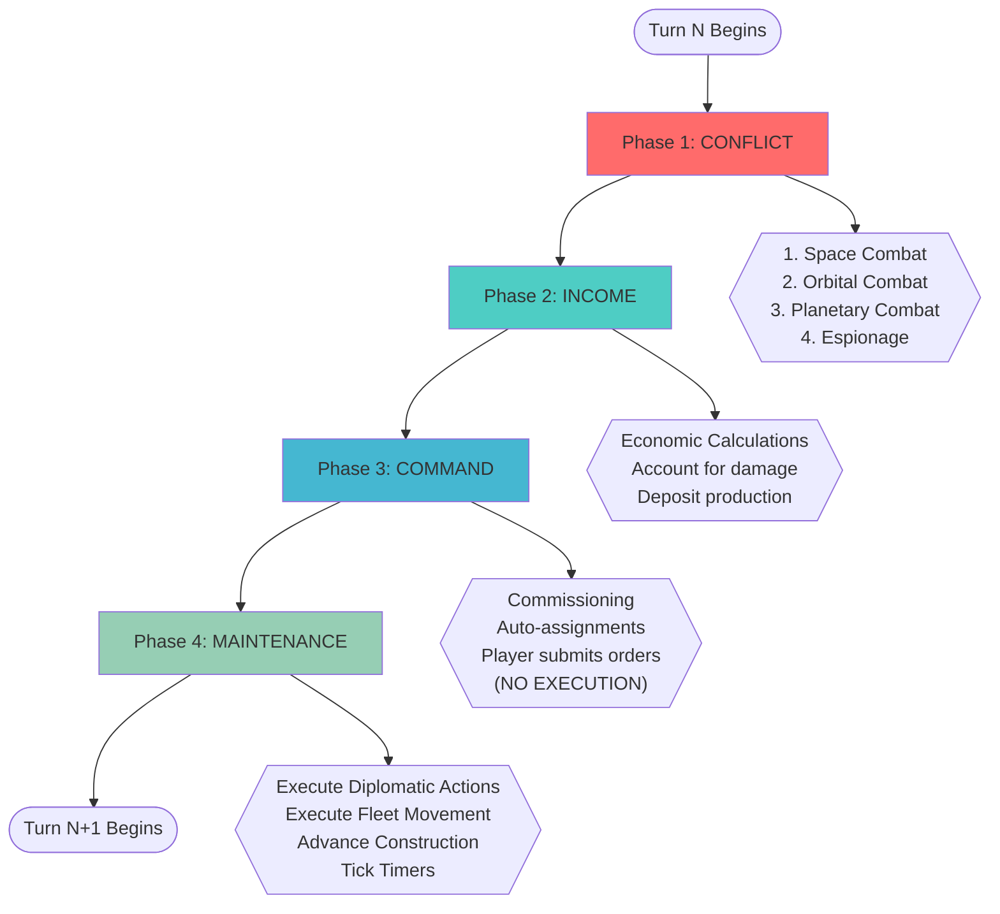
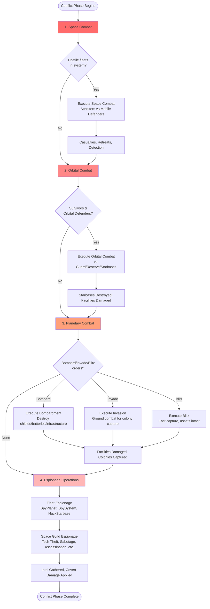
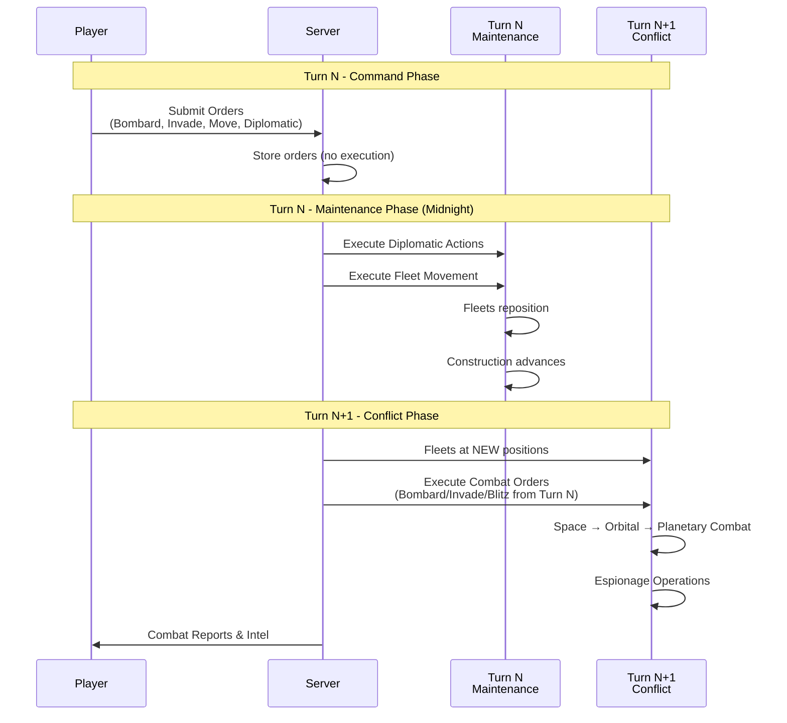
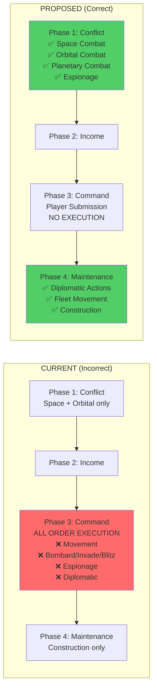
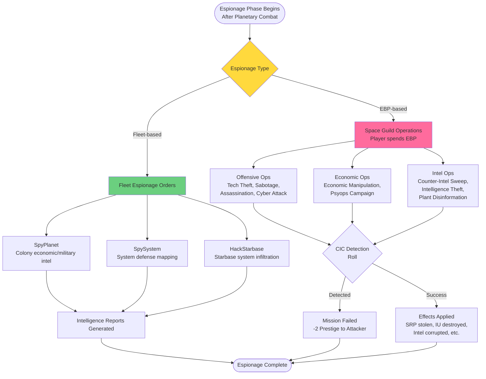
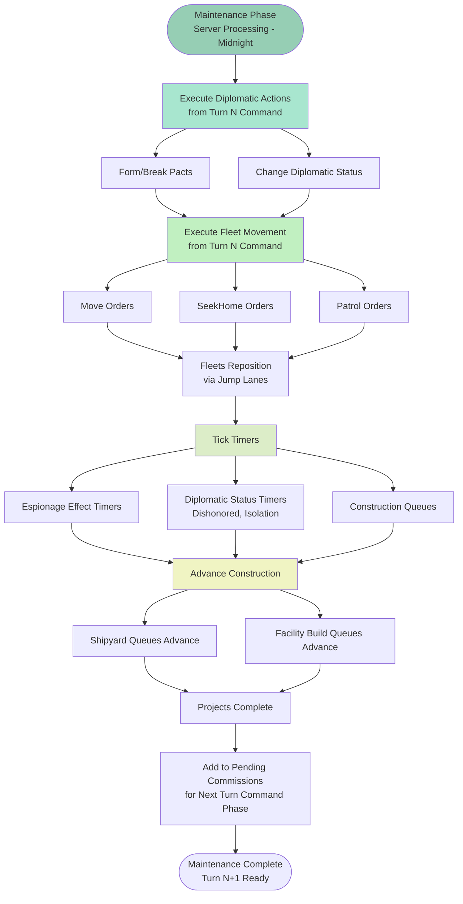

# Phase Order Analysis - Spec vs. Implementation

**Date:** 2025-12-06
**Purpose:** Verify turn resolution phase order matches design specification

---

## SPECIFICATION (Correct Flow)

### Turn N:

**1. Conflict Phase:**
- Fleets at positions from Turn N-1 Maintenance Phase movement
- Combat resolution (in order):
  1. Space Combat (attackers vs mobile defenders)
  2. Orbital Combat (survivors vs guard/reserve/starbases)
  3. Planetary Combat (Bombard/Invade/Blitz orders from Turn N-1 execute)
  4. Espionage Operations (collect after-action intel):
     - **Fleet-based espionage:** SpyPlanet, SpySystem, HackStarbase (scout intel)
     - **Space Guild espionage:** EBP-based covert ops (Tech Theft, Sabotage, Assassination, Cyber Attack, Economic Manipulation, Psyops, Counter-Intel, Intelligence Theft, Plant Disinformation)
- Units destroyed, facilities damaged, espionage effects applied

**2. Income Phase:**
- Economic calculations
- Accounts for damage from Conflict Phase
- Production deposited to treasury

**3. Command Phase:**
- **Pre-player:** Commissioning, auto-assignments (clear dock space)
- **Player actions:** Review intelligence reports, submit orders for Turn N+1
- **Orders submitted, NOT executed** (no server processing)

**4. Maintenance Phase** (Server processing - e.g. midnight):
- Diplomatic actions execute (orders from Turn N Command)
- Fleet movement executes (orders from Turn N Command)
- Repairs progress (ships NOT released until after Turn N+1 Conflict)
- Construction advances
- Upkeep costs deducted
- Timers tick

### Turn N+1:
**1. Conflict Phase:**
- Fleets at NEW positions (from Turn N Maintenance movement)
- Combat with Bombard/Invade/Blitz orders from Turn N Command
- Espionage collects intel on new combat

---

## ARCHITECTURAL DIAGRAMS

### Diagram 1: Turn Phase Flow (Correct Architecture)



### Diagram 2: Conflict Phase Detailed Flow



### Diagram 3: Order Execution Timeline (Multi-Turn Flow)



### Diagram 4: Current vs. Proposed Architecture



### Diagram 5: Espionage Architecture



### Diagram 6: Maintenance Phase (Server Processing)



---

## REFERENCE TABLES

### Table 1: Phase Comparison (Current vs. Proposed)

| Phase | Current (Incorrect) | Proposed (Correct) | Status |
|-------|---------------------|-------------------|---------|
| **1. Conflict** | Space + Orbital combat only | ✅ Space Combat<br/>✅ Orbital Combat<br/>✅ Planetary Combat (Bombard/Invade/Blitz)<br/>✅ Espionage (Fleet + Space Guild) | ❌ Missing planetary combat & espionage |
| **2. Income** | Economic calculations | ✅ Economic calculations | ✅ Correct |
| **3. Command** | ❌ Fleet movement execution<br/>❌ Bombard/Invade/Blitz execution<br/>❌ Espionage execution<br/>❌ Diplomatic action execution<br/>✅ Commissioning<br/>✅ Build order generation | ✅ Commissioning<br/>✅ Auto-assignments<br/>✅ Player order submission<br/>❌ No execution | ❌ Should NOT execute orders |
| **4. Maintenance** | ✅ Construction advancement<br/>✅ Timer ticks | ✅ Diplomatic action execution<br/>✅ Fleet movement execution<br/>✅ Construction advancement<br/>✅ Timer ticks | ❌ Missing diplomatic & movement |

### Table 2: Order Execution Timing

| Order Type | Submitted | Executed | Phase | Notes |
|------------|-----------|----------|-------|-------|
| **Move** | Turn N Command | Turn N Maintenance | Phase 4 | Fleet repositions before Turn N+1 Conflict |
| **SeekHome** | Turn N Command | Turn N Maintenance | Phase 4 | Retreat to friendly system |
| **Patrol** | Turn N Command | Turn N Maintenance | Phase 4 | Multi-system patrol route |
| **Bombard** | Turn N Command | Turn N+1 Conflict | Phase 1 (Step 3) | After space/orbital combat |
| **Invade** | Turn N Command | Turn N+1 Conflict | Phase 1 (Step 3) | After space/orbital combat |
| **Blitz** | Turn N Command | Turn N+1 Conflict | Phase 1 (Step 3) | After space/orbital combat |
| **SpyPlanet** | Turn N Command | Turn N+1 Conflict | Phase 1 (Step 4) | After planetary combat |
| **SpySystem** | Turn N Command | Turn N+1 Conflict | Phase 1 (Step 4) | After planetary combat |
| **HackStarbase** | Turn N Command | Turn N+1 Conflict | Phase 1 (Step 4) | After planetary combat |
| **Space Guild Espionage** | Turn N Command | Turn N+1 Conflict | Phase 1 (Step 4) | After planetary combat |
| **Diplomatic Actions** | Turn N Command | Turn N Maintenance | Phase 4 | Pact formation/breaking |
| **Colonize** | Turn N Command | Turn N Command | Phase 3 | Immediate (colonization is non-combat) |
| **Build Orders** | Turn N Command | Turn N Maintenance → N+1 Command | Phase 4 → Phase 3 | Queue advances in Maintenance, commissions in Command |

### Table 3: Space Guild Espionage Operations

| Operation | EBP Cost | Effect | Duration | Detection Penalty |
|-----------|----------|--------|----------|-------------------|
| Tech Theft | 5 | Steal 10 SRP from target research | Instant | -2 Prestige if detected |
| Sabotage (Low) | 2 | Destroy 1d6 Industrial Units | Instant | -2 Prestige if detected |
| Sabotage (High) | 7 | Destroy 1d20 Industrial Units | Instant | -2 Prestige if detected |
| Assassination | 10 | Reduce target SRP gain by 50% | 1 turn | -2 Prestige if detected |
| Cyber Attack | 6 | Cripple target starbase | Instant | -2 Prestige if detected |
| Economic Manipulation | 6 | Halve target NCV | 1 turn | -2 Prestige if detected |
| Psyops Campaign | 3 | Reduce target tax revenue by 25% | 1 turn | -2 Prestige if detected |
| Counter-Intel Sweep | 4 | Block enemy intel gathering | 1 turn | N/A (defensive) |
| Intelligence Theft | 8 | Steal entire enemy intel database | Instant | -2 Prestige if detected |
| Plant Disinformation | 6 | Corrupt enemy intel 20-40% variance | 2 turns | -2 Prestige if detected |

*Note: EBP = Espionage Budget Points (40 PP each). Maximum 1 espionage action per turn.*

### Table 4: Implementation Checklist

| Component | File(s) | Action | Priority | Status |
|-----------|---------|--------|----------|--------|
| **Conflict Phase: Planetary Combat** | `resolve.nim:378-394` | Remove `when false:`, enable execution | Critical | ⏳ Pending |
| **Conflict Phase: Espionage** | `resolve.nim:313-376` | Remove `when false:`, enable execution | Critical | ⏳ Pending |
| **Command Phase: Remove Bombard/Invade/Blitz** | `resolve.nim:683-748` | Remove execution, keep submission | Critical | ⏳ Pending |
| **Command Phase: Remove Espionage** | `resolve.nim:561-574` | Move to Conflict Phase | Critical | ⏳ Pending |
| **Command Phase: Remove Diplomatic** | `resolve.nim:817-848` | Move to Maintenance Phase | High | ⏳ Pending |
| **Command Phase: Remove Movement** | `resolve.nim:667` | Move to Maintenance Phase | Critical | ⏳ Pending |
| **Maintenance Phase: Add Diplomatic** | `economy_resolution.nim:544+` | Add diplomatic action execution | High | ⏳ Pending |
| **Maintenance Phase: Add Movement** | `economy_resolution.nim:544+` | Add fleet movement execution | Critical | ⏳ Pending |
| **Testing: Phase Order** | New test file | Verify correct execution order | Critical | ⏳ Pending |
| **Testing: Multi-Turn Orders** | New test file | Verify 1-turn delay for combat orders | High | ⏳ Pending |
| **Testing: Event Generation** | Existing tests | Verify conquest events generated | Critical | ⏳ Pending |
| **Documentation: Update Specs** | `docs/specs/gameplay.md` | Update phase descriptions | Medium | ⏳ Pending |

### Table 5: Conflict Phase Step-by-Step

| Step | Operation | Inputs | Outputs | Events Generated |
|------|-----------|--------|---------|------------------|
| **1. Space Combat** | `resolveBattle()` | Hostile fleets, diplomatic status | Casualties, retreats, cloaked detection | Battle, SpaceCombat |
| **2. Orbital Combat** | `resolveBattle()` | Survivors, orbital defenders, starbases | Starbase destruction, facility damage | OrbitalCombat, StarbaseDestroyed |
| **3a. Bombardment** | `resolveBombardment()` | Fleet AS, shields, batteries | Shield/battery/IU destruction | Bombardment |
| **3b. Invasion** | `resolveInvasion()` | Marines, defending armies, batteries | Colony capture, 50% IU loss | SystemCaptured, InvasionRepelled |
| **3c. Blitz** | `resolveBlitz()` | Marines, defending forces | Colony capture, 0% IU loss | ColonyCaptured, InvasionRepelled |
| **4a. Fleet Espionage** | `resolveEspionage()` | Scout fleets, CIC levels | Intelligence reports | SpySuccess, SpyDetected |
| **4b. Space Guild Espionage** | `processEspionageActions()` | EBP spending, CIC levels | Resource theft, sabotage effects | EspionageSuccess, EspionageDetected |

### Table 6: File Modification Summary

| File | Current Lines | Changes Required | New Lines | Complexity |
|------|--------------|------------------|-----------|------------|
| `resolve.nim` | 856 | Re-enable Conflict Phase blocks, remove Command Phase execution | ~50 added, ~150 removed | High |
| `economy_resolution.nim` | 642 | Add diplomatic + movement execution to Maintenance | ~100 added | Medium |
| `simultaneous_planetary.nim` | 163 | Update comments (no logic changes needed) | ~10 modified | Low |
| `simultaneous_espionage.nim` | Unknown | Update comments (no logic changes needed) | ~10 modified | Low |
| `CLAUDE.md` | Current | Update phase order documentation | ~20 added | Low |
| `docs/specs/gameplay.md` | Current | Update phase descriptions | ~30 modified | Low |

---

## CURRENT IMPLEMENTATION (To Be Verified)

### resolve.nim Lines 166-201:

```nim
# Phase 1: Conflict (combat, infrastructure damage, espionage)
resolveConflictPhase(result.newState, effectiveOrders, result.combatReports, result.events, rng)

# Phase 2: Income (resource collection)
resolveIncomePhase(result.newState, effectiveOrders)

# Phase 3: Command (commissioning → build orders → fleet orders → diplomatic actions)
resolveCommandPhase(result.newState, effectiveOrders, result.combatReports, result.events, rng)

# Phase 4: Maintenance (upkeep, effect decrements, status updates, queue advancement)
let completedProjects = resolveMaintenancePhase(result.newState, result.events, effectiveOrders)
```

### Files to Analyze:
1. `src/engine/resolve.nim` - Phase 1 (Conflict)
2. `src/engine/resolution/economy_resolution.nim` - Phases 2 & 4 (Income, Maintenance)
3. `src/engine/resolve.nim` - Phase 3 (Command)

---

## PHASE-BY-PHASE ANALYSIS

### Phase 1: Conflict Phase (resolve.nim:232-394)

**What it SHOULD do:**
- Space Combat
- Orbital Combat
- Planetary Combat (Bombard/Invade/Blitz)

**What it CURRENTLY does:**
- Line 245-299: Detect hostile fleets, trigger battles
- Line 303: `resolveBattle(state, systemId, ...)` - Space & Orbital combat only
- Line 305-339: Spy scout travel
- Line 341-357: Salvage recovery
- Line 361-394: Bombardment/Invasion resolution (**CURRENTLY IN CONFLICT PHASE - VERIFY IF CORRECT**)

**Status:** ⚠️ NEEDS VERIFICATION
- Does `resolveBattle()` include Planetary Combat?
- Lines 361-394 handle bombardment/invasion - is this the right place?

---

### Phase 2: Income Phase (economy_resolution.nim:829+)

**What it SHOULD do:**
- Economic calculations
- Account for Conflict Phase damage

**What it CURRENTLY does:**
- TBD (need to read economy_resolution.nim)

**Status:** ⏳ PENDING ANALYSIS

---

### Phase 3: Command Phase (resolve.nim:398-856)

**What it SHOULD do:**
- Commissioning (pre-player)
- Auto-assignments (pre-player)
- Player submits orders (not executed)
- Diplomatic actions

**What it CURRENTLY does:**
- Line 405-408: Commissioning ✅
- Line 410-469: Build order generation ✅
- Line 471-534: Simultaneous resolution (colonization, planetary combat, blockades, espionage)
- Line 575-815: **Fleet order EXECUTION** ❌ (should be in Maintenance Phase?)
- Line 817-848: Diplomatic actions ✅

**Status:** ❌ INCORRECT
- Fleet orders execute in Command Phase
- Should only submit orders, execute in Maintenance Phase

---

### Phase 4: Maintenance Phase (economy_resolution.nim:544+)

**What it SHOULD do:**
- Repairs
- Construction advances
- Upkeep costs
- **Fleet movement execution**

**What it CURRENTLY does:**
- TBD (need to read economy_resolution.nim)

**Status:** ⏳ PENDING ANALYSIS

---

## KEY QUESTIONS

1. **Conflict Phase:** Does `resolveBattle()` include Planetary Combat (Bombard/Invade/Blitz)?
   - If yes, why is there separate handling at lines 361-394?
   - If no, where should Planetary Combat execute?

2. **Command Phase:** Fleet orders execute here (lines 575-815). Should they?
   - Spec says orders are submitted, not executed
   - Movement should happen in Maintenance Phase

3. **Maintenance Phase:** Does it handle fleet movement?
   - Need to read economy_resolution.nim to verify

4. **Commissioning:** Currently happens in Command Phase (line 405). Correct?
   - Spec says "before player gives orders" - seems correct

---

## NEXT STEPS

1. Read `resolveBattle()` in combat_resolution.nim - check for Phase 3 Planetary Combat
2. Read `resolveIncomePhase()` in economy_resolution.nim
3. Read `resolveMaintenancePhase()` in economy_resolution.nim
4. Create correction plan based on findings

---

## FINDINGS

### Finding 1: Bombard/Invade/Blitz MOVED from Conflict → Command Phase
**File:** `resolve.nim:378-394`
**Evidence:** Disabled code block (`when false:`) with comment:
```
# NOTE: Now handled by SIMULTANEOUS PLANETARY COMBAT RESOLUTION (see Command Phase)
# This sequential loop is deprecated and will be removed
```
**Status:** ❌ INCORRECT - Should execute in Conflict Phase (Phase 1), not Command Phase (Phase 3)

### Finding 2: Fleet Movement Executes in Command Phase
**File:** `resolve.nim:667` (calls `resolveMovementOrder()`)
**Evidence:** Movement happens during fleet order execution in Command Phase
**Status:** ❌ INCORRECT - Should execute in Maintenance Phase (Phase 4)

### Finding 3: Maintenance Phase Missing Fleet Movement
**File:** `economy_resolution.nim:544-642`
**Evidence:** Only handles: espionage effect timers, diplomatic proposals, population transfers, terraforming, diplomatic status updates, construction queue advancement
**Status:** ❌ INCOMPLETE - Should execute fleet movement orders

---

## PROPOSED CHANGES

### Change 1: Restore Conflict Phase Order (Combat → Espionage)
**Action:** Re-enable planetary combat AND espionage in Conflict Phase (proper sequence)
**Files to Modify:**
1. `resolve.nim:378-394` - Remove `when false:`, enable planetary combat execution
2. `resolve.nim:313-376` - Remove `when false:`, enable espionage execution
3. `resolve.nim:Command Phase` - Remove Bombard/Invade/Blitz + espionage handling

**Implementation:**
```nim
# In resolveConflictPhase() - Execute in order:

# 1. Space & Orbital Combat
for systemId in combatSystems:
  resolveBattle(state, systemId, orders, combatReports, events, rng)

# 2. Planetary Combat (after space/orbital cleared)
for houseId in state.houses.keys:
  if houseId in orders:
    for order in orders[houseId].fleetOrders:
      case order.orderType
      of FleetOrderType.Bombard:
        resolveBombardment(state, houseId, order, events)
      of FleetOrderType.Invade:
        resolveInvasion(state, houseId, order, events)
      of FleetOrderType.Blitz:
        resolveBlitz(state, houseId, order, events)
      else:
        discard

# 3. Espionage Operations (collect after-action intel)
# 3a. Fleet-based espionage (scout intel gathering)
#     - SpyPlanet: Gather colony economic/military data
#     - SpySystem: Map system defenses and fleet presence
#     - HackStarbase: Infiltrate starbase systems for detailed intel
simultaneous_espionage.resolveEspionage(state, orders, rng)

# 3b. Space Guild espionage (EBP-based covert operations)
#     - Tech Theft (5 EBP): Steal 10 SRP from target research
#     - Sabotage Low/High (2/7 EBP): Destroy 1d6/1d20 Industrial Units
#     - Assassination (10 EBP): Reduce target SRP gain by 50% for 1 turn
#     - Cyber Attack (6 EBP): Cripple target starbase
#     - Economic Manipulation (6 EBP): Halve target NCV for 1 turn
#     - Psyops Campaign (3 EBP): Reduce target tax revenue by 25% for 1 turn
#     - Counter-Intel Sweep (4 EBP): Block enemy intel gathering for 1 turn
#     - Intelligence Theft (8 EBP): Steal entire enemy intel database
#     - Plant Disinformation (6 EBP): Corrupt enemy intel 20-40% for 2 turns
simultaneous_espionage.processEspionageActions(state, orders, rng)
```

**Rationale:**
- Espionage happens LAST so scouts can observe combat results and Space Guild operatives can exploit post-battle chaos
- Fleet espionage provides intelligence on enemy capabilities
- Space Guild espionage disrupts enemy operations through covert actions
- Both types collect/apply effects based on combat outcomes (casualties, damage, weakened defenses)

### Change 2: Move Fleet Movement + Diplomatic Actions to Maintenance Phase
**Action:** Execute ALL player orders in Maintenance Phase (server processing time)
**Files to Modify:**
1. `economy_resolution.nim` - Add fleet movement + diplomatic action execution to `resolveMaintenancePhase()`
2. `resolve.nim:Command Phase` - Remove order execution AND diplomatic actions

**Implementation:**
```nim
# In resolveMaintenancePhase() - Server processes all player orders at maintenance time:
# 1. Execute diplomatic actions
for houseId in state.houses.keys:
  if houseId in orders:
    for action in orders[houseId].diplomaticActions:
      processDiplomaticAction(state, houseId, action, events)

# 2. Execute fleet movement orders
for houseId in state.houses.keys:
  if houseId in orders:
    for order in orders[houseId].fleetOrders:
      case order.orderType
      of FleetOrderType.Move, FleetOrderType.SeekHome, FleetOrderType.Patrol:
        resolveMovementOrder(state, houseId, order, events)
      else:
        discard
```

### Change 3: Update Command Phase
**Action:** Command Phase = Player submission ONLY (no server processing)
**Files to Modify:**
1. `resolve.nim:Command Phase` - Keep only: commissioning, auto-assignments, build order generation

**Result:**
- Orders submitted in Command Phase
- Movement executes in Maintenance Phase (Phase 4)
- Combat orders execute in next turn's Conflict Phase (Phase 1)

---

## EXECUTION FLOW (After Changes)

### Turn N:
**Phase 1: Conflict**
- Fleets at positions from Turn N-1 Maintenance movement
- 1. Space Combat → 2. Orbital Combat → 3. Planetary Combat
- **Bombard/Invade/Blitz orders (from Turn N-1) execute**
- 4. **Espionage operations** (collect after-action intel):
  - Fleet espionage: Scout intel gathering (SpyPlanet, SpySystem, HackStarbase)
  - Space Guild espionage: EBP-based covert ops (sabotage, tech theft, assassination, etc.)
- Units destroyed, facilities damaged, espionage effects applied

**Phase 2: Income**
- Economic calculations
- Account for Conflict Phase damage

**Phase 3: Command**
- Commissioning (clear dock space)
- Auto-assignments
- Build order generation
- **Player submits orders for Turn N+1** (no server processing)

**Phase 4: Maintenance** (Server processes all orders at maintenance time, e.g. midnight)
- **Diplomatic actions execute**
- **Fleet movement orders execute**
- Espionage/diplomatic timers tick
- Construction queues advance
- Fleets reposition

### Turn N+1:
**Phase 1: Conflict**
- Fleets at NEW positions (from Turn N Maintenance)
- **Combat orders from Turn N execute**
- ...

---

## TESTING PLAN

1. **Unit Tests:**
   - Phase order validation
   - Fleet movement in Maintenance Phase
   - Planetary combat in Conflict Phase

2. **Integration Tests:**
   - Full turn cycle with bombardment orders
   - Multi-turn fleet movement → combat sequence
   - Verify conquest events generated

3. **Balance Tests:**
   - Run 20-game batch with bombardment/invasion scenarios
   - Verify conquest tracking in diagnostics CSV

---

## RISKS & MITIGATIONS

### Risk 1: Timing Issues
**Problem:** Orders submitted in Turn N execute in Turn N+1
**Mitigation:** Verify all order validation accounts for 1-turn delay

### Risk 2: Breaking Existing AI
**Problem:** AI may submit orders expecting immediate execution
**Mitigation:** Review AI order generation (RBA) for timing assumptions

### Risk 3: Simultaneous Resolution
**Problem:** Current simultaneous resolution in Command Phase may conflict with Conflict Phase execution
**Mitigation:** Move simultaneous resolution to Conflict Phase OR keep for conflict detection only

---

## NEXT STEPS

1. ✅ Analysis complete
2. ⏳ User approval of proposed changes
3. ⏳ Implement Change 1 (Bombard/Invade/Blitz to Conflict)
4. ⏳ Implement Change 2 (Movement to Maintenance)
5. ⏳ Implement Change 3 (Simplify Command Phase)
6. ⏳ Testing & validation
7. ⏳ Update documentation
