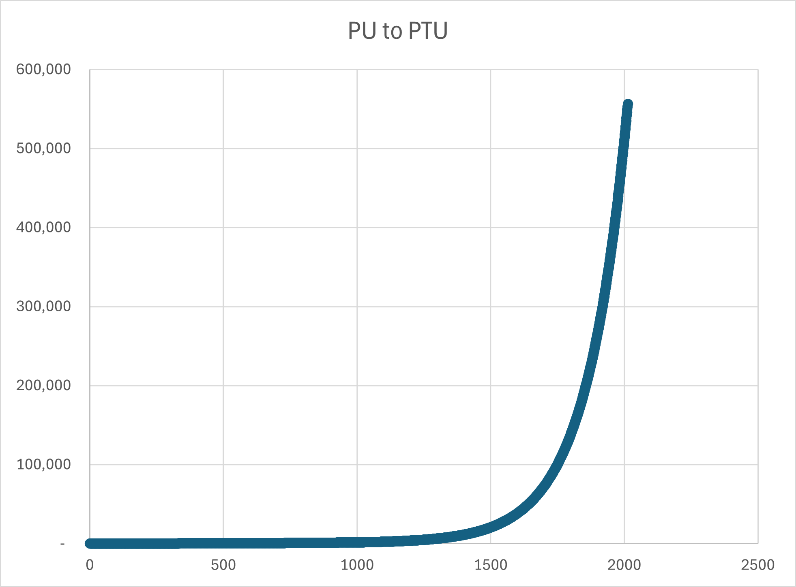
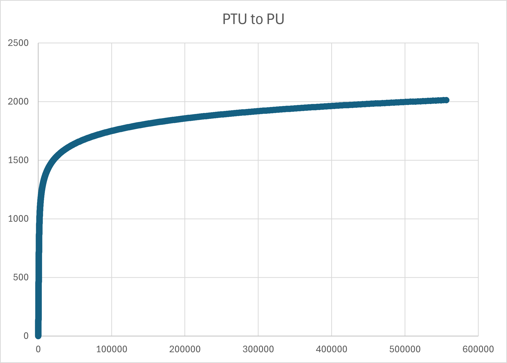

# 3.0 Economics

Reckless fiat monetary policy left the former Empire in ruins. Demagoguery, excessive money printing, deficit spending, out of control socialist entitlements, and simple greed by bureaucratic elites led directly to revolution and collapse. The Empire cannibalized itself from the inside out. As Archon, your obligation is to rebuild from the ashes and lead your House to prosperity.

The standard unit of account in EC4X is the Production Point (PP).

The economic power of your House is fueled by productivity, industrial capacity, and technological growth. Your strategic decisions around taxation, industrial investment, and research & development (R&D) directly impact your economic output and military strength.

Production points settle instantaneously through the Cipher Ledger - a cryptographic network operating on quantum-entangled nodes embedded in jump lane stabilizers. Houses mint blind-signature PP tokens that route through secure lane channels, enabling instant private settlement while maintaining complete opacity to rival intelligence agencies.

## 3.1 Principles

**Population Unit (PU)**: The productive capacity of a colony's population, measured in abstract economic units rather than raw headcount.

**Population Transfer Unit (PTU)**: The number of people required to generate one PU of productive capacity. As colonies grow larger, diminishing returns mean more people are needed per unit of production - efficiency gains, quality of life improvements, and specialization mean individuals produce less marginal output even as total wealth grows. One PTU represents approximately 50,000 souls.

The PTU-to-PU ratio increases exponentially with colony size. Small colonies are highly efficient - each PTU you send generates substantial PU. Large colonies suffer diminishing returns - adding more people yields proportionally less production.

**Strategic consequence**: Transferring colonists from mature worlds to new colonies is advantageous. The mother world loses relatively few PUs while the daughter colony gains significant productive capacity. This incentivizes colonial expansion rather than concentrating population on homeworlds.

For planet classification and maximum PU capacity by planet class, see [Section 2.2](02-assets.md#22-solar-systems).

**Minimum Viable Colony**: A colony requires a minimum population of 5,000 souls to remain viable. If a colony's population falls below this threshold (through combat losses, starvation, or other attrition), the colony collapses and is abandoned.

The relationship between PU and PTU is exponential. As the population grows the laws of diminishing returns take effect and the amount of production generated per individual is reduced. People are doing less work while the colony continues to slowly gain wealth. Think of gains in efficiency, productivity, and quality of life. 

This model is dis-inflationary; inflation asymptotically approaches zero over time.

A high PTU to PU ratio is an advantage when transferring colonists from larger planets to smaller planets. The mother-colony is able to contribute a relatively large number of people to the new colony without a significant loss of production to itself.

The equations (in Python) for converting PU to PTU:

```python
PTU = pu - 1 + np.exp(0.00657 * pu)
```

Code for converting PTU back to PU:

```python
import numpy as np
from scipy.special import lambertw

PTU = 100000 #example

def logsumexp(x):
    c = x.max()
    return c + np.log(np.sum(np.exp(x - c)))

x = np.float64(657*(PTU + 1)/100000)

pu = -100000/657*lambertw((657*np.exp(x - logsumexp(x)))/100000) + PTU + 1
```

An Excel spreadsheet is included in the GitHub 'assets' folder to visualize the relationship. You need to have "Python in Excel" enabled for Excel. TODO: standalone Python scripts will be provided in the repo.




**Gross Colony Output (GCO)**: The total economic output of a colony, expressed in production points. GCO is determined by the productivity of the colony, industrial investments, resource availability, and technological enhancements.

```
GCO = (PU × RAW_INDEX) + (IU × EL_MOD × CST_MOD × (1 + PROD_GROWTH))
```

Where:

- PU: Population Units of the colony
- RAW_INDEX: Resource quality index based on the solar system's mineral abundance.
- CST_MOD: Construction tech capacity modifier = 1.0 + (CST_level - 1) × 0.10 
- IU: Industrial Units at the colony
- EL_MOD: Economic Level Modifier, based on the colony's EL tech level
- PROD_GROWTH: Productivity growth rate influenced by the tax rate

**RAW INDEX Table**

<!-- RAW_MATERIAL_TABLE_START -->

| RAW       | RAW ACR | Eden (EDN) | Lush (LSH) | Benign (BEN) | Harsh (HRH) | Hostile (HOS) | Desolate (DES) | Extreme (EXT) |
| --------- |:------:|:----------:|:----------:|:-----------:|:----------:|:------------:|:-------------:|:------------:|
| Very Poor | VPR    | 60%        | 60%        | 60%         | 60%        | 60%          | 60%           | 60%          |
| Poor      | POR    | 80%        | 75%        | 70%         | 65%        | 64%          | 63%           | 62%          |
| Abundant  | ABN    | 100%       | 90%        | 80%         | 70%        | 68%          | 66%           | 64%          |
| Rich      | RCH    | 120%       | 105%       | 90%         | 75%        | 72%          | 69%           | 66%          |
| Very Rich | VRH    | 140%       | 120%       | 100%        | 80%        | 76%          | 72%           | 68%          |

*Source: config/economy.kdl [rawMaterialEfficiency] section*

<!-- RAW_MATERIAL_TABLE_END -->

Look up the Raw Material classification of your colony's system in the RAW column, and cross index with the planet's habitable conditions.

**Gross House Output (GHO)**: The sum total of all colony GCO.

## 3.2 Tax Rate

Each turn in the Income Phase you set a House-wide tax rate from 0% to 100%. Your tax rate determines how much of a colony's Gross Colony Output (GCO) is collected as Production Points (PP) for your treasury.

**Tax Collection**  
PP Income = Total GCO across all colonies × Tax Rate (rounded up)

Higher tax rates generate more immediate revenue but anger your population. Lower rates slow short-term spending power but accelerate long-term growth and prestige.

### 3.2.1 High-Tax Prestige Penalty

Every Income Phase the game applies a prestige penalty based on the **current turn's tax rate** using an exponential formula:

```
penalty = -floor(0.01 × (taxRate - 50)²)
```

<!-- TAX_PENALTY_TABLE_START -->

| Current Tax Rate | Prestige Penalty |
| ---------------- | ---------------- |
| ≤ 50%            | 0                |
| 60%              | -1               |
| 70%              | -4               |
| 80%              | -9               |
| 90%              | -16              |
| 100%             | -25              |

*Source: config/prestige.kdl [taxPenalty] section*

<!-- TAX_PENALTY_TABLE_END -->

The exponential curve punishes extreme tax rates more heavily than moderate ones.

### 3.2.2 Low-Tax Incentives

To reward benevolent or populist rule, colonies grant bonuses in the same Income Phase based on the **tax rate set this turn**:

<!-- TAX_INCENTIVE_TABLE_START -->

| Tax Rate This Turn | Population Growth Bonus (multiplier to natural 2% base) | Bonus Prestige per Colony This Turn |
| ------------------ | ------------------------------------------------------- | ----------------------------------- |
| 41 – 50 %          | No bonus                                                | –                                   |
| 31 – 40 %          | ×1.05 (+5 %)                                            | –                                   |
| 21 – 30 %          | ×1.10 (+10 %)                                           | +1                                  |
| 11 – 20 %          | ×1.15 (+14 %)                                           | +2                                  |
| 0 – 10 %           | ×1.20 (+19 %)                                           | +3                                  |

*Source: config/prestige.kdl [tax_incentives] and config/economy.kdl [taxPopulationGrowth] sections*

<!-- TAX_INCENTIVE_TABLE_END -->

With multiple big colonies, low taxes become a legitimate prestige-farming strategy that can outpace military victories in the late game.

## 3.3 Net Colony Value (NCV) and Treasury Management

Net Colony Value (NCV): Represents the net tax revenue collected from each colony.

```
NCV = GCO × tax rate
```

Net House Value (NHV): The sum total of all NCVs across the player's colonies. NHV is transferred to the House treasury at the beginning of each turn.

## 3.4 Industrial Units and Productivity Growth

Industrial Units (IU) represent manufacturing capacity - factories, shipyards, supply chains, and industrial infrastructure. IU directly boosts GCO through the production formula.

**Passive IU Growth:**

Colonies naturally develop industrial infrastructure as populations grow and economies mature:

```
IU Growth per Turn = max(2, floor(PU / 50)) × tax multiplier × (1 + starbase bonus)
```

Where:

- Tax multiplier = `(1 - tax_rate)` (e.g., 50% tax → 0.5 multiplier)
- Starbase bonus = 0.05 per operational starbase, max 0.15 (3 starbases)

High taxes throttle industrial development. Low taxes accelerate it. For starbase economic benefits, see [Section 2.4.4](02-assets.md#244-starbases).

**Active IU Investment:**

You can accelerate industrial development by spending PP directly:

```
IU purchased = PP spent
```

Each PP you spend converts directly to one IU at your target colony. Investment is immediate and takes effect in the same turn's GCO calculation.

**Strategic Considerations:**

Young colonies benefit most from IU investment—the multiplier effect on GCO is strongest when baseline production is low. Mature colonies with high PU already generate substantial GCO from population alone; IU investment has diminishing returns but remains useful for maintaining economic growth.

## 3.5 Population Growth

Population naturally increases each turn via birthrate, modified by tax policy and infrastructure:

```
PU Growth per Turn = max(2, floor(PU × 0.30 × tax_multiplier × (1 + starbase_bonus)))
```

Where:

- Base birthrate = 30% per turn
- Tax multiplier from [Section 3.2.2](#322-low-tax-incentives)
- Starbase bonus = 0.05 per operational starbase, max 0.15 (3 starbases)

**Active Population Transfer:**

You can move PTU between colonies to accelerate development. Due to the exponential PTU-to-PU relationship, your mature colonies can export large numbers of people while losing minimal PU, and young colonies gain substantial productive capacity from each PTU received.

**Transportation:**

You transport PTU via two methods:

1. **Environmental Transformation and Colonization ships (ETACs)**: Plant new colonies. See [Section 2.3.2.3](02-assets.md#23223-environmental-transformation-and-colonization-etac) for unit specifications.

2. **Space Guild contracts**: Move PTU between established colonies. The neutral Space Guild facilitates civilian population transfers between your colonies for a fee.

**Guild Transfer Costs:**

Transfer cost is based on the destination planet's habitability class:

| Planet Class | Cost (PP per PTU) |
|--------------|-------------------|
| Eden         | 4 PP             |
| Lush         | 5 PP             |
| Benign       | 6 PP             |
| Harsh        | 8 PP             |
| Hostile      | 10 PP            |
| Desolate     | 12 PP            |
| Extreme      | 15 PP            |

**Transit Time:** Guild transports follow normal starmap traversal rules through jump lanes. The transfer time depends on the distance between source and destination colonies. This mechanic is abstracted from the player - you pay upfront and receive confirmation when the colonists arrive.

**Transfer Edge Cases:**

| Event | Result |
|-------|--------|
| Source Colony Conquered | Transfer continues (Guild already paid, neutral status) |
| Destination Colony Conquered | Colonists lost as refugees |
| Destination Colony Blockaded | Rerouted to nearest friendly colony |
| Destination Colony Collapsed | Rerouted to nearest friendly colony |

## 3.6 Fighter Economics

Fighter capacity is determined by colony industrial capacity and House technology:

```
Max Fighters per Colony = floor(IU / 100) × FD_MULTIPLIER
```

Where:

- **IU**: Industrial Units at the colony
- **FD_MULTIPLIER**: From Fighter Doctrine (FD) research [Section 4.12](04-research_development.md#412-fighter-doctrine-fd)

**No Infrastructure Required**: Fighters are built planet-side via distributed manufacturing. No spaceports, shipyards, or starbases required.

**Capacity Enforcement**: Colonies exceeding capacity receive 2-turn grace period, then oldest Fighters auto-disband with no salvage value.

**Construction Cost:**

Each Fighter costs **5 PP** to commission.

**Maintenance:**

Fighters have zero ongoing maintenance cost. Once built, they're free to operate.

**Carriers:**

Fighters can be loaded onto carriers for mobility. Carrier capacity depends on carrier type and Advanced Carrier Operations (ACO) technology. See [Section 2.4.1](02-assets.md#241-fighters--carriers) for carrier loading mechanics and [Section 4.13](04-research_development.md#413-advanced-carrier-operations-aco) for ACO research.

**Strategic Considerations:**

Fighters are cost-effective early-game defenders and remain relevant throughout the campaign. Large mature colonies can field dozens of Fighters, creating formidable defensive positions. Industrial capacity (IU) determines your maximum fighter complement—colonies with high IU investment can support massive fighter wings, while underdeveloped colonies are limited to token forces.

## 3.7 Facility Construction Economics

**Spaceports:**

- **Cost**: 20 PP
- **Construction Time**: 1 turn
- **Construction Capacity**: 5 simultaneous docks
- **Planet-side ship construction penalty**: +100% PP cost to launch ships into orbit
- **Cannot repair ships** - construction only

**Shipyards:**

- **Cost**: 60 PP
- **Construction Time**: 2 turns
- **Prerequisite**: Requires operational Spaceport at colony
- **Construction Capacity**: 10 simultaneous docks
- **Orbital construction**: Standard PP costs, no penalties
- **Cannot repair ships** - construction only

**Drydocks:**

- **Cost**: 150 PP
- **Construction Time**: 2 turns
- **Prerequisite**: Requires operational Spaceport at colony
- **Repair Capacity**: 10 simultaneous docks
- **Ship repairs**: 25% of ship's original PP cost, 1 turn duration (only Drydocks can repair ships)
- **Cannot construct ships** - repair only

**Construction Capacity Scaling:**

All three facilities' dock counts scale with Construction (CST) technology level. See [Section 4.5](04-research_development.md#45-construction-cst) for CST research progression and capacity multipliers.

For detailed facility capabilities and construction rules, see [Sections 5.0-5.4](05-construction.md#50-construction).

## 3.8 Research & Development Investment

You allocate PP to three research pools during the Income Phase. PP is converted to Research Points (RP) based on your Gross House Output (GHO) and Science Level (SL):

**PP to RP Conversion Formulas:**

```
ERP = PP × (1 + log₁₀(GHO)/3) × (1 + SL/10)
SRP = PP × (1 + log₁₀(GHO)/4) × (1 + SL/5)
TRP = PP × (1 + log₁₀(GHO)/3.5) × (1 + SL/20)
```

Where:
- **GHO**: Gross House Output (sum of all colony GCO)
- **SL**: Science Level (1-10)
- **log₁₀**: Base-10 logarithm (provides diminishing returns on economic scale)

**Logarithmic Scaling**: The logarithmic GHO bonus ensures that economic growth provides meaningful research advantages without creating runaway snowball effects. A House with 10x the GHO of a rival has only ~1.3x the research efficiency, not 10x.

**Economic Research Points (ERP)**: Improves your colony economic output through Economic Level (EL) technology. Each EL tier increases the economic multiplier applied to Industrial Units in the GCO formula. Benefits strongly from both GHO and SL bonuses (strongest GHO scaling).

**Science Research Points (SRP)**: Unlocks critical infrastructure and doctrinal technologies including Fighter Doctrine (FD), Advanced Carrier Operations (ACO), Cloaking (CLK), Electronic Intelligence (ELI), Shields (SLD), Terraforming (TER), and Strategic Lift (STL). Benefits from both GHO and SL bonuses (moderate GHO scaling, strong SL scaling).

**Technology Research Points (TRP)**: Advances weapons (WEP) and construction (CST) technologies. WEP improvements increase ship combat effectiveness. CST improvements increase facility construction capacity and unlock advanced hull classes. Benefits from both GHO and SL bonuses (moderate GHO scaling, modest SL scaling).

**Efficiency Scaling Examples:**

| GHO | ERP Bonus | SRP Bonus | TRP Bonus |
|-----|-----------|-----------|-----------|
| 100 | +67% | +50% | +57% |
| 1,000 | +100% | +75% | +86% |
| 10,000 | +133% | +100% | +114% |

**Key Insight**: Higher GHO and SL make research investment more efficient, but with diminishing returns. Economic dominance provides an advantage without making technological catch-up impossible. A modest research infrastructure (GHO ~1000) already captures most of the efficiency gains.

Research pools accumulate over multiple turns. Technologies require specific point thresholds and Science Level (SL) prerequisites to unlock. For complete research progression tables and technology effects, see [Section 4.0](04-research_development.md#40-research--development).

## 3.9 Maintenance Costs

All military assets require ongoing maintenance each turn. Maintenance costs are deducted from your treasury during the Income Phase, after resource collection.

**Fleet Maintenance**: Ships incur maintenance based on their class and current status. Active fleets pay full maintenance. Reserve fleets pay reduced maintenance. Mothballed fleets pay minimal maintenance for preservation and skeleton crews.

**Facility Maintenance**: Spaceports, shipyards, drydocks, and starbases require ongoing upkeep. Ground units (armies and marines) also incur maintenance costs.

**Crippled Ships**: Ships crippled by combat damage pay reduced maintenance (50% of base cost) until repaired.

Maintenance costs scale with your military power. Houses with large fleets and extensive infrastructure face proportionally higher upkeep obligations.

For specific maintenance rates by asset type, see `config/ships.kdl`, `config/facilities.kdl`, and `config/ground_units.kdl`.

## 3.9.1 Maintenance Shortfall Consequences

If your treasury cannot cover total maintenance costs, your House enters a maintenance shortfall crisis. The consequences are graduated and severe.

### Payment Processing

**Full Payment**: If treasury ≥ total maintenance, deduct full amount. All maintenance-crippled ships have their shortfall counters reset to zero, preventing salvage.

**Partial Payment**: If treasury < total maintenance, the house pays what it can. The payment ratio (treasury / total maintenance) determines what percentage of maintenance-crippled ships have their shortfall counters reset. Ships with lower counters (more recently crippled) are prioritized for restoration.

**No Payment**: If treasury = 0, no ships are restored. All existing maintenance-crippled ships continue countdown to salvage, and additional ships are crippled to cover the full shortfall.

### Shortfall Penalties

**Ship Crippling**: The oldest ships (lowest Ship IDs) are progressively crippled until the cumulative maintenance cost of crippled ships equals or exceeds the unpaid shortfall amount. These ships are marked with `CrippledReason: Maintenance` and begin a two-turn countdown to auto-salvage.

**Infrastructure Degradation**: Colonies suffer infrastructure damage proportional to the shortfall amount. Damaged infrastructure reduces production capacity until repaired.

**Consecutive Shortfall Tracking**: The house's consecutive shortfall turn counter increments. This counter resets to zero only when full maintenance is paid. Consecutive shortfalls impose escalating prestige penalties.

### Auto-Salvage System

Ships crippled by maintenance shortfall (not combat damage) enter a two-turn grace period:

- **Turn N**: Ship crippled due to shortfall (shortfallTurns = 1)
- **Turn N+1**: Counter increments (shortfallTurns = 2), unless partial payment resets it
- **Turn N+2**: Ship auto-salvaged if shortfallTurns ≥ 2

Auto-salvage destroys the ship and returns 50% of its production cost to the house treasury. The salvage value multiplier is configurable in `config/ships.kdl`.

**Recovery Mechanism**: Houses that resume full or partial maintenance payments can prevent salvage by resetting ship shortfall counters. Ships remain crippled but are preserved in your fleet, available for future repairs.

**Combat-Crippled Ships**: Ships crippled by battle damage (`CrippledReason: Combat`) are never auto-salvaged. They remain crippled until repaired at drydocks and do not count toward the shortfall salvage system.

---
