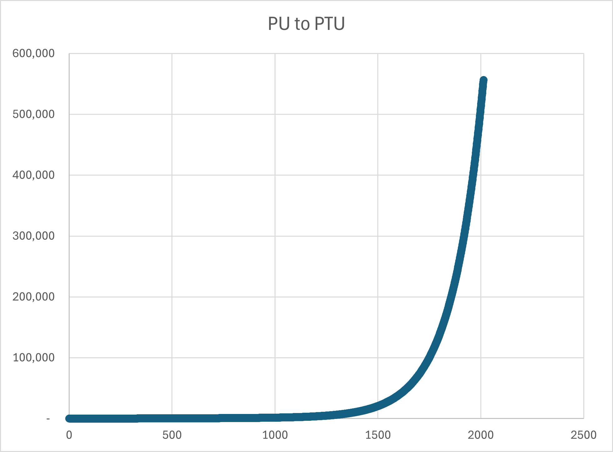

# 3.0 Economics

Reckless fiat monetary policy left the former Empire in ruins. Demagoguery, excessive money printing, deficit spending, out of control socialist entitlements, and simple greed by bureaucratic elites led directly to revolution and collapse. The Empire cannibalized itself from the inside out. As Duke your obligation is to rebuild from the ashes and lead your House to prosperity. 

The standard unit of account in EC4X the Production Point (PP).

The economic power of a House is fueled by productivity, industrial capacity, and technological growth. Strategic decisions around taxation, industrial investment, and research & development (R&D) will directly impact a player's economic output and military strength.

Production points settle near instantaneously on the inter-dimensional Phoenix network. (All comms and data transfers are instantaneous).

## 3.1 Principles

**Population Unit (PU)**: Represents a measure of economic production rather than raw population size.

**Population Transfer Unit (PTU)**: A quantity of people and their associated cost of cargo and equipment required to colonize a planet. One PTU is approximately 50k souls. 

The relationship between PTU and PU is exponential. As the population grows the laws of diminishing returns take effect and the amount of production generated per individual is reduced. People are doing less work while the colony continues to slowly gain wealth. Think of gains in efficiency, productivity, and quality of life. 

This model is dis-inflationary; inflation asymptotically approaches zero over time.

A high PTU to PU ratio is an advantage when transferring colonists from larger planets to smaller planets. The mother-colony is able to contribute a relatively large number of people to the new colony without a significant loss of production to itself. This incentives expanding population across newly acquired planets.

The equations (in Python) for converting PU to PTU:

```
  PTU = pu - 1 + np.exp(0.00657 * pu)
```

Code for converting PTU back to PU:

```
import numpy as np
from scipy.special import lambertw

PTU = 100000 #example

def logsumexp(x):
    c = x.max()
    return c + np.log(np.sum(np.exp(x - c)))

x = np.float64(657*(PTU + 1)/100000)

pu = -100000/657*lambertw((657*np.exp(x - logsumexp(x)))/100000) + PTU + 1
```

An Excel spreadsheet is included in the GitHub 'assets' folder to visualize the relationship. You need to have "Python in Excel" enabled for Excel. TODO: standalone Python scripts will be provided in the repo.




**Gross Colony Output (GCO)**: The total economic output of a colony, expressed in production points. GCO is determined by the productivity of the colony, industrial investments, resource availability, and technological enhancements.

```
GCO = (PU × RAW_INDEX) + (IU × EL_MOD × (1 + PROD_GROWTH))
```

Where:
- PU: Population Units of the colony
- RAW_INDEX: Resource quality index based on the solar system's mineral abundance. 
- IU: Industrial Units at the colony
- EL_MOD: Economic Level Modifier, based on the colony's EL tech level
- PROD_GROWTH: Productivity growth rate influenced by the tax rate

**RAW INDEX Table**

<!-- RAW_MATERIAL_TABLE_START -->
| RAW       | Eden | Lush | Benign | Harsh | Hostile | Desolate | Extreme |
| --------- |:----:|:----:|:------:|:-----:|:-------:|:--------:|:-------:|
| Very Poor | 60%  | 60%  |  60%   |  60%  |   60%   |   60%    |   60%   |
| Poor      | 80%  | 75%  |  70%   |  65%  |   64%   |   63%    |   62%   |
| Abundant  | 100% | 90%  |  80%   |  70%  |   68%   |   66%    |   64%   |
| Rich      | 120% | 105% |  90%   |  75%  |   72%   |   69%    |   66%   |
| Very Rich | 140% | 120% |  100%  |  80%  |   76%   |   72%    |   68%   |

*Source: config/economy.toml [raw_material_efficiency] section*
<!-- RAW_MATERIAL_TABLE_END -->

Look up the Raw Material classification of your colony's system in the RAW column, and cross index with the planet's habitable conditions.

**Gross House Output (GHO)**: The sum total of all colony GCO.

## 3.2 Tax Rate

Each turn in the Income Phase the player sets a House-wide tax rate from 0 % to 100 %. The tax rate determines how much of a colony’s Gross Colony Output (GCO) is collected as Production Points (PP) for the treasury.

**Tax Collection**  
PP Income = Total GCO across all colonies × Tax Rate (rounded up)

Higher tax rates generate more immediate revenue but anger the population. Lower rates slow short-term spending power but accelerate long-term growth and prestige.

### 3.2.1 High-Tax Prestige Penalty (Anti-Cycling Rule)

Every Income Phase the game calculates the **average tax rate over the current turn + the previous five turns** (rolling 6-turn window) and applies the following prestige penalty if the average is above 50 %:

<!-- TAX_PENALTY_TABLE_START -->
| Rolling 6-Turn Average Tax Rate | Prestige Penalty per Turn |
|---------------------------------|---------------------------|
| ≤ 50 %                          |             0             |
| 51 – 60 %                       |            -1             |
| 61 – 70 %                       |            -2             |
| 71 – 80 %                       |            -4             |
| 81 – 90 %                       |            -7             |
| 91 – 100 %                      |            -11            |

*Source: config/prestige.toml [tax_penalties] section*
<!-- TAX_PENALTY_TABLE_END -->

This penalty is applied every turn the qualifying average is met and cannot be avoided by short-term cycling.

### 3.2.2 Low-Tax Incentives (The Carrot)

To reward benevolent or populist rule, colonies grant bonuses in the same Income Phase based on the **tax rate set this turn**:

<!-- TAX_INCENTIVE_TABLE_START -->
| Tax Rate This Turn | Population Growth Bonus (multiplier to natural 2% base) | Bonus Prestige per Colony This Turn |
|--------------------|----------------------------------------------------------|-------------------------------------|
| 41 – 50 %          | No bonus                                                 |                  –                  |
| 31 – 40 %          | ×1.05 (+5 %)                                             |                  –                  |
| 21 – 30 %          | ×1.10 (+10 %)                                            |                 +1                  |
| 11 – 20 %          | ×1.15 (+14 %)                                            |                 +2                  |
| 0 – 10 %           | ×1.20 (+19 %)                                            |                 +3                  |

*Source: config/prestige.toml [tax_incentives] and config/economy.toml [tax_population_growth] sections*
<!-- TAX_INCENTIVE_TABLE_END -->

With multiple big colonies, low taxes become a legitimate prestige-farming strategy that can outpace military victories in the late game.

## 3.3 Net Colony Value (NCV) and Treasury Management

Net Colony Value (NCV): Represents the net tax revenue collected from each colony.

```
NCV = GCO × tax rate
```

Net House Value (NHV): The sum total of all NCVs across the player's colonies. NHV is transferred to the House treasury at the beginning of each turn.

### **3.4 Industrial Investments and Productivity Growth**

Investing in Industrial Units (IU) increases the manufacturing capacity of a colony, directly boosting GCO. The cost of IU investments scales based on the percentage of IU relative to the colony's PU.

<!-- IU_INVESTMENT_TABLE_START -->
| IU Investment (% of PU) | Cost Multiplier | PP  |
| ----------------------- |:---------------:|:---:|
| Up to 50%               | 1.0             | 15  |
| 51% - 75%               | 1.2             | 18  |
| 76% - 100%              | 1.5             | 23  |
| 101% - 150%             | 2.0             | 30  |
| 151% and above          | 2.5             | 38  |

*Source: config/economy.toml [industrial_investment] section*
<!-- IU_INVESTMENT_TABLE_END -->

## 3.5 Economic Level Modifier

R&D investments allow players to increase their Economic Level Modifier (EL_MOD), boosting overall productivity. Advancing tech levels requires significant PP investment but provides exponential benefits to GCO.

Refer to [Section 4.2](#42-economic-level-el) for cost and modifiers.

## 3.6 Population Growth

Colonists are hard at work making babies for the House, and the PTU growth rate under normal conditions is 1.5% per turn.

A logistical growth function is used for the calculation. Each planet class has an upper bound on the population it can support. This gives a nice 's' curve distribution, and lends incentive to terraform less hospitable planets.

[The Logistic Equation](https://michaelneuper.com/posts/modelling-population-growth-in-python/)


## 3.7 Colonization

ETACs plant a flag in unoccupied Solar Systems and set the initial conditions for terraforming. Their capacity to move PTU is limited to one unit.

The Space Guilds are contracted to transfer larger populations between existing Colonies in civilian Starliners. Passengers are kept in status to minimize living space, and all of their supplies and equipment for their new destination are tightly packed into the cargo hold.

The cost is expensive and dependent upon the livable conditions of the destination planet. The logistics are abstracted for game purposes; delivery time (turns) across jump lanes is in accordance with [Section 6.1](operations.md#61-jump-lanes).

<!-- COLONIZATION_COST_TABLE_START -->
| Conditions | PP/PTU |
| ---------- |:------:|
| Eden       | 4      |
| Lush       | 5      |
| Benign     | 6      |
| Harsh      | 8      |
| Hostile    | 10     |
| Desolate   | 12     |
| Extreme    | 15     |

*Source: config/economy.toml [colonization] section*
<!-- COLONIZATION_COST_TABLE_END -->

### Space Guild Population Transfer

The Space Guilds provide civilian Starliner services to transfer established populations between existing colonies. This service is separate from initial ETAC colonization and reflects the logistics of moving large populations with their equipment and supplies across interstellar distances.

**Transfer Costs:**

<!-- POPULATION_TRANSFER_COST_TABLE_START -->
| Planet Class | Base Cost (PP/PTU) | Cost per Jump* |
|:-------------|:------------------:|:---------------|
| Eden         | 4                  | Base × (1 + 0.2 × jumps) |
| Lush         | 5                  | Base × (1 + 0.2 × jumps) |
| Benign       | 6                  | Base × (1 + 0.2 × jumps) |
| Harsh        | 8                  | Base × (1 + 0.2 × jumps) |
| Hostile      | 10                 | Base × (1 + 0.2 × jumps) |
| Desolate     | 12                 | Base × (1 + 0.2 × jumps) |
| Extreme      | 15                 | Base × (1 + 0.2 × jumps) |

*Distance modifier: +20% per jump beyond first

*Source: config/population.toml [transfer_costs] and [transfer_modifiers] sections*
<!-- POPULATION_TRANSFER_COST_TABLE_END -->

**Transfer Mechanics:**

<!-- POPULATION_TRANSFER_MECHANICS_TABLE_START -->
| Mechanic | Value | Description |
|:---------|:------|:------------|
| **Transit Time** | 1 turn/jump | Minimum 1 turn even within same system |
| **Minimum PTU** | 1 PTU | Smallest transferable unit |
| **Source Reserve** | 1 PU | Source colony must retain at least this |
| **Concurrent Limit** | 5 transfers | Maximum active transfers per house |
| **Source Conquered** | Continue | Transfer proceeds (Guild is neutral) |
| **Dest Conquered** | Lost | PTUs lost (refugees disperse) |
| **Dest Blockaded** | Return | PTUs return to source |

*Source: config/population.toml [transfer_time], [transfer_limits], and [transfer_risks] sections*
<!-- POPULATION_TRANSFER_MECHANICS_TABLE_END -->

Colonists do not start contributing to the colony's economic production for at least one full turn after arrival.

## 3.8 Expenditures

Each turn, the Duke can allocate Treasury funds as follows:

1. Military: Construction and recruiting.
2. Spacelift Command: Bases and ships
3. Research and Development: Investment in new technologies.
4. Industrial Units (IU): Investment in colony manufacturing.
5. Terraforming: Costs for planetary upgrade projects.
6. Space Guild Services:
    - Population Transfer: Moving citizens to new colonies.
    - Espionage: Covert operations and intelligence gathering.
7. Counter Intelligence: Defense against espionage.
8. Savings & Investment: Financial reserves and investments for future growth.

## 3.9 Maintenance Costs

At the beginning of each turn, players pay maintenance costs for everything they own: ships, ground units, yards, bases and anything else that can be constructed. All costs are listed in the data tables in [Section 9](reference.md#90-data-tables).

Players are able to reduce maintenance costs by placing active duty ships on either reserve status or mothballing them:

Maintenance costs for reserve ships is reduced by half, are auto-assigned into squadrons, and join a reserve fleet with orders 05 to guard the closest planet. Reserve ships have their AS and DS reduced by half, but do not change combat state. Reserve fleets can not be moved, and ships must already be located at a colony in order to place them in reserve. Colonies are allotted a single fleet for reserve duty.

The maintenance cost for mothballed ships is zero. Mothballed ships are placed in orbit around a colony and taken offline. They are screened during combat and are unable to join the fight. Mothballed ships are vulnerable to destruction if there is no Task Force present to screen them.

The payment of maintenance costs is not optional. If a player is unable to pay maintenance, random fleets will start going offline and ordered to hold position (00). Ships in these fleets do not accept new orders and will suffer a reduction of combat state every turn they are offline.

For every turn that a player misses payment for maintenance they lose prestige points; refer to [Section 9.4](reference.md#94-prestige).

## 3.10 Fighter Squadron Economics

**Construction:**
- **Production Cost**: 20 PP per squadron
- **Construction Time**: 1 turn
- **Location**: Planet-side only (distributed manufacturing, no Spaceport required)

**Maintenance:**
- **Cost**: 1 PP per turn per squadron
- **Applies to**: All fighters (planet-based and embarked)
- **Payment**: Beginning of each turn with other military assets
- **Non-payment**: Squadrons disbanded (oldest first), no salvage value

**Fighter Capacity Constraints:**
- Max FS = floor(PU / 100) × FD Multiplier
- Infrastructure requirement: 1 operational Starbase per 5 FS (round up)
- Effective capacity = min(Population capacity, Infrastructure capacity)

**Capacity Impact by Status:**
- Planet-based fighters: Count against colony capacity
- Embarked fighters: Do NOT count against any colony capacity
- Combat-deployed (hostile systems): Do NOT count against enemy capacity

**Capacity Violations:**

Grace period: 2 turns to resolve violations from:
- Infrastructure loss (Starbase destroyed/crippled)
- Population loss (bombardment, transfer)

Resolution costs:
- Repair Starbase: 25% of Starbase PC (1 turn)
- Build Starbase: Full Starbase PC (3 turns)
- Transfer population: 4-15 PP per PTU (varies by planet class)
- Disband excess fighters: 0 PP (no salvage, loses 20 PP asset value per squadron)
- Carrier relocation: Carrier maintenance costs during transit

## 3.11 Maintenance & Tax Shortfall Consequences

Each Maintenance Phase the game first calculates total upkeep costs for all assets (fleet maintenance, Starbase upkeep, ground forces, planetary infrastructure, etc.) as defined in Sections 9.1–9.3.

Upkeep is deducted automatically from the House treasury. If the treasury contains insufficient Production Points to pay full upkeep, the following resolution order is applied immediately (player has no choice in prioritisation):

1. **Treasury is reduced to 0 PP.**
2. **All current-turn construction and research projects are cancelled** (no partial progress is retained; PP spent this turn are lost).
3. **Random fleet disbanding begins** until upkeep can be met:
   - The game randomly selects fleets (lowest ID first in case of ties).
   - Entire fleets are disbanded squadron-by-squadron.
   - Ships are salvaged for **25 % of their original Production Cost** (instead of the normal 50 % from Order 15 Salvage). Credits are added to the treasury immediately.
   - Disbanded fleets lose all orders and are removed from the map.
4. If disbanding all fleets is still insufficient (extremely rare), planetary infrastructure is stripped in this order until upkeep is met:
   - Industrial Units are removed (1 IU = 1 PP value)
   - Spaceports / Shipyards (salvaged for 25 % PC)
   - Starbases (salvaged for 25 % PC)
   - Ground defences and shields last

**Prestige Penalties for Missing Maintenance**
Missing full upkeep (i.e., any forced disbanding or asset stripping occurs) triggers escalating prestige losses applied at the end of the Maintenance Phase:

<!-- MAINTENANCE_SHORTFALL_TABLE_START -->
| Consecutive Turns of Missed Full Upkeep | Prestige Loss This Turn | Cumulative Example |
|-----------------------------------------|-------------------------|--------------------|
| 1st turn                                |                      -8 |                 -8 |
| 2nd consecutive turn                    |                     -11 |                -19 |
| 3rd consecutive turn                    |                     -14 |                -33 |
| 4th+ consecutive turn                   |                     -17 per turn | –50, –67, etc.       |

*Source: config/prestige.toml [penalties] section*
<!-- MAINTENANCE_SHORTFALL_TABLE_END -->

The counter resets only after a turn of **full upkeep payment with no forced disbanding**.

**Strategic Notes**
- A single turn of tax shortfall is survivable but painful.
- Two or more consecutive turns of shortfall spirals quickly into prestige collapse and potential elimination (prestige ≤ 0 for three turns → Defensive Collapse).
- Low-tax strategies (Section 3.2.2) that leave a large treasury buffer are the best defence against sudden blockade or bombardment income crashes.
- Players are encouraged to maintain at least 1–2 turns of upkeep in reserve at all times, especially during wartime.

This ensures that running sustained deficits is catastrophic (as intended), while giving benevolent low-tax empires a natural safety cushion through larger cash reserves and faster recovery.

## 3.12 House Combat Squadron Limit

Maximum Capital-Ship Squadrons + Carriers = Total House PU ÷ 100 (round down, minimum 8)

What counts:
- Every squadron that has a capital-ship flagship (CT and larger, including Raiders) = 1 slot
- Every carrier (CV / CX) that is NOT the flagship of a squadron = 1 slot

Players never pay double for the same carrier.

What does NOT count (completely unlimited except money / existing rules):
- Pure fighter squadrons (FS) – still only governed by Section 2.4.1 (per-colony PU + Starbases)
- Scouts (SC) – free to spam for espionage
- Starbases, ETACs, Troop Transports – unchanged


  
# 4.0 Research & Development

**CRITICAL: All technology levels start at level 1, never 0.** Starting tech values are configured in `config/tech.toml` under the `[starting_tech]` section. This applies to ALL nine technology types:

<!-- STARTING_TECH_TABLE_START -->
| Tech | Starting Level | Effect |
|------|----------------|--------|
| **EL** | 1 | Economic Level - 5% production bonus (GCO modifier) |
| **SL** | 1 | Science Level - Base research capability |
| **CST** | 1 | Construction Tech - Base shipyard capacity |
| **WEP** | 1 | Weapons Tech - Base combat strength (AS/DS) |
| **TER** | 1 | Terraforming Tech - Base terraforming capability |
| **ELI** | 1 | Electronic Intelligence - Base spy scout capability |
| **CIC** | 1 | Counter-Intelligence - Base espionage detection |
| **FD** | 1 | Fighter Doctrine I - 1.0x fighter capacity multiplier |
| **ACO** | 1 | Advanced Carrier Operations I - CV=3FS, CX=5FS |

*Source: config/tech.toml [starting_tech] section*
<!-- STARTING_TECH_TABLE_END -->

The starting tech configuration ensures consistent behavior across the engine. Game scenario files (e.g., `game_setup/standard.toml`) inherit these values. See [Section 9.11](#911-technology-research) for complete tech advancement tables.

## 4.1 Research Points (RP)

Each turn, players can invest production points in RP to further their R&D efforts.
R&D upgrades will be purchased in the first and seventh months of the Terran calendar, i.e. the first and seventh turns of each game year. Levels must be purchased in sequential order, and only one level per R&D area each upgrade cycle.

There are three areas of investment:
- Economic RP (ERP)
- Science RP (SRP)
- Technology RP (TRP)

Economic Levels (EL) are purchased with ERP and Science Levels (SL) are purchased with SRP. Science drives engineering, and new technologies are developed and purchased directly with TRP. EL and SL are correlated.

### 4.1.1 Research Breakthroughs

Technological progress can experience sudden leaps due to unexpected Research Breakthroughs. These moments of serendipity inject variability into the game, rewarding players for consistent investment in R&D and offering the chance for significant, game-altering advances.

**Research breakthroughs are triggered automatically twice per year**:

Bi-Annual Roll (Turn 1 and Turn 7):
- During the Income Phase of Turn 1 and Turn 7, the game system makes a 1d10 roll for each player per [Section 1.3.2](gameplay.md#132-income-phase).
- The base chance for a breakthrough is 10%.
- Players receive a +1% bonus for every 50 RP invested during the previous six turns (including ERP, SRP, and TRP combined).
- Breakthrough RP bonuses are immediately available for R&D purchases during the Command Phase of the same turn per [Section 1.3.3](gameplay.md#133-command-phase).

**Breakthrough Types and Dice Roll**:

If the breakthrough is successful, a second 1d10 roll determines the type of breakthrough achieved. Each result on the die corresponds to a specific breakthrough type:

| Dice Roll | Breakthrough Type           | Effect Description                                         |
|:---------:| --------------------------- | ---------------------------------------------------------- |
| 0-4       | **Minor Breakthrough**      | +10 ERP, SRP, or TRP based on the current investment focus |
| 5-6       | **Moderate Breakthrough**   | 20% reduction in TRP cost for the next technology upgrade  |
| 7-8       | **Major Breakthrough**      | Automatically advance the next SL or EL by 1 level         |
| 9         | **Revolutionary Discovery** | Unlocks a unique technology or double-level advancement    |

**Minor Breakthrough (0-4)**:

The player gains an additional +10 points in ERP, SRP, or TRP, depending on their current investment focus (whichever has the highest allocation). This boosts research progress without direct cost.

**Moderate Breakthrough (5-6)**:

The player receives a 20% reduction in TRP cost for the next technology upgrade, reflecting streamlined research processes. This provides a cost advantage in the upcoming tech level advancement.

**Major Breakthrough (7-8)**:
   
The player automatically advances the next SL or EL by 1 level, skipping the usual SRP or ERP cost. This represents a significant leap in understanding, allowing rapid progression in core economic or scientific capabilities.

**Revolutionary Discovery (9)**:
- **Quantum Computing**: Permanently increases EL_MOD by 10%.
- **Advanced Stealth Systems**: Grants Raiders an additional +2 detection difficulty.
- **Terraforming Nexus**: Increases colony growth rate by an additional 2% per turn.
- **Experimental Propulsion**: Allows crippled military ships to jump across **restricted lanes**, enhancing fleet mobility.

Example:

During Turn 7, the game system performs a Research Breakthrough Roll for each player. Player A has invested a total of 150 RP over the previous six turns, providing a +3% bonus to their roll (10% base + 3% investment bonus).  The player is successful, and the second roll on the table is a 9, resulting in a "Revolutionary Discovery." Player A unlocks Experimental Propulsion, allowing their crippled military ships to traverse restricted jump lanes, providing a significant strategic advantage in maneuverability.

## 4.2 Economic Level (EL)

EL represents the entrepreneurial skills and general education level of House citizens.

EL is not a specific reflection of scientific or technological advancement, although they are correlated.

A House's GHO benefits from EL upgrades by 5% per level, for a maximum of 50% at EL10+. The economy is tied to entrepreneurial ambition and citizen education.

The formula for ERP in production points is:

```
1 ERP = (5 + log(GHO)) PP
```

Example: to purchase 10 ERPs with a GHO of 500, the cost in production points is:

```
10 ERP = 10(5 + log(500)) = 77 PP
```

For EL1 to EL5 The cost in ERP to advance one EL level is:

```
ERP = 40 + EL(10)
```

After EL5 the cost increases linearly by 15 points per EL level.

<!-- ECONOMIC_LEVEL_TABLE_START -->
| EL  | ERP Cost | EL MOD |
|:---:|:--------:|:------:|
| 01 | 25       | 0.05   |
| 02 | 30       | 0.10   |
| 03 | 35       | 0.15   |
| 04 | 40       | 0.20   |
| 05 | 45       | 0.25   |
| 06 | 52       | 0.30   |
| 07 | 60       | 0.35   |
| 08 | 67       | 0.40   |
| 09 | 75       | 0.45   |
| 10 | 82       | 0.50   |
| 11+ | 90+      | 0.50   |

*Source: config/tech.toml [economic_level] section*
<!-- ECONOMIC_LEVEL_TABLE_END -->

## 4.3 Science Level (SL)

Science explores new knowledge methodically through observation and experimentation, in alignment with nature. SL is dependent on the education and skill levels of citizens, and thus EL. 

Advancing to the next SL requires the House have previously developed an equivalent level of EL. For example, advancing from SL1 to SL2 requires the house to be at EL2 or greater.

The cost of SRP is dependent upon the current SL.

```
1 SRP = 2 + SL(0.5) PP
```

Example: To purchase 10 SRPs at SL2, the price in production points is:

```
10 SRP = 10(2 + 2(0.5)) = 30 PP
```

For SL1 to SL5, the cost in SRP to advance one SL level is:

```
SRP = 20 + SL(5)
```

After SL5, the cost increases linearly by 10 per level.

<!-- SCIENCE_LEVEL_TABLE_START -->
| SL  | SRP Cost |
|:---:|:--------:|
| 01 | 12       |
| 02 | 15       |
| 03 | 17       |
| 04 | 20       |
| 05 | 22       |
| 06 | 27       |
| 07 | 32       |
| 08+ | 37+      |

*Source: config/tech.toml [science_level] section*
<!-- SCIENCE_LEVEL_TABLE_END -->

## 4.4 Technology Research Points (TRP)

Engineering is the practical application of science, and thus dependent upon advances in SL. Engineering advancements are made with direct investment in TRP.

In EC4X, advances in engineering are tied to the Military and Industrial complex, although development also carries over to commerce, mining, agriculture, industry, propulsion systems, computing, AI, robotics, services, medicine, and almost every other realm of material human flourishing.

The cost of TRP is dependent upon the required SL for the technology being developed [^2].

```
1 TRP = (5 + 4(SL))/10 + log(GHO) * 0.5 PP
```

For example, to purchase 5 TRPs towards the development TER3 with a GHO of 500, the price in production points is:

```
5 TRP = 5((5 + 4(3))/10 + log(500)(0.5)) = 15.25 PP
```

New engineering technologies are purchased directly with TRP.

\* Starting at Science Level 1 (SL1), each subsequent level of technology requires an additional 5 Technology Research Points (TRP) more than the previous level, with the initial cost being 25 TRP for the first level.

[^2]: **Game Designer Notes**:
As players expand their colonies, their NHV will grow. The logarithmic scaling with GHO allows for economic growth without making technology upgrades too cheap or too expensive, encouraging strategic planning around colonization and tech advancement.
If this formula results in too rapid or too slow of a tech progression, adjust the constant multiplier on the log term or change the base cost formula. The goal is to allow players to upgrade technologies in line with their economic growth while maintaining strategic depth.
For example, increasing the multiplier could make tech more expensive, encouraging slower but more impactful upgrades, whereas decreasing it could speed up tech progression, potentially making the game feel more dynamic but less strategic if not balanced correctly.
The TRP formula assumes a tax rate of 50% and a balanced budget of 40% Military, 30% R&D, 30% Other (Terraforming, Guild Services, CIC, 10% IU investment, etc..)
At 30% R&D EL,SL and every tech can be advanced every 1st and 7th month of the game as it becomes available. Excel file "ec4x_budget.xlsx" included in GitHub repo under "assets"
The formula will need testing and tweaking based on player feedback, especially concerning how it feels in terms of progression and economic strategy within the game.
Previously the formula used exp(GHO) * 0.0025 PP which grows the cost way too quickly in relation to GHO. Conversely, log(GHO) increases very slowly as GHO grows, and encourages a balanced economy where players can still feel the impact of economic growth on technology costs, but without the costs becoming too overwhelming. It allows for a more predictable and manageable progression.

## 4.5 Construction (CST)

Upgrades improve the construction capability and capacity of planet based factories, Spaceports, Shipyards. Existing units are upgraded at zero cost.

Construction capacity increases by 10% each level (round up).

CST will open up new, larger hulled classes of combat ships.

<!-- CST_TABLE_START -->
| CONSTRUCTION_TECH Level | SL  | TRP Cost |
|:---------:|:---:| -------- |
| CST1      | 1   | 12       |
| CST2      | 2   | 15       |
| CST3      | 3   | 17       |
| CST4      | 4   | 20       |
| CST5+     | 5   | \*22     |

*Source: config/tech.toml [construction_tech] section*
<!-- CST_TABLE_END -->

The maximum construction level is CST10.

### Construction Speed Bonus

CST tech reduces ship construction time by 10% per level:
- **Formula:** `ceiling(base_time × (1.0 - (CST_level - 1) × 0.10))`
- **Minimum:** 1 turn (construction never completes faster than 1 turn)
- **Example:** A Battleship (3 turns base) at CST5 takes `ceiling(3 × 0.6)` = 2 turns

This creates meaningful progression from early game (capitals take 4-5 turns) to late game (CST10 enables rapid construction of even the largest ships).

See [Section 9.1.1](reference.md#911-ship-construction-times) for complete construction time table.

## 4.6 Weapons (WEP)

Upgrades improve the Attack Strength (AS) and Defense Strength (DS) of combat ships by 10% for each Weapons level (rounded down).

For every WEP increase, Production Cost (PC) per unit increases by 10%.

Upgrades do not apply to preexisting ships; only new ships.

<!-- WEP_TABLE_START -->
| WEAPONS_TECH Level | SL  | TRP Cost |
|:---------:|:---:| -------- |
| WEP1      | 1   | 12       |
| WEP2      | 2   | 15       |
| WEP3      | 3   | 17       |
| WEP4      | 4   | 20       |
| WEP5+     | 5   | \*22     |

*Source: config/tech.toml [weapons_tech] section*
<!-- WEP_TABLE_END -->

The maximum WEP level is WEP10.

## 4.7 Terraforming (TER)

Terraforming improve a planet's livable conditions, and thus the population limit. There are seven Terraforming levels that correspond directly with the planet classes.

<!-- TER_TABLE_START -->
| TERRAFORMING_TECH Level | SL  | TRP Cost |
|:---------:|:---:| -------- |
| TER1      | 1   | 12       |
| TER2      | 2   | 15       |
| TER3      | 3   | 17       |
| TER4      | 4   | 20       |
| TER5      | 5   | 22       |
| TER6      | 6   | 25       |
| TER7      | 7   | 27       |

*Source: config/tech.toml [terraforming_tech] section*
<!-- TER_TABLE_END -->

After the tech is achieved, the cost to upgrade a planet is as follows:

<!-- TER_UPGRADE_COST_TABLE_START -->
| Planet Class | Required TER | PU        | PP   |
|:------------ |:------------:|:---------:|:----:|
| Extreme      | TER1         | 1 - 20    | NA   |
| Desolate     | TER2         | 21 - 60   | 60   |
| Hostile      | TER3         | 61 - 180  | 180  |
| Harsh        | TER4         | 181 - 500 | 500  |
| Benign       | TER5         | 501- 1k   | 1000 |
| Lush         | TER6         | 1k - 2k   | 1500 |
| Eden         | TER7         | 2001+     | 2000 |

*Source: config/tech.toml [terraforming_upgrade_costs] section*
<!-- TER_UPGRADE_COST_TABLE_END -->

Example: Upgrading from TER3 to TER4 requires 91 PP.

Planets do not skip a class in their terraforming development.

## 4.8 Electronic Intelligence (ELI)

ELI technology enables the detection of cloaked Raiders and enemy Scouts, and the gathering of intelligence from rival assets.

Upgrades do not apply to preexisting Starbases and Scouts.

<!-- ELI_TABLE_START -->
| ELECTRONIC_INTELLIGENCE Level | SL  | TRP Cost |
|:---------:|:---:| -------- |
| ELI1      | 1   | 12       |
| ELI2      | 2   | 15       |
| ELI3      | 3   | 17       |
| ELI4      | 4   | 20       |
| ELI5      | 5   | 22       |

*Source: config/tech.toml [electronic_intelligence] section*
<!-- ELI_TABLE_END -->

The maximum ELI level is ELI5.

## 4.9 Cloaking (CLK)

Cloaking enables Raiders to cloak their assigned fleets with increasing levels of probability.

Upgrades do not apply to preexisting Raiders.

<!-- CLK_TABLE_START -->
| CLOAKING_TECH Level | SL  | TRP Cost |
|:---------:|:---:| -------- |
| CLK1      | 3   | 17       |
| CLK2      | 4   | 20       |
| CLK3      | 5   | 22       |
| CLK4      | 6   | 25       |
| CLK5      | 7   | 27       |

*Source: config/tech.toml [cloaking_tech] section*
<!-- CLK_TABLE_END -->

The maximum CLK level is CLK5.

## 4.10 Planetary Shields (SLD)

Planetary Shields protect a colony from bombardment and invasion.

Upgrades do not apply to preexisting shields. Salvage and build a new one.

<!-- SLD_TABLE_START -->
| SHIELD_TECH Level | SL  | TRP Cost |
|:---------:|:---:| -------- |
| SLD1      | 3   | 17       |
| SLD2      | 4   | 20       |
| SLD3      | 5   | 22       |
| SLD4      | 6   | 25       |
| SLD5      | 7   | 27       |

*Source: config/tech.toml [shield_tech] section*
<!-- SLD_TABLE_END -->

The maximum SLD level is SLD5.

## 4.11 Counter Intelligence Command (CIC)

The CIC enhances security measures to shield the House from espionage threats posed by rivals.

<!-- CIC_TABLE_START -->
| COUNTER_INTELLIGENCE_TECH Level | SL  | TRP Cost |
|:---------:|:---:| -------- |
| CIC1      | 1   | 12       |
| CIC2      | 2   | 15       |
| CIC3      | 3   | 17       |
| CIC4      | 4   | 20       |
| CIC5      | 5   | 22       |

*Source: config/tech.toml [counter_intelligence_tech] section*
<!-- CIC_TABLE_END -->

The maximum CIC level is CIC5.

## 4.12 Fighter Doctrine (FD)

Fighter Doctrine represents advancements in tactical coordination, pilot training infrastructure, and logistics systems that enable colonies to support larger fighter wings.

**Research Progression:**

<!-- FD_TABLE_START -->
| Tech Level | Prerequisites | TRP Cost | SL Required | Capacity Multiplier |
|:----------:|--------------|:--------:|:-----------:|:-------------------:|
| FD I       | None         | N/A      | 1           | 1.0x                |
| FD II      | FD I         | 15       | 2           | 1.5x                |
| FD III     | FD II        | 17       | 3           | 2.0x                |

*Source: config/tech.toml [fighter_doctrine] section*
<!-- FD_TABLE_END -->

**FD I - Basic Fighter Operations**

Standard fighter squadron operations with conventional command structures. Base capacity determined by population and infrastructure.

**FD II - Advanced Fighter Operations**

Enhanced pilot academies, improved communication networks, and advanced squadron coordination protocols. Increases operational capacity by 50% through better resource utilization and training throughput.

**FD III - Elite Fighter Operations**

Elite pilot training programs, AI-assisted tactical coordination, and distributed command networks. Doubles fighter squadron capacity through revolutionary organizational efficiency and automated logistics systems.

**Application:**

Fighter Doctrine upgrades apply house-wide immediately upon research completion. All colonies recalculate their maximum fighter squadron capacity using the new multiplier.

Colonies must maintain the required Starbase infrastructure (1 operational Starbase per 5 FS) regardless of doctrine level. The Starbase requirement does not scale with FD tech.

When FD tech increases capacity, existing fighter squadrons remain operational and colonies can immediately commission additional squadrons up to their new capacity limit (subject to infrastructure requirements and available production points).

If capacity increases would require additional Starbases, colonies have 2 turns to construct the required infrastructure before commissioning new squadrons. Existing squadrons are grandfathered and remain operational during the grace period.

## 4.13 Advanced Carrier Operations (ACO)

Advanced Carrier Operations improves carrier efficiency, allowing greater fighter squadron capacity per vessel through enhanced hangar systems, rapid deployment mechanisms, and improved logistics.

**Research Progression:**

<!-- ACO_TABLE_START -->
| Tech Level | Prerequisites | TRP Cost | SL Required | CV Capacity | CX Capacity |
|:----------:|--------------|:--------:|:-----------:|:-----------:|:-----------:|
| ACO I      | None         | N/A      | 1           | 3 FS        | 5 FS        |
| ACO II     | ACO I        | 20       | 4           | 4 FS        | 6 FS        |
| ACO III    | ACO II       | 22       | 5           | 5 FS        | 8 FS        |

*Source: config/tech.toml [advanced_carrier_operations] section*
<!-- ACO_TABLE_END -->

**ACO I - Standard Carrier Operations**

Base carrier capacity with conventional hangar layouts and deployment systems. Standard Carriers (CV) accommodate 3 fighter squadrons; Super Carriers (CX) carry 5.

**ACO II - Enhanced Carrier Operations**

Improved hangar bay design, automated fighter launch systems, and enhanced maintenance facilities increase carrier capacity by 33%. Standard Carriers (CV) can accommodate 4 fighter squadrons; Super Carriers (CX) can carry 6.

**ACO III - Advanced Carrier Operations**

Revolutionary multi-deck hangar systems, AI-coordinated rapid deployment, and advanced repair facilities maximize carrier efficiency. Standard Carriers (CV) accommodate 5 fighter squadrons; Super Carriers (CX) carry 8.

**Application:**

ACO upgrades apply immediately to all carriers in the House fleet upon research completion. Existing carriers can load additional fighters up to their new capacity limit at any friendly colony during the loading phase.

Carriers in transit or in combat zones must return to a friendly colony to take advantage of increased capacity.

ACO technology affects carrier capacity only and does not modify fighter squadron statistics, maintenance costs, or combat effectiveness.

## 4.14 Strategic Considerations

- Balancing R&D Investments: Players must balance investments across ERP, SRP, and TRP to maximize their economic output, technological advancements, and military strength.
- Economic Synergies: Increasing EL and SL together can provide synergistic benefits, enhancing overall productivity and unlocking powerful technologies.
- Adapting to Opponents: Flexibility in R&D strategy is key. Prioritizing weapons technology (WEP) during a military conflict or focusing on terraforming (TER) for long-term economic growth can be critical decisions based on the game state.

# 5.0 Construction

Construction and repair of House assets is accomplished planet-side or in orbit, with restrictions. 

## 5.0 Ship Construction

The number of turns required to construct a ship varies by hull class and CST tech level per [Section 9.1.1](reference.md#911-ship-construction-times).

**Payment Model:**
- Full PC cost must be paid **upfront** from house treasury when construction begins
- Construction cannot start if house lacks sufficient PP in treasury
- If construction is cancelled, 50% of PC is refunded to treasury

**Construction Vulnerability:**

Ships under construction in docks can be destroyed during the Conflict Phase if:
- The shipyard/spaceport is destroyed by orbital bombardment
- The facility is crippled by combat damage

Destroyed ships-in-construction provide no salvage value. The house loses the full PC investment.

**Completion and Commissioning:**

Ships complete during the Maintenance Phase and are immediately commissioned:
- Ship is created with current house tech levels
- Automatically assigned to existing squadron at facility location (if capacity available)
- Otherwise, new squadron is created with ship as flagship
- If no fleet exists at location, new fleet is created

**Ship Repairs:**

The number of turns required to repair a crippled ship is one turn. The ship's squadron must be located at a colony equipped with a shipyard, and the ship remains decommissioned through the repair period.

**Dock Management:**

Spaceport and Shipyard construction capacity is limited by their CST tech level per [Section 4.5](economy.md#45-construction-cst).

## 5.1 Planet-side Construction

Ground units and fighter squadrons are produced via colony industry, distributed across the surface or in underground factories.

Ships (excluding fighter squadrons) constructed planet-side incur a 100% PC increase due to the added cost of orbital launch, and require a spaceport to commission.

## 5.2 Planet-side Repair

Ground units and fighter squadrons are repaired and refitted planet-side.

## 5.3 Orbital Construction

Shipyard construction of a ship in orbit is the standard method of commissioning a vessel, and incurs no penalty.

## 5.4 Orbital Repair

Ship repairs require a Shipyard. The cost of repair equals one quarter (25%) of the unit's PC.

Example: A player wishes to repair a crippled WEP3 Light Cruiser. The cost is:

```
72.6 * 0.25 = 18.15 PP.
```

The logistics of repairing a ship planet-side and returning it to orbit make it economically infeasible. Ships are salvaged at colonies without restriction and earn 50 % of the original PC back to the House treasury.


