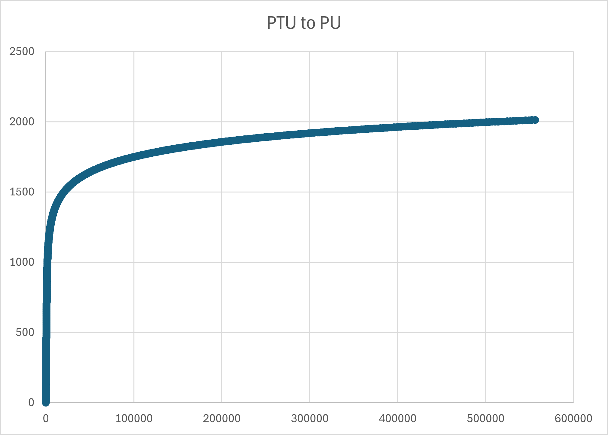

# 3.0 Economics

Reckless fiat monetary policy left the former Empire in ruins. Demagoguery, excessive money printing, deficit spending, out of control socialist entitlements, and simple greed by bureaucratic elites led directly to revolution and collapse. The Empire cannibalized itself from the inside out. As Duke, your obligation is to rebuild from the ashes and lead your House to prosperity.

The standard unit of account in EC4X is the Production Point (PP).

The economic power of your House is fueled by productivity, industrial capacity, and technological growth. Your strategic decisions around taxation, industrial investment, and research & development (R&D) directly impact your economic output and military strength.

Production points settle instantaneously through the Cipher Ledger - a cryptographic network operating on quantum-entangled nodes embedded in jump lane stabilizers. Houses mint blind-signature PP tokens that route through secure lane channels, enabling instant private settlement while maintaining complete opacity to rival intelligence agencies.

## 3.1 Principles

**Population Unit (PU)**: The productive capacity of a colony's population, measured in abstract economic units rather than raw headcount.

**Population Transfer Unit (PTU)**: The number of people required to generate one PU of productive capacity. As colonies grow larger, diminishing returns mean more people are needed per unit of production - efficiency gains, quality of life improvements, and specialization mean individuals produce less marginal output even as total wealth grows. One PTU represents approximately 50,000 souls.

The PTU-to-PU ratio increases exponentially with colony size. Small colonies are highly efficient - each PTU you send generates substantial PU. Large colonies suffer diminishing returns - adding more people yields proportionally less production.

**Strategic consequence**: Transferring colonists from mature worlds to new colonies is advantageous. The mother world loses relatively few PUs while the daughter colony gains significant productive capacity. This incentivizes colonial expansion rather than concentrating population on homeworlds.

For planet classification and maximum PU capacity by planet class, see [Section 2.2](assets.md#22-solar-systems).

The relationship between PU and PTU is exponential. As the population grows the laws of diminishing returns take effect and the amount of production generated per individual is reduced. People are doing less work while the colony continues to slowly gain wealth. Think of gains in efficiency, productivity, and quality of life. 

This model is dis-inflationary; inflation asymptotically approaches zero over time.

A high PTU to PU ratio is an advantage when transferring colonists from larger planets to smaller planets. The mother-colony is able to contribute a relatively large number of people to the new colony without a significant loss of production to itself.

The equations (in Python) for converting PU to PTU:

```python
PTU = pu - 1 + np.exp(0.00657 * pu)
```

Code for converting PTU back to PU:

```python
import numpy as np
from scipy.special import lambertw

PTU = 100000 #example

def logsumexp(x):
    c = x.max()
    return c + np.log(np.sum(np.exp(x - c)))

x = np.float64(657*(PTU + 1)/100000)

pu = -100000/657*lambertw((657*np.exp(x - logsumexp(x)))/100000) + PTU + 1
```

An Excel spreadsheet is included in the GitHub 'assets' folder to visualize the relationship. You need to have "Python in Excel" enabled for Excel. TODO: standalone Python scripts will be provided in the repo.




**Gross Colony Output (GCO)**: The total economic output of a colony, expressed in production points. GCO is determined by the productivity of the colony, industrial investments, resource availability, and technological enhancements.

```
GCO = (PU × RAW_INDEX) + (IU × EL_MOD × CST_MOD × (1 + PROD_GROWTH))
```

Where:

- PU: Population Units of the colony
- RAW_INDEX: Resource quality index based on the solar system's mineral abundance.
- CST_MOD: Construction tech capacity modifier = 1.0 + (CST_level - 1) × 0.10 
- IU: Industrial Units at the colony
- EL_MOD: Economic Level Modifier, based on the colony's EL tech level
- PROD_GROWTH: Productivity growth rate influenced by the tax rate

**RAW INDEX Table**

<!-- RAW_MATERIAL_TABLE_START -->

| RAW       | Eden | Lush | Benign | Harsh | Hostile | Desolate | Extreme |
| --------- |:----:|:----:|:------:|:-----:|:-------:|:--------:|:-------:|
| Very Poor | 60%  | 60%  | 60%    | 60%   | 60%     | 60%      | 60%     |
| Poor      | 80%  | 75%  | 70%    | 65%   | 64%     | 63%      | 62%     |
| Abundant  | 100% | 90%  | 80%    | 70%   | 68%     | 66%      | 64%     |
| Rich      | 120% | 105% | 90%    | 75%   | 72%     | 69%      | 66%     |
| Very Rich | 140% | 120% | 100%   | 80%   | 76%     | 72%      | 68%     |

*Source: config/economy.toml [raw_material_efficiency] section*

<!-- RAW_MATERIAL_TABLE_END -->

Look up the Raw Material classification of your colony's system in the RAW column, and cross index with the planet's habitable conditions.

**Gross House Output (GHO)**: The sum total of all colony GCO.

## 3.2 Tax Rate

Each turn in the Income Phase you set a House-wide tax rate from 0% to 100%. Your tax rate determines how much of a colony's Gross Colony Output (GCO) is collected as Production Points (PP) for your treasury.

**Tax Collection**  
PP Income = Total GCO across all colonies × Tax Rate (rounded up)

Higher tax rates generate more immediate revenue but anger your population. Lower rates slow short-term spending power but accelerate long-term growth and prestige.

### 3.2.1 High-Tax Prestige Penalty (Anti-Cycling Rule)

Every Income Phase the game calculates the **average tax rate over the current turn + the previous five turns** (rolling 6-turn window) and applies the following prestige penalty if the average is above 50 %:

<!-- TAX_PENALTY_TABLE_START -->

| Rolling 6-Turn Average Tax Rate | Prestige Penalty per Turn |
| ------------------------------- | ------------------------- |
| ≤ 50 %                          | 0                         |
| 51 – 60 %                       | -1                        |
| 61 – 70 %                       | -2                        |
| 71 – 80 %                       | -4                        |
| 81 – 90 %                       | -7                        |
| 91 – 100 %                      | -11                       |

*Source: config/prestige.toml [tax_penalties] section*

<!-- TAX_PENALTY_TABLE_END -->

This penalty is applied every turn the qualifying average is met and cannot be avoided by short-term cycling.

### 3.2.2 Low-Tax Incentives

To reward benevolent or populist rule, colonies grant bonuses in the same Income Phase based on the **tax rate set this turn**:

<!-- TAX_INCENTIVE_TABLE_START -->

| Tax Rate This Turn | Population Growth Bonus (multiplier to natural 2% base) | Bonus Prestige per Colony This Turn |
| ------------------ | ------------------------------------------------------- | ----------------------------------- |
| 41 – 50 %          | No bonus                                                | –                                   |
| 31 – 40 %          | ×1.05 (+5 %)                                            | –                                   |
| 21 – 30 %          | ×1.10 (+10 %)                                           | +1                                  |
| 11 – 20 %          | ×1.15 (+14 %)                                           | +2                                  |
| 0 – 10 %           | ×1.20 (+19 %)                                           | +3                                  |

*Source: config/prestige.toml [tax_incentives] and config/economy.toml [tax_population_growth] sections*

<!-- TAX_INCENTIVE_TABLE_END -->

With multiple big colonies, low taxes become a legitimate prestige-farming strategy that can outpace military victories in the late game.

## 3.3 Net Colony Value (NCV) and Treasury Management

Net Colony Value (NCV): Represents the net tax revenue collected from each colony.

```
NCV = GCO × tax rate
```

Net House Value (NHV): The sum total of all NCVs across the player's colonies. NHV is transferred to the House treasury at the beginning of each turn.

## 3.4 Industrial Units and Productivity Growth

Industrial Units (IU) represent manufacturing capacity - factories, shipyards, supply chains, and industrial infrastructure. IU directly boosts GCO through the production formula.

**Passive IU Growth:**

Colonies naturally develop industrial infrastructure as populations grow and economies mature:

```
IU Growth per Turn = max(1, floor(PU / 200)) × tax multiplier × (1 + starbase bonus)
```

Where:

- Tax multiplier = `(1 - tax_rate)` (e.g., 50% tax → 0.5 multiplier)
- Starbase bonus = 0.05 per operational starbase, max 0.15 (3 starbases)

High taxes throttle industrial development. Low taxes accelerate it. For starbase economic benefits, see [Section 2.4.4](assets.md#244-starbases).

**Active IU Investment:**

You can accelerate industrial development by spending PP directly:

```
IU purchased = PP spent
```

Each PP you spend converts directly to one IU at your target colony. Investment is immediate and takes effect in the same turn's GCO calculation.

**Strategic Considerations:**

Young colonies benefit most from IU investment—the multiplier effect on GCO is strongest when baseline production is low. Mature colonies with high PU already generate substantial GCO from population alone; IU investment has diminishing returns but remains useful for maintaining economic growth.

## 3.5 Population Growth

Population naturally increases each turn via birthrate, modified by tax policy and infrastructure:

```
PU Growth per Turn = max(1, floor(PU × 0.02 × tax_multiplier × (1 + starbase_bonus)))
```

Where:

- Base birthrate = 2% per turn
- Tax multiplier from [Section 3.2.2](#322-low-tax-incentives-the-carrot)
- Starbase bonus = 0.05 per operational starbase, max 0.15 (3 starbases)

**Active Population Transfer:**

You can move PTU between colonies to accelerate development. Due to the exponential PTU-to-PU relationship, your mature colonies can export large numbers of people while losing minimal PU, and young colonies gain substantial productive capacity from each PTU received.

**Transportation:**

You transport PTU via two methods:

1. **Environmental Transformation and Colonization ships (ETACs)**: Plant new colonies. See [Section 2.3.2.3](assets.md#23223-environmental-transformation-and-colonization-etac) for unit specifications.

2. **Space Guild contracts**: Move PTU between established colonies. Guild fees and mechanics are handled through the Income Phase interface.

## 3.6 Fighter Squadron Economics

Fighter Squadron (FS) capacity is determined by colony infrastructure and House technology:

```
Max FS per Colony = max(1, floor(PU / 100)) × FD_MULTIPLIER
```

Where:

- PU / 100: Natural capacity scaling with population
- FD_MULTIPLIER: From Fighter Doctrine (FD) research [Section 4.12](#412-fighter-doctrine-fd)
- Operational Starbase requirement: 1 Starbase per 5 FS (rounded up)

**Construction Cost:**

Each Fighter Squadron costs **5 PP** to commission.

**Maintenance:**

Fighter Squadrons have zero ongoing maintenance cost. Once built, they're free to operate.

**Carriers:**

Fighter Squadrons can be loaded onto carriers for mobility. Carrier capacity depends on carrier type and Advanced Carrier Operations (ACO) technology. See [Section 2.4.1](assets.md#241-fighter-squadrons--carriers) for carrier loading mechanics and [Section 4.13](#413-advanced-carrier-operations-aco) for ACO research.

**Infrastructure Requirement:**

Colonies must maintain 1 operational Starbase per 5 FS (rounded up). When Fighter Doctrine research increases capacity, colonies have 2 turns grace period to construct additional Starbases before commissioning new squadrons.

**Strategic Considerations:**

Fighter Squadrons are cost-effective early-game defenders and remain relevant throughout the campaign. Large mature colonies can field dozens of squadrons, creating formidable defensive positions. However, the Starbase infrastructure requirement constrains total capacity and creates meaningful tradeoffs between defense depth and construction investment.

## 3.7 Facility Construction Economics

**Spaceports:**

- **Cost**: 20 PP
- **Construction Time**: 1 turn
- **Construction Capacity**: 5 simultaneous docks
- **Planet-side ship construction penalty**: +100% PP cost to launch ships into orbit
- **Cannot repair ships** - construction only

**Shipyards:**

- **Cost**: 60 PP
- **Construction Time**: 2 turns
- **Prerequisite**: Requires operational Spaceport at colony
- **Construction Capacity**: 10 simultaneous docks
- **Orbital construction**: Standard PP costs, no penalties
- **Ship repairs**: 25% of ship's original PP cost, 1 turn duration
- **Starbase repairs**: 25% of starbase's original PP cost, 1 turn duration

**Construction Capacity Scaling:**

Both facilities' dock counts scale with Construction (CST) technology level. See [Section 4.5](#45-construction-cst) for CST research progression and capacity multipliers.

For detailed facility capabilities and construction rules, see [Sections 5.0-5.4](#50-construction).

## 3.8 Research & Development Investment

You allocate PP to three research pools during the Income Phase:

**Economic Research Points (ERP)**: Improves your colony economic output through Economic Level (EL) technology. Each EL tier increases the economic multiplier applied to Industrial Units in the GCO formula.

**Social Research Points (SRP)**: Unlocks critical infrastructure and doctrinal technologies including Fighter Doctrine (FD), Advanced Carrier Operations (ACO), Cloaking (CLK), Electronic Intelligence (ELI), Shields (SLD), Terraforming (TER), and Strategic Lift (STL).

**Tactical Research Points (TRP)**: Advances weapons (WEP) and construction (CST) technologies. WEP improvements increase ship combat effectiveness. CST improvements increase facility construction capacity and unlock advanced hull classes.

Research pools accumulate over multiple turns. Technologies require specific point thresholds and Science Level (SL) prerequisites to unlock. For complete research progression tables and technology effects, see [Section 4.0](#40-research--development).

---

# 4.0 Research & Development

R&D investment drives your technological advancement across economic, social, and military domains. You allocate Production Points to three distinct research pools each turn, accumulating progress toward specific technology thresholds.

## 4.1 Science Level (SL)

Science Level represents your House's overall technological sophistication and research infrastructure. SL gates access to advanced technologies—you cannot research a technology whose SL requirement exceeds your current Science Level.

**SL Progression:**

<!-- SL_TABLE_START -->

| SL  | ERP Required | SRP Required | Total RP Required | Cumulative RP |
|:---:|:------------:|:------------:|:-----------------:|:-------------:|
| 1   | 0            | 0            | 0                 | 0             |
| 2   | 10           | 10           | 20                | 20            |
| 3   | 12           | 13           | 25                | 45            |
| 4   | 15           | 16           | 31                | 76            |
| 5   | 19           | 21           | 40                | 116           |
| 6   | 24           | 27           | 51                | 167           |
| 7   | 31           | 35           | 66                | 233           |
| 8   | 40           | 46           | 86                | 319           |
| 9   | 52           | 60           | 112               | 431           |
| 10  | 68           | 78           | 146               | 577           |

*Source: config/tech.toml [science_levels] section*

<!-- SL_TABLE_END -->

SL advances automatically when your House accumulates the required ERP and SRP thresholds. Both pools must meet their respective requirements simultaneously.

**Strategic Implications:**

SL advancement is non-linear and becomes progressively more expensive. Early SL tiers unlock rapidly with modest investment, but reaching SL 10 requires sustained R&D commitment over many turns. Houses that neglect research find themselves technologically outpaced and unable to field advanced unit types or economic multipliers.

## 4.2 Economic Level (EL)

Economic Level multiplies Industrial Unit output in the GCO formula, representing advances in manufacturing efficiency, automation, and industrial organization.

**Research Progression:**

<!-- EL_TABLE_START -->

| Tech Level | Prerequisites | ERP Cost | SL Required | Economic Multiplier |
|:----------:| ------------- |:--------:|:-----------:|:-------------------:|
| EL I       | None          | N/A      | 1           | 1.0x                |
| EL II      | EL I          | 10       | 2           | 1.5x                |
| EL III     | EL II         | 12       | 3           | 2.0x                |
| EL IV      | EL III        | 15       | 4           | 2.5x                |
| EL V       | EL IV         | 19       | 5           | 3.0x                |
| EL VI      | EL V          | 24       | 6           | 3.5x                |
| EL VII     | EL VI         | 31       | 7           | 4.0x                |
| EL VIII    | EL VII        | 40       | 8           | 4.5x                |
| EL IX      | EL VIII       | 52       | 9           | 5.0x                |
| EL X       | EL IX         | 68       | 10          | 5.5x                |

*Source: config/tech.toml [economic_level] section*

<!-- EL_TABLE_END -->

**Application:**

EL multiplier applies to the IU component of GCO:

```
IU Output = IU × EL_MOD × CST_MOD × (1 + PROD_GROWTH + STARBASE_BONUS)
```

EL upgrades affect all colonies simultaneously. A House at EL V with 100 IU at each of three colonies generates triple the industrial output compared to EL I.

**Strategic Considerations:**

EL research provides exponential returns when combined with high IU counts. If you pursue industrial strategies, prioritize EL advancement alongside IU investment. However, EL is useless without IU to multiply—young colonies benefit more from direct IU spending than EL research.

## 4.3 Weapons Technology (WEP)

Weapons technology improves ship combat statistics across all hull classes. Each WEP tier increases Attack Strength (AS), Defense Strength (DS), and modifies ship costs.

**Research Progression:**

<!-- WEP_TABLE_START -->

| Tech Level | Prerequisites | TRP Cost | SL Required |
|:----------:| ------------- |:--------:|:-----------:|
| WEP I      | None          | N/A      | 1           |
| WEP II     | WEP I         | 10       | 2           |
| WEP III    | WEP II        | 12       | 3           |
| WEP IV     | WEP III       | 15       | 4           |
| WEP V      | WEP IV        | 19       | 5           |
| WEP VI     | WEP V         | 24       | 6           |
| WEP VII    | WEP VI        | 31       | 7           |
| WEP VIII   | WEP VII       | 40       | 8           |
| WEP IX     | WEP VIII      | 52       | 9           |
| WEP X      | WEP IX        | 68       | 10          |

*Source: config/tech.toml [weapons_technology] section*

<!-- WEP_TABLE_END -->

**Application:**

WEP affects all newly constructed ships and retrofitting existing ships:

**New Construction:**

- Ships are built with current House WEP level
- AS/DS values use WEP-modified statistics
- Construction costs reflect current WEP tier

**Retrofitting Existing Ships:**

- Costs 50% of the ship's current WEP-tier construction cost
- Requires 1 turn at a Shipyard
- Ship is unavailable during retrofit (cannot move or fight)
- After retrofit, ship uses new WEP tier statistics

For complete ship statistics by WEP level, see [Section 10.0](reference.md#100-unit-reference-tables).

**Strategic Considerations:**

WEP research is essential for maintaining military competitiveness. Houses that fall behind in WEP face catastrophic combat disadvantages—a WEP III fleet cannot trade effectively against WEP V opponents. However, retrofitting large fleets is expensive and time-consuming, creating windows of vulnerability during technological transitions.

## 4.4 Shields (SLD)

Shield technology protects colonies from orbital bombardment, absorbing incoming fire before ground installations take damage.

**Research Progression:**

<!-- SLD_TABLE_START -->

| Tech Level | Prerequisites | SRP Cost | SL Required | Absorption % | Shield DS |
|:----------:| ------------- |:--------:|:-----------:|:------------:|:---------:|
| SLD I      | None          | 10       | 2           | 15%          | 10        |
| SLD II     | SLD I         | 13       | 3           | 25%          | 20        |
| SLD III    | SLD II        | 16       | 4           | 35%          | 30        |
| SLD IV     | SLD III       | 21       | 5           | 45%          | 40        |
| SLD V      | SLD IV        | 27       | 6           | 55%          | 50        |
| SLD VI     | SLD V         | 35       | 7           | 65%          | 60        |

*Source: config/tech.toml [shields] section*

<!-- SLD_TABLE_END -->

**Planetary Shield Construction:**

After researching an SLD tier, Houses can construct Planetary Shields at any colony:

- **Construction Cost**: Varies by SLD level (see [Section 10.0](reference.md#100-unit-reference-tables))
- **Construction Time**: 1 turn
- **Limit**: One shield per colony
- **Upgrading**: Requires salvaging old shield (50% refund) and building new shield

**Bombardment Mechanics:**

During orbital bombardment, each incoming hit from the attacking fleet has a probability equal to the Absorption % of being completely absorbed by the shield. Absorbed hits deal zero damage to ground installations. Hits that penetrate the shield damage ground batteries normally.

The shield itself has DS that must be overcome before it can be destroyed. Once destroyed, subsequent bombardment rounds bypass shields entirely until a new shield is constructed.

For complete bombardment rules, see [Section 7.5](operations.md#75-planetary-bombardment).

**Strategic Considerations:**

High-tier shields make your colonies nearly impervious to bombardment, forcing attackers to commit overwhelming fleets or conduct protracted sieges. However, shields are expensive to upgrade and provide no benefit against ground invasion—Marines bypass shields entirely. Late-game Planet-Breaker weapons completely ignore shields, making SLD VI potentially obsolete against advanced adversaries.

## 4.5 Construction (CST)

Construction technology increases shipyard and spaceport capacity, enables advanced hull classes, and improves industrial efficiency.

**Research Progression:**

<!-- CST_TABLE_START -->

| Tech Level | Prerequisites | TRP Cost | SL Required | Capacity Multiplier | Unlocked Hulls |
|:----------:| ------------- |:--------:|:-----------:|:-------------------:| -------------- |
| CST I      | None          | N/A      | 1           | 1.0x                | DD, CL, CA, CV |
| CST II     | CST I         | 10       | 2           | 1.1x                | BC             |
| CST III    | CST II        | 12       | 3           | 1.2x                | -              |
| CST IV     | CST III       | 15       | 4           | 1.3x                | BB, CX         |
| CST V      | CST IV        | 19       | 5           | 1.4x                | -              |
| CST VI     | CST V         | 24       | 6           | 1.5x                | DN             |
| CST VII    | CST VI        | 31       | 7           | 1.6x                | -              |
| CST VIII   | CST VII       | 40       | 8           | 1.7x                | SD             |
| CST IX     | CST VIII      | 52       | 9           | 1.8x                | -              |
| CST X      | CST IX        | 68       | 10          | 1.9x                | PB             |

*Source: config/tech.toml [construction] section*

<!-- CST_TABLE_END -->

**Facility Capacity:**

CST technology increases construction throughput at shipyards and spaceports:

**Spaceport Docks:**

```
Dock Count = 5 × CST_MULTIPLIER (rounded down)
```

**Shipyard Docks:**

```
Dock Count = 10 × CST_MULTIPLIER (rounded down)
```

Example: At CST VI (1.5x multiplier):

- Spaceports: 5 × 1.5 = 7 docks
- Shipyards: 10 × 1.5 = 15 docks

**Hull Class Unlocks:**

Certain ship classes require minimum CST levels to construct:

- **CST I**: Destroyers (DD), Light Cruisers (CL), Heavy Cruisers (CA), Standard Carriers (CV)
- **CST II**: Battlecruisers (BC)
- **CST IV**: Battleships (BB), Super Carriers (CX)
- **CST VI**: Dreadnoughts (DN)
- **CST VIII**: Super-Dreadnoughts (SD)
- **CST X**: Planet-Breakers (PB)

For complete hull specifications, see [Section 10.1](reference.md#101-space-force-wep1).

**GCO Modifier:**

CST technology also applies a modifier to Industrial Unit output in the GCO formula:

```
CST_MOD = 1.0 + (CST_level - 1) × 0.10
```

Example: CST VI → CST_MOD = 1.0 + (6-1) × 0.10 = 1.5

**Strategic Considerations:**

CST is essential for both military and economic expansion. If you pursue capital ship strategies, invest heavily in CST to unlock dreadnoughts and super-dreadnoughts. The capacity multiplier allows your mature colonies to maintain larger construction queues, enabling rapid fleet replacement during prolonged conflicts. The GCO modifier makes CST economically valuable even for defensive-focused Houses.

## 4.6 Terraforming (TER)

Terraforming technology allows colonies to upgrade their planet class, increasing maximum Population Unit (PU) capacity and improving economic output.

**Research Progression:**

<!-- TER_TABLE_START -->

| Tech Level | Prerequisites | SRP Cost | SL Required | Terraform Cost | Upgrade Path       |
|:----------:| ------------- |:--------:|:-----------:|:--------------:| ------------------ |
| TER I      | None          | 16       | 4           | 100 PP         | Extreme → Desolate |
| TER II     | TER I         | 21       | 5           | 150 PP         | Desolate → Hostile |
| TER III    | TER II        | 27       | 6           | 200 PP         | Hostile → Harsh    |
| TER IV     | TER III       | 35       | 7           | 250 PP         | Harsh → Benign     |
| TER V      | TER IV        | 46       | 8           | 300 PP         | Benign → Lush      |
| TER VI     | TER V         | 60       | 9           | 350 PP         | Lush → Eden        |

*Source: config/tech.toml [terraforming] section*

<!-- TER_TABLE_END -->

**Terraforming Process:**

1. Research the TER tier corresponding to desired upgrade
2. Spend required PP at target colony during Income Phase
3. Planet class upgrades immediately
4. Maximum PU capacity increases per new planet class (see [Section 2.2](assets.md#22-solar-systems))
5. RAW_INDEX efficiency improves if applicable

**Limits:**

Planets cannot skip classes. A Hostile world must upgrade to Harsh before reaching Benign. Each upgrade requires separate research and payment.

**Strategic Considerations:**

Terraforming converts marginal colonies into economic powerhouses. A fully terraformed Eden world can support 2,000+ PU, generating enormous GCO even with modest IU investment. However, terraforming is expensive and slow—the SRP cost progression means reaching TER VI requires sustained research investment throughout the mid-to-late game. If you pursue terraforming strategies, balance opportunity cost against immediate military needs.

## 4.7 Cloaking (CLK)

Cloaking technology enables covert operations through Raiders - specialized ships that conduct espionage and disruptive attacks behind enemy lines.

**Research Progression:**

<!-- CLK_TABLE_START -->

| Tech Level | Prerequisites | SRP Cost | SL Required | Detection Resistance |
|:----------:| ------------- |:--------:|:-----------:|:--------------------:|
| CLK I      | None          | 10       | 2           | Moderate             |
| CLK II     | CLK I         | 13       | 3           | Good                 |
| CLK III    | CLK II        | 16       | 4           | Excellent            |
| CLK IV     | CLK III       | 21       | 5           | Superior             |
| CLK V      | CLK IV        | 27       | 6           | Elite                |

*Source: config/tech.toml [cloaking] section*

<!-- CLK_TABLE_END -->

**Raider Capabilities:**

Raiders are specialized covert vessels that conduct intelligence gathering, sabotage, and assassination missions. Each CLK tier improves Raider stealth, making them harder to detect.

**Detection Mechanics:**

Enemy colonies equipped with Electronic Intelligence (ELI) technology can detect Raiders. Detection rolls compare the Raider's CLK level against the defender's ELI level using the Raider Detection Table in [Section 2.4.3](assets.md#243-raiders).

Higher CLK tiers significantly reduce detection probability, enabling Raiders to operate deep in enemy territory with relative impunity.

**Strategic Applications:**

- **Intelligence**: Reveal enemy fleet compositions and colony defenses
- **Sabotage**: Destroy Industrial Units, damage infrastructure
- **Assassination**: Eliminate enemy commanders (advanced missions)
- **Blockade Running**: Covert supply runs to besieged colonies

For complete Raider specifications and mission types, see [Sections 2.4.3](assets.md#243-raiders) and [Section 9.0](operations.md#90-covert-operations).

**Strategic Considerations:**

CLK investment creates information asymmetry—Houses with advanced Raiders can scout enemy positions while remaining undetected. However, Raiders are fragile and expensive, and aggressive ELI investment by adversaries can neutralize CLK advantages. The CLK vs. ELI arms race becomes critical in late-game peer conflicts.

## 4.8 Electronic Intelligence (ELI)

Electronic Intelligence represents sensor technology, signals analysis, and detection networks. ELI enables colonies to detect enemy Scouts and Raiders conducting covert operations.

**Research Progression:**

<!-- ELI_TABLE_START -->

| Tech Level | Prerequisites | SRP Cost | SL Required | Detection Capability |
|:----------:| ------------- |:--------:|:-----------:|:--------------------:|
| ELI I      | None          | 10       | 2           | Basic                |
| ELI II     | ELI I         | 13       | 3           | Improved             |
| ELI III    | ELI II        | 16       | 4           | Advanced             |
| ELI IV     | ELI III       | 21       | 5           | Superior             |
| ELI V      | ELI IV        | 27       | 6           | Elite                |

*Source: config/tech.toml [electronic_intelligence] section*

<!-- ELI_TABLE_END -->

**Detection Mechanics:**

ELI determines a colony's ability to detect enemy Scouts and Raiders:

**Scout Detection**: Uses the Scout Detection Table in [Section 2.4.2](assets.md#242-scouts). Detection probability increases with ELI tier and multiple Scout presence (mesh network effect).

**Raider Detection**: Uses the Raider Detection Table in [Section 2.4.3](assets.md#243-raiders). Higher ELI levels significantly increase detection probability against cloaked Raiders.

**Starbase Synergy**: Starbases provide a +2 ELI modifier for detection rolls, making them critical for defending high-value colonies against covert operations. See [Section 2.4.4](assets.md#244-starbases).

**Strategic Considerations:**

ELI provides critical combat benefits by detecting cloaked Raiders and preventing their devastating +4 CER ambush bonus. Your ELI-equipped scouts share detection across your entire task force, negating enemy stealth advantages in both space and orbital combat. However, ELI provides no direct firepower or economic benefit—you must balance ELI investment against other research priorities.

Failing to invest in ELI allows adversaries to operate Raiders with impunity against your forces. Undetected Raiders strike first, potentially crippling your fleet before your capital ships can respond. ELI is defensive technology with offensive implications—Houses without adequate ELI face catastrophic combat disadvantages against cloaked adversaries.

ELI is also essential for planetary defense. Your colonies with high ELI and Starbases (+2 ELI modifier) can detect covert Scout and Raider operations, protecting your industrial capacity from sabotage missions. ELI is a meta-game technology—its value depends entirely on opponent strategies and the prevalence of stealth warfare in your campaign.

## 4.9 Strategic Lift (STL)

Strategic Lift improves Environmental Transformation and Colonization (ETAC) ships and Troop Transports, increasing their carry capacity for colonists and Marines.

**Research Progression:**

<!-- STL_TABLE_START -->

| Tech Level | Prerequisites | SRP Cost | SL Required | ETAC Capacity | Transport Capacity |
|:----------:| ------------- |:--------:|:-----------:|:-------------:|:------------------:|
| STL I      | None          | N/A      | 1           | 1 PTU         | 1 MD               |
| STL II     | STL I         | 10       | 2           | 2 PTU         | 2 MD               |
| STL III    | STL II        | 13       | 3           | 3 PTU         | 3 MD               |
| STL IV     | STL III       | 16       | 4           | 4 PTU         | 4 MD               |
| STL V      | STL IV        | 21       | 5           | 5 PTU         | 5 MD               |

*Source: config/tech.toml [strategic_lift] section*

<!-- STL_TABLE_END -->

**Application:**

STL upgrades apply immediately to all existing ETACs and Troop Transports upon research completion. Ships in transit or loading can immediately increase their cargo capacity up to the new limit.

**ETAC Implications:**

Higher STL tiers allow new colonies to start with larger populations, accelerating early development. A single ETAC at STL V establishes colonies with 5 PTU instead of 1 PTU, providing immediate productive capacity and reducing the need for follow-up colonist transfers.

**Troop Transport Implications:**

STL improvements enable larger invasion forces. A Transport at STL V carries 5 Marine Divisions instead of 1, allowing Houses to conduct overwhelming ground assaults with fewer ships and reducing the number of jumps required to position invasion forces.

**Strategic Considerations:**

STL is an economic multiplier for expansion-focused strategies. If you pursue aggressive colonization, early STL investment benefits you enormously, while defensive Houses can delay STL research indefinitely. However, STL becomes critical during peer conflicts—Houses that neglect STL face logistical disadvantages when reinforcing distant colonies or conducting invasions across extended jump lane networks.

## 4.10 Command (CMD)

Command technology increases the Command Rating (CR) of capital ship flagships, allowing them to lead larger squadrons.

**Research Progression:**

<!-- CMD_TABLE_START -->

| Tech Level | Prerequisites | TRP Cost | SL Required | CR Increase |
|:----------:| ------------- |:--------:|:-----------:|:-----------:|
| CMD I      | None          | N/A      | 1           | Base CR     |
| CMD II     | CMD I         | 10       | 2           | +1 CR       |
| CMD III    | CMD II        | 12       | 3           | +2 CR       |
| CMD IV     | CMD III       | 15       | 4           | +3 CR       |
| CMD V      | CMD IV        | 19       | 5           | +4 CR       |

*Source: config/tech.toml [command] section*

<!-- CMD_TABLE_END -->

**Application:**

CMD bonuses apply to the base Command Rating of capital ship flagships:

```
Effective CR = Base CR + CMD Bonus
```

Example: A Battleship (BB) has Base CR 9. At CMD III, Effective CR = 9 + 2 = 11.

Higher CR allows flagships to command more ships within their squadron, as each ship consumes Command Cost (CC) based on its class. For squadron composition rules and CC values, see [Section 2.3.3](assets.md#233-squadrons).

**Retrofitting:**

Unlike WEP technology, CMD bonuses apply automatically to existing flagships without requiring retrofits. The moment CMD research completes, all capital ships in the House fleet can immediately reorganize squadrons to take advantage of increased CR.

**Strategic Considerations:**

CMD research enables squadron consolidation, reducing administrative overhead and improving tactical flexibility. At CMD V, you can field fewer, larger squadrons instead of many small squadrons, simplifying fleet management during complex operations. However, larger squadrons become more vulnerable to focused fire—losing a high-CR flagship potentially scatters many ships, creating organizational chaos.

## 4.11 Capital Ship Capacity

Capital squadron capacity represents a House's ability to maintain large warships through industrial infrastructure:

```
Max Capital Squadrons = max(8, floor(Total_House_IU ÷ 100) × 2)
```

Capital ships are defined as vessels with Command Rating (CR) ≥ 7:

- Battlecruisers (BC)
- Battleships (BB)
- Dreadnoughts (DN)
- Super-Dreadnoughts (SD)
- Standard Carriers (CV)
- Super Carriers (CX)

**Capacity Enforcement:**

When a House exceeds capital squadron capacity (typically from IU loss due to bombardment, blockades, or territory loss), excess squadrons are immediately claimed by Space Guilds for salvage. Priority for removal:

1. Crippled flagships first
2. Lowest Attack Strength (AS) among non-crippled flagships

The House receives 50% of each ship's original build cost as salvage payment.

**Strategic Implications:**

Your industrial capacity directly determines fleet size. If you pursue capital ship strategies, invest heavily in IU development and protect your industrial colonies from bombardment. Losing a major industrial world can force immediate fleet reductions, potentially at the worst possible moment.

For complete salvage mechanics, see [Section 2.5.1](assets.md#251-capital-ship-salvage-operations).

## 4.12 Fighter Doctrine (FD)

Fighter Doctrine improves organizational efficiency and training throughput, increasing the number of Fighter Squadrons (FS) each colony can support.

**Research Progression:**

<!-- FD_TABLE_START -->

| Tech Level | Prerequisites | TRP Cost | SL Required | Capacity Multiplier |
|:----------:| ------------- |:--------:|:-----------:|:-------------------:|
| FD I       | None          | N/A      | 1           | 1.0x                |
| FD II      | FD I          | 15       | 2           | 1.5x                |
| FD III     | FD II         | 17       | 3           | 2.0x                |

*Source: config/tech.toml [fighter_doctrine] section*

<!-- FD_TABLE_END -->

**FD I - Basic Fighter Operations**

Standard fighter squadron operations with conventional command structures. Base capacity determined by population and infrastructure.

**FD II - Advanced Fighter Operations**

Enhanced pilot academies, improved communication networks, and advanced squadron coordination protocols. Increases operational capacity by 50% through better resource utilization and training throughput.

**FD III - Elite Fighter Operations**

Elite pilot training programs, AI-assisted tactical coordination, and distributed command networks. Doubles fighter squadron capacity through revolutionary organizational efficiency and automated logistics systems.

**Application:**

Fighter Doctrine upgrades apply house-wide immediately upon research completion. All colonies recalculate their maximum fighter squadron capacity using the new multiplier:

```
Max FS per Colony = max(1, floor(PU / 100)) × FD_MULTIPLIER
```

Colonies must maintain the required Starbase infrastructure (1 operational Starbase per 5 FS) regardless of doctrine level. The Starbase requirement does not scale with FD tech.

When FD tech increases capacity, existing fighter squadrons remain operational and colonies can immediately commission additional squadrons up to their new capacity limit (subject to infrastructure requirements and available production points).

If capacity increases would require additional Starbases, colonies have 2 turns to construct the required infrastructure before commissioning new squadrons. Existing squadrons are grandfathered and remain operational during the grace period.

For fighter squadron economics, see [Section 3.6](#36-fighter-squadron-economics). For combat mechanics, see [Section 2.4.1](assets.md#241-fighter-squadrons--carriers).

## 4.13 Advanced Carrier Operations (ACO)

Advanced Carrier Operations improves carrier efficiency, allowing greater fighter squadron capacity per vessel through enhanced hangar systems, rapid deployment mechanisms, and improved logistics.

**Research Progression:**

<!-- ACO_TABLE_START -->

| Tech Level | Prerequisites | TRP Cost | SL Required | CV Capacity | CX Capacity |
|:----------:| ------------- |:--------:|:-----------:|:-----------:|:-----------:|
| ACO I      | None          | N/A      | 1           | 3 FS        | 5 FS        |
| ACO II     | ACO I         | 20       | 4           | 4 FS        | 6 FS        |
| ACO III    | ACO II        | 22       | 5           | 5 FS        | 8 FS        |

*Source: config/tech.toml [advanced_carrier_operations] section*

<!-- ACO_TABLE_END -->

**ACO I - Standard Carrier Operations**

Base carrier capacity with conventional hangar layouts and deployment systems. Standard Carriers (CV) accommodate 3 fighter squadrons; Super Carriers (CX) carry 5.

**ACO II - Enhanced Carrier Operations**

Improved hangar bay design, automated fighter launch systems, and enhanced maintenance facilities increase carrier capacity by 33%. Standard Carriers (CV) can accommodate 4 fighter squadrons; Super Carriers (CX) can carry 6.

**ACO III - Advanced Carrier Operations**

Revolutionary multi-deck hangar systems, AI-coordinated rapid deployment, and advanced repair facilities maximize carrier efficiency. Standard Carriers (CV) accommodate 5 fighter squadrons; Super Carriers (CX) carry 8.

**Application:**

ACO upgrades apply immediately to all carriers in the House fleet upon research completion. Existing carriers can load additional fighters up to their new capacity limit at any friendly colony during the loading phase.

Carriers in transit or in combat zones must return to a friendly colony to take advantage of increased capacity.

ACO technology affects carrier capacity only and does not modify fighter squadron statistics, maintenance costs, or combat effectiveness.

For carrier combat mechanics, see [Section 2.4.1](assets.md#241-fighter-squadrons--carriers).

## 4.14 Strategic Considerations

- **Balancing R&D Investments**: You must balance investments across ERP, SRP, and TRP to maximize your economic output, technological advancements, and military strength.
- **Economic Synergies**: Increasing EL and SL together provides synergistic benefits, enhancing your overall productivity and unlocking powerful technologies.
- **Adapting to Opponents**: Flexibility in R&D strategy is key. Prioritize weapons technology (WEP) during military conflicts or focus on terraforming (TER) for long-term economic growth—critical decisions based on the game state.

---

# 5.0 Construction

You accomplish construction and repair of House assets planet-side or in orbit, with restrictions.

## 5.1 Ship Construction

All ship construction completes instantly (1 turn) regardless of hull class or CST tech level. This reflects the game's time narrative where turns represent variable time periods (1-15 years depending on map size).

**Payment Model:**

- You must pay full PC cost **upfront** from your house treasury when construction begins
- You cannot start construction if your house lacks sufficient PP in treasury
- If you cancel construction, you receive a 50% PC refund to treasury

**Construction Vulnerability:**

Ships under construction in docks can be destroyed during the Conflict Phase if:

- The shipyard/spaceport is destroyed by orbital bombardment
- The facility is crippled by combat damage

Destroyed ships-in-construction provide no salvage value. Your house loses the full PC investment.

**Completion and Commissioning:**

Ship building completes at the start of the Command Phase and are immediately commissioned:

- Ship is created with current house tech levels
- Automatically assigned to existing squadron at facility location (if capacity available)
- Otherwise, new squadron is created with ship as flagship
- If no fleet exists at location, new fleet is created

**Construction Locations:**

Ships can be constructed at two facility types with different costs and requirements. See [Sections 5.2-5.5](#52-planet-side-construction) for detailed construction rules by facility type.

## 5.2 Planet-side Construction

Ground units and fighter squadrons are produced via colony industry, distributed across the surface or in underground factories.

**Spaceports:**

Ships (excluding fighter squadrons) constructed planet-side incur a **100% PC increase** due to the added cost of orbital launch, and require a spaceport to commission.

**Example Cost Calculation:**

Base ship cost: 50 PP  
Planet-side construction: 50 PP × 2 = 100 PP total

For spaceport specifications and capacity, see [Section 2.3.2.1](assets.md#23221-spaceports).

## 5.3 Planet-side Repair

Ground units and fighter squadrons are repaired and refitted planet-side using colony industrial capacity.

**Spaceports cannot repair ships.** Spaceports are construction facilities only - they launch ships into orbit but cannot repair orbital damage.

## 5.4 Orbital Construction

Shipyard construction of a ship in orbit is the standard method of commissioning a vessel, and incurs no penalty.

**Standard Costs:**

Ships built at shipyards use their base PP cost with no modifiers. This is the economically efficient construction method.

For shipyard specifications and capacity, see [Section 2.3.2.2](assets.md#23222-shipyards).

## 5.5 Orbital Repair

**Ship repairs require a Shipyard.** Spaceports cannot repair ships - only shipyards have the orbital infrastructure for ship repairs.

**Ship Repairs:**

The number of turns required to repair a crippled ship is one turn. The ship's squadron must be located at a colony equipped with a shipyard, and the ship remains decommissioned through the repair period.

The cost of repair equals one quarter (25%) of the ship's construction PP. All ship repairs complete in 1 turn regardless of ship class.

Example: You wish to repair a crippled WEP3 Light Cruiser. The cost is:

```
72.6 PP (build cost) * 0.25 = 18.15 PP (repair cost)
```

**Starbase Repairs:**

Starbase repairs also require shipyards and cost 25% of the starbase's construction PP. Repair time is 1 turn.

**Colonies without shipyards cannot repair crippled ships.** Ships must either:

- Transfer to a colony with shipyard capacity, or
- Be salvaged for 50% PC recovery
